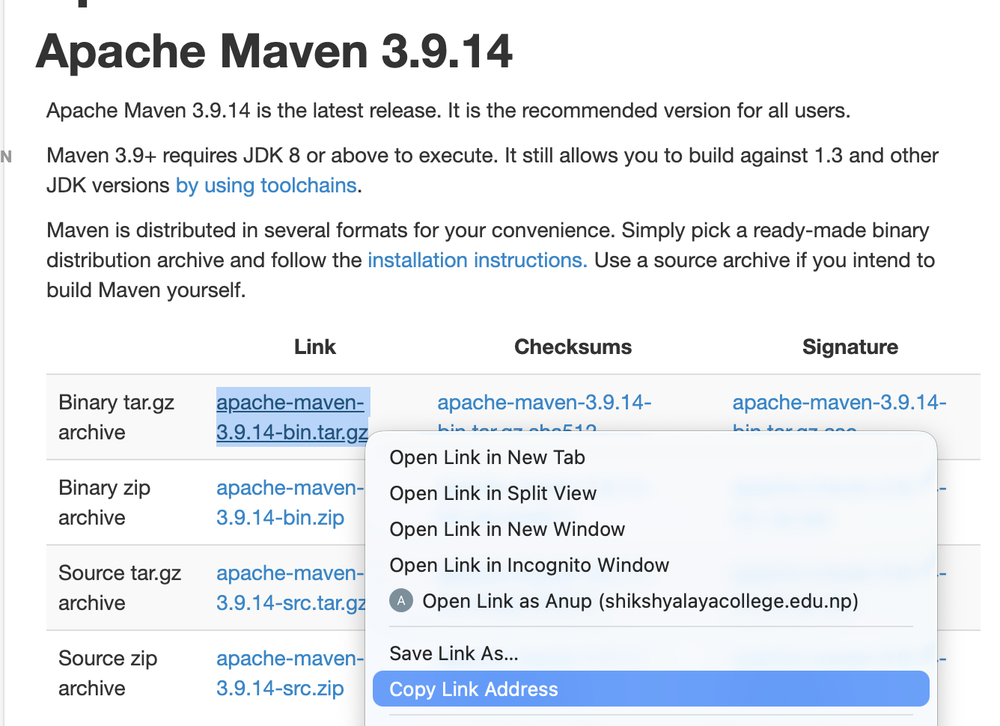
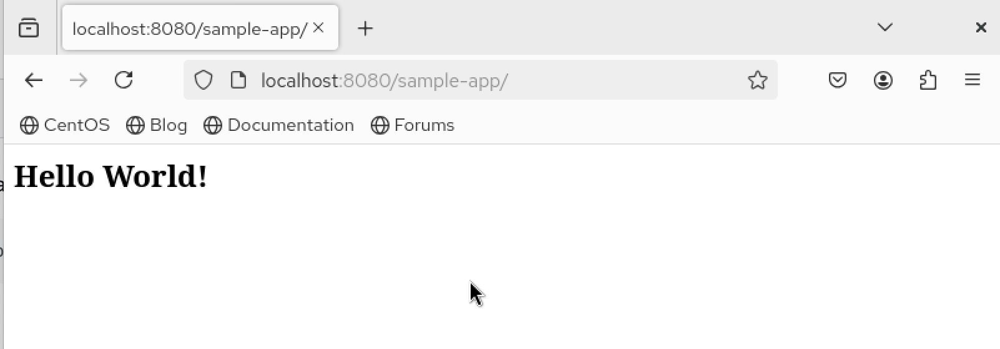

# Apache Maven

---

> Prerequities:
> Create a new Virtual Machine Named `Java Developer`

**Introduction**

Maven is an open source build automation and project management tool originally designed for Java projects, though it has since been adopted across many JVM based ecosystems. At its core, Maven revolves around something called the **Project Object Model**, or POM; an XML file that describes your project, its dependencies, and how it should be built.

One of the things that makes Maven stand out is its philosophy of **"convention over configuration."** Rather than forcing you to spell out every detail of your build, Maven assumes a standard project layout and provides sensible defaults. If you follow its conventions, you can get a working build with very little configuration. Here's what Maven brings to the table:

- **Reproducible builds**: Given the same source and configuration, Maven produces the same output every time. No more "it works on my machine" surprises.
  
- **A standard lifecycle**: Maven defines a clear sequence of phases: `validate`, `compile`, `test`, `package`, `verify`, `install`, and `deploy`. Every Maven project follows this flow.
  
- **Automatic dependency resolution**: You declare what libraries you need, and Maven figures out the rest, including transitive dependencies (the libraries your libraries depend on).
  
- **Plugin based architecture**: Compilation, testing, packaging, reporting, and even site generation are all handled by plugins. If Maven doesn't do something out of the box, there's likely a plugin for it.
  
- **Smooth CI/CD integration**: Maven plays well with Jenkins, GitLab CI, GitHub Actions, and artifact repositories like Nexus and Artifactory. It also integrates with quality and security scanners without much fuss.

> **Mnemonic**: Maven = Model + Lifecycle + Plugins + Dependencies

---

**Why Maven?**

To appreciate what Maven does, it helps to think about what life looked like before it existed.

**Complex build processes** were the norm. Developers had to manually compile source files, manage classpaths, and package everything together. Each project had its own ad hoc build scripts, which were often fragile and hard to maintain.

**Dependency management was a nightmare.** Teams would check JAR files directly into version control or pass them around on shared drives. Figuring out which version of a library a project actually needed and whether it conflicted with another library was a tedious, error prone exercise. People called it "dependency hell" for good reason.

**There was no standardization.** Walk into a new project, and you'd find a completely different directory structure, a different build tool, and a different set of conventions. Onboarding took longer than it should have.

Maven addressed all of this by providing Java developers with a common project structure, a declarative way to specify dependencies, and a single, consistent command line interface for building any project. Once you learn Maven, you can walk into almost any Maven based project and know where things are and how to build it.

---

**Concepts & Terminology**

Before diving deeper, let's get comfortable with the vocabulary Maven uses. These terms come up constantly.

**POM (pom.xml)**:

This is the heart of every Maven project. The POM is an XML file that sits at the root of your project and tells Maven everything it needs to know: what your project is called, what it depends on, which plugins to use, and how to build it. Think of it as the single source of truth for your project's build configuration.

**Coordinates (GAV)**:

Three pieces of information identify every artifact in the Maven ecosystem, often referred to as GAV coordinates:

- **GroupId**: Identifies the organization or group that created the project. It typically follows reverse domain naming, like `com.company.project`.
- **ArtifactId**: The name of the specific project or module, such as `data-service`.
- **Version**: The version number, like `1.0.0` or `1.0.0-SNAPSHOT` (where SNAPSHOT indicates a development version that's still in progress).

Together, these three values uniquely identify any artifact in the Maven universe.
    
**Dependencies**:

These are the external libraries your project needs. Instead of downloading JARs manually and dropping them into a `lib/` folder, you declare them in your POM. Maven takes care of downloading them, storing them locally, and making them available on your classpath. It even resolves transitive dependencies; if library A depends on library B, Maven will pull in both.
   
**Repositories:**

Maven uses a layered repository system:

- **Local repository**: A folder on your machine, usually at `~/.m2/repository`. Every artifact Maven downloads gets cached here, so it doesn't have to fetch it again.
- **Central repository**: The default public repository maintained by the Maven community. It hosts the vast majority of open source Java libraries.
- **Remote repository**: A private or corporate repository, often running Sonatype Nexus or JFrog Artifactory. Companies use these to host proprietary artifacts and to proxy the central repository for better control and performance.

**Build Lifecycle and Goals**:
A lifecycle is a predefined sequence of phases that Maven executes in order. A goal is a specific task: like compiling code or running tests, that gets bound to a phase and executed by a plugin. When you run `mvn test`, Maven walks through every phase up to and including `test`, executing the goals bound to each one along the way.


---

**Maven Build Lifecycle**

Maven defines three built in lifecycles, but the one you'll use most often is the default lifecycle. Here are its phases, in order:

1. **validate**: Checks that the project is set up correctly and the POM is valid.
2. **compile**: Compiles the project's source code into bytecode.
3. **test**: Runs unit tests against the compiled code using a framework like JUnit. The code doesn't need to be packaged for this step.
4. **package**: Takes the compiled code and bundles it into a distributable format, typically a JAR or WAR file.
5. **verify**: Runs integration tests and other checks to make sure the package meets quality standards.
6. **install**: Copies the package into your local Maven repository (`~/.m2/repository`), making it available as a dependency for other projects on the same machine.
7. **deploy**: Uploads the final package to a remote repository so that other developers and projects can use it.

There are two other lifecycles worth knowing about:

- **Clean lifecycle**: `pre-clean` -> `clean` -> `post-clean`. The `clean` phase deletes the `target/` directory, wiping out previous build outputs. You'll often run `mvn clean` before a fresh build.
- **Site lifecycle**: `pre-site` -> `site` -> `post-site` -> `site-deploy`. This generates project documentation and can publish it to a web server.

One thing that catches newcomers off guard: running a later phase automatically triggers all earlier phases. So `mvn package` doesn't just package your code: it first runs `validate`, then `compile`, then `test`, and only then `package`. This is by design and ensures nothing gets skipped.

---


**Common Maven commands**

Here are the commands you'll reach for most often.

**Core Build Commands**
```
mvn clean                  # Delete the target/ directory (previous build outputs)
mvn compile                # Compile the source code
mvn test                   # Run unit tests
mvn package                # Build the artifact (JAR or WAR)
mvn verify                 # Run integration tests and quality checks
mvn install                # Install the artifact to your local ~/.m2/ repository
mvn deploy                 # Upload the artifact to a remote repository
```

  - Useful flags:
```
mvn -DskipTests package          # Skip running tests, but still compile them
mvn -DskipITs verify             # Skip integration tests specifically
mvn -T 1C clean package          # Run a parallel build using 1 thread per CPU core
mvn -U clean package             # Force Maven to check for updated SNAPSHOT dependencies
mvn -Pprod package               # Activate a profile named 'prod'
mvn -Denv=prod package           # Pass a system property for property-based profile activation
```

**Maven Wrapper:**

The Maven wrapper lets you pin a specific Maven version to your project, so everyone on the team (and your CI server) uses the same version regardless of what's installed globally.

```bash
mvn -N io.takari:maven:wrapper   # Generate the ./mvnw script and wrapper JAR
./mvnw clean package             # Build using the project-pinned Maven version
```

**Utility Commands**:
```
mvn dependency:tree                       # Print the full dependency graph
mvn help:effective-pom                    # Show the fully resolved POM (including inherited settings)
mvn versions:display-dependency-updates   # Check if any dependencies have newer versions
mvn versions:display-plugin-updates       # Check if any plugins have newer versions
```

---

**Installation & Configuration**

These instructions are written for **Fedora, RHEL, or CentOS** using the `dnf` package manager. If you're on a different distribution, the package names and commands may vary slightly, but the overall process is the same.

**Prerequisites: Java (JDK 11+)**
  - Create a VM named `developer` (as per your lab/notes).

**Step 1: Install Java**

Maven requires a JDK (Java Development Kit) to run. Version 11 or higher is recommended, though JDK 21 is a solid choice for modern projects.

```bash
sudo dnf -y install java-*-openjdk java-*-openjdk-devel
```
```
java --version
```


**Step 2: Find the JDK Path and Set JAVA_HOME**

After installation, you need to figure out where the JDK was installed so you can set the `JAVA_HOME` environment variable. Maven (and many other tools) rely on this variable to locate the JDK.

```bash
cd /usr/lib/jvm
```
```bash
ls
```
```bash
cd java-21-openjdk
```
```bash
pwd                            
```
> You should see something like: `/usr/lib/jvm/java-21-openjdk`


```bash
cd
```

- Now set it system wide by editing `/etc/profile` (or use `~/.bashrc` if you only want it for your user):

```bash
sudo vim /etc/profile
```

Add these lines at the end:

```bash
export JAVA_HOME=/usr/lib/jvm/java-21-openjdk
export PATH="$PATH:$JAVA_HOME/bin"
```

Apply the changes and verify:

```bash
source /etc/profile
```
```bash
echo $JAVA_HOME
```
```bash
which java
```


**Step 3: Install Maven**

You have two options here.


**Option A: Use the package manager.** This is the simplest approach, though you may not get the latest version.

```bash
sudo dnf info maven
sudo dnf -y install maven
```
```bash
mvn --version
```


Then set the environment variables by adding these lines to `/etc/profile`:
```bash
sudo vim /etc/profile
```
```bash
export M2_HOME=/usr/share/maven
export PATH="$PATH:$M2_HOME/bin"
```
```bash
source /etc/profile
```


**Option B: Download the latest binary directly.** This is the recommended approach if you want a specific or the most recent version. Check [Maven's download page](https://maven.apache.org/download.cgi) for the latest link.




> Copy Link Address, and You Will find something like: https://dlcdn.apache.org/maven/maven-3/3.9.14/binaries/apache-maven-3.9.14-bin.tar.gz

```bash
cd /tmp
```
```bash
sudo wget https://dlcdn.apache.org/maven/maven-3/3.9.14/binaries/apache-maven-3.9.14-bin.tar.gz
```
```bash
sudo tar -zxvf apache-maven-*-bin.tar.gz
```
```bash
sudo mv apache-maven-3.9.* /opt/maven
```


```
cd
```

Optionally, you can create a dedicated system user to own the Maven installation. This is a good practice for shared servers:
```bash
sudo groupadd maven
```
```bash
sudo useradd -g maven -d /opt/maven -s /sbin/nologin maven
```
```bash
sudo chown -R maven:maven /opt/maven
```

Then set the environment variables by adding these lines to `/etc/profile`:

```bash
export M2_HOME=/opt/maven
export PATH="$PATH:$M2_HOME/bin"
```

Apply and confirm everything is working:

```bash
source /etc/profile
```
```bash
mvn --version
```
If you see Maven's version info along with the Java version and OS details, you're good to go.


> **Note:** The `mvn` file inside Maven's `bin/` directory isn't a compiled binary; it's a shell script. It sets up the necessary environment variables and classpath, then launches Maven's core Java class. This is why `JAVA_HOME` needs to be set correctly.


---

**Project Structure & Creation**

The Default Directory Layout

One of Maven's biggest advantages is its standardized directory structure. Every Maven project follows the same layout, which means once you've seen one, you can navigate any of them:

```
project-root/
├── pom.xml                              # The project's build configuration
├── src/
│   ├── main/
│   │   ├── java/                        # Your production source code goes here
│   │   ├── resources/                   # Configuration files, properties, etc.
│   │   └── webapp/                      # Web assets (JSPs, HTML, WEB-INF): for WAR projects
│   └── test/
│       ├── java/                        # Your test source code goes here
│       └── resources/                   # Test specific configuration files
└── target/                              # Maven's output directory (generated, not checked in)
    ├── classes/
    ├── test-classes/
    └── <artifact>.jar or <artifact>.war
```

The `target/` directory is where Maven puts everything it generates: **compiled classes**, **test results**, and the f**inal artifact**. You should never check this directory into version control.

---

**Creating a New Project**

Maven provides archetypes: essentially project templates, to scaffold new projects quickly.

**Creating a Web Application**

**Example 1:**
  - Web Application
```bash
mkdir -p ~/sampleapp
cd ~/sampleapp
```
```
mvn archetype:generate \
  -DgroupId=com.devopsclass \
  -DartifactId=sample-app \
  -DarchetypeArtifactId=maven-archetype-webapp \
  -DinteractiveMode=false
```

This creates a basic web application structure with a `pom.xml` configured for WAR packaging. You can inspect what was generated:
```bash
tree sample-app
```


```bash
cd sample-app
```
```bash
ls
```
> You'll see: pom.xml  src/

```bash
ls src/main/webapp
```
> You'll see: index.jsp; your code is located in this file.
```bash
sudo vim index.jsp 
```
```html
<html>
<body>
<h2>DevOps: Breaking Down Silos!</h2>
</body>
</html>
```
```
cd
```
> We will compile, package, and test this code locally later.

---

```bash
mvn archetype:generate \
  -DgroupId=com.devopsclass \
  -DartifactId=sample-app \
  -DarchetypeArtifactId=maven-archetype-webapp \
  -DinteractiveMode=false
```

Let's break down what each parameter does:
  - `-DgroupId=com.devopsclass`: Sets the base package name using reverse-domain notation
  - `-DartifactId=sample-app`: Names the project and creates the root directory
  - `-DarchetypeArtifactId=maven-archetype-webapp`: Tells Maven to use the web application template
  - `-DinteractiveMode=false`: Skips the interactive prompts and uses the provided values directly
    
---


The two most common archetypes are:
  - `maven-archetype-quickstart`: A simple Java project that produces a JAR
  - `maven-archetype-webapp`: A web application that produces a WAR


---


**Creating a Spring Boot Application**

Spring Boot projects aren't typically created through Maven archetypes. Instead, the community uses **Spring Initializr**, which you can access through a web browser or the command line: 

**Example 2:**

- Create a project directory
```
mkdir -p ~/myproject
cd ~/myproject
```

- Download a Spring Boot starter project from the Spring Initializr web service
```bash
curl -sSL --fail \
  "https://start.spring.io/starter.zip?type=maven-project&language=java&groupId=com.example&artifactId=demo&name=demo&packaging=jar&javaVersion=21&dependencies=web" \
  -o demo.zip
```
> The `-sSL --fail` flags tell `curl` to run in silent mode, follow redirects, and return an error if something goes wrong; rather than silently downloading an error page.

```
unzip demo.zip -d .
```
```
rm demo.zip
cd
```
```
tree myproject
```


**Example 3:** Downloads a pre-configured Spring Boot project as a ZIP file from Spring Initializr
```bash
curl https://start.spring.io/starter.zip -d type=maven-project \
  -d language=java -d bootVersion=3.3.4 -d groupId=com.example \
  -d artifactId=demo -d name=demo -d packaging=jar -d javaVersion=21 \
  -d dependencies=web -o demo.zip
```
```bash
unzip demo.zip -d .
```


**Differences:**

| Aspect | Command 1 (GET) | Command 2 (POST) |
|--------|-----------------|------------------|
| **HTTP Method** | GET | POST |
| **Parameters** | URL query string | Form data (-d flags) |
| **Flags** | `-sSL --fail` | None |
| **Spring Boot Version** | Default/latest | **Specific: 3.3.4** |
| **URL Length** | Very long | Short and clean |
| **Error Handling** | `--fail` (fail on HTTP errors) | Default behavior |
| **Silent Mode** | `-s` (silent) | Shows progress |
| **Redirects** | `-L` (follow redirects) | Default behavior |


**Which is the better method:**?
  - **Example 1**: When you want the latest Spring Boot version
  - **Example 2**: When you need a specific Spring Boot version (better for reproducible builds in DevOps)

> Both produce the same project structure, just potentially different Spring Boot versions!

---

**Creating a Quarkus Application**

Quarkus has its own Maven plugin for project generation:

```
mkdir -p ~/NewProject
cd ~/NewProject
```
```
mvn io.quarkus:quarkus-maven-plugin:3.15.0:create \
  -DprojectGroupId=com.example1 \
  -DprojectArtifactId=quarkus-app \
  -DclassName="com.example1.GreetingResource" \
  -Dpath="/hello"
```
This generates a ready to run Quarkus project with a sample REST endpoint at `/hello`.
```
cd
tree example1
```


---


**The pom.xml**

The `pom.xml` is the file that ties everything together. It's where you declare your project's identity, list its dependencies, configure plugins, and define how the project should be built. Every Maven project has one, and understanding it is essential.

**A Minimal Web Application POM**

Here's a clean, working POM for a simple web application. It's a good starting point that you can build on:

```bash
sudo vim pom.xml
```

```xml
<project xmlns="http://maven.apache.org/POM/4.0.0"
         xmlns:xsi="http://www.w3.org/2001/XMLSchema-instance"
         xsi:schemaLocation="http://maven.apache.org/POM/4.0.0
                             http://maven.apache.org/xsd/maven-4.0.0.xsd">
  <modelVersion>4.0.0</modelVersion>

  <!-- Project coordinates -->
  <groupId>com.devopsclass</groupId>
  <artifactId>sample-app</artifactId>
  <version>1.0.0</version>
  <packaging>war</packaging>

  <name>sample-app</name>
  <description>Sample web application built with Maven</description>

  <!-- Build settings -->
  <properties>
    <maven.compiler.release>21</maven.compiler.release>
    <project.build.sourceEncoding>UTF-8</project.build.sourceEncoding>
  </properties>

  <dependencies>
    <!-- The Servlet API — provided by Tomcat at runtime, so we don't package it -->
    <dependency>
      <groupId>jakarta.servlet</groupId>
      <artifactId>jakarta.servlet-api</artifactId>
      <version>6.0.0</version>
      <scope>provided</scope>
    </dependency>

    <!-- JUnit 5 for testing — only needed during the test phase -->
    <dependency>
      <groupId>org.junit.jupiter</groupId>
      <artifactId>junit-jupiter</artifactId>
      <version>5.10.3</version>
      <scope>test</scope>
    </dependency>
  </dependencies>

  <build>
    <plugins>
      <!-- Surefire runs unit tests and supports JUnit 5 -->
      <plugin>
        <groupId>org.apache.maven.plugins</groupId>
        <artifactId>maven-surefire-plugin</artifactId>
        <version>3.5.1</version>
        <configuration>
          <useModulePath>false</useModulePath>
        </configuration>
      </plugin>

      <!-- Jetty plugin lets you run the app locally without a full Tomcat install -->
      <plugin>
        <groupId>org.eclipse.jetty.ee10</groupId>
        <artifactId>jetty-ee10-maven-plugin</artifactId>
        <version>12.0.10</version>
        <configuration>
          <webApp>
            <contextPath>/sample-app</contextPath>
          </webApp>
        </configuration>
      </plugin>
    </plugins>
  </build>
</project>
```

---

**Advanced POM Features**

As your projects grow, you'll likely encounter these patterns.

**Parent POM and Dependency Management**

Large organizations often define a parent POM that establishes company wide standards; compiler settings, plugin versions, coding conventions, and so on. Individual projects inherit from it:

```xml
<parent>
    <groupId>com.mycompany</groupId>
    <artifactId>company-parent-pom</artifactId>
    <version>1.0.0</version>
</parent>
```

**Profiles for Environment Specific Configuration**

Profiles let you customize the build for different environments — development, staging, production — without maintaining separate POM files:

```xml
<profiles>
  <profile>
    <id>prod</id>
    <properties>
      <app.env>production</app.env>
    </properties>
    <activation>
      <property>
        <name>env</name>
        <value>prod</value>
      </property>
    </activation>
  </profile>
</profiles>
```

You'd activate this profile by running `mvn -Denv=prod package` or `mvn -Pprod package`.

---

**Build & Deployment Workflow**

**Where Maven Fits in the Software Development Lifecycle?**

If you think about the typical SDLC requirements, design, implementation, testing, deployment, and maintenance, Maven primarily supports the implementation through the deployment stages. It gives you a consistent, repeatable way to compile code, run tests, produce artifacts, and push them to where they need to go.


**Compiling and Packaging**

All Maven commands should be run from the directory containing your `pom.xml`. The first time you build a project, Maven will download any plugins and dependencies it needs and cache them in `~/.m2/repository`. Subsequent builds are much faster.

```
cd ~/sampleapp/sample-app

# Compile the source code
mvn compile

# Run tests and produce the packaged artifact
mvn package

# Check what was generated
ls target/                                # You should see: sample-app-1.0.0.war
```


**Testing Locally**

For quick local testing without setting up a full Tomcat server, you can use the Jetty plugin (if it's configured in your POM):

```bash
mvn jetty:run                        # Then open http://localhost:8080/sample-app/ in your browser
```



---

**Deploying the WAR to Tomcat**

Assuming:
  - Tomcat server is powered on and accessible.
  - Developer machine has built `target/sample-app.war`.
  - Tomcat’s `webapps/` directory is on the remote host.
  - The default Tomcat HTTP connector is 8080 unless you reconfigure.

```
# Copy WAR to remote Tomcat
cd target/
scp sample-app.war cnode@10.10.5.9:~/apache-tomcat-9.0.106/webapps

# Access deployed application
http://10.10.5.9:8080/sample-app/

# Or if custom port: http://10.10.5.9:5080/sample-app/
```

  - Access the app in a browser (adjust port/context path if configured differently):
```
http://10.10.5.9:8080/sample-app/
# If your Tomcat uses port 5080 per your setup:
# http://10.10.5.9:5080/sample-app/
```

Make changes and redeploy:

```
# On developer machine
cd /home/cnode/javaapp/sample-app/src/main/webapp

sudo vim index.jsp
# ...change the content...

cd ../../../
mvn package
cd target
scp sample-app.war cnode@10.10.5.9:~/apache-tomcat-9.0.106/webapps
```

---
