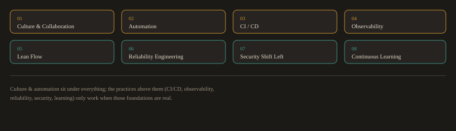

## F.3 DevOps

### What Is DevOps?

DevOps is a cultural philosophy and a set of engineering practices that unifies software development and IT operations. The core goal is to deliver software faster, more reliably, and with fewer failures, while maintaining the ability to respond quickly when things go wrong.

Before DevOps, development and operations were separate teams with different goals and different incentives:

- Developers were measured on shipping features quickly.

- Operations teams were measured on system stability.

- These goals were in direct conflict. Developers wanted to change things. Operations wanted to keep things the same.

The result was slow, painful releases. Developers wrote code and handed it to operations with incomplete documentation. Operations deployed it manually, often following undocumented procedures. When something broke in production, both teams blamed each other.

DevOps eliminates this conflict through shared ownership, automation, and continuous feedback. The team that builds the software also operates it and is responsible for its reliability. When something breaks at 2am, product engineers share operational responsibility with platform, operations, or SRE teams through an on call model appropriate to the organization.

---
### The eight dimensions of DevOps:

**Fig. F.3a · The eight dimensions**



*Eight practice areas that together define a mature DevOps organization.*

| Dimension | What It Means in Practice |
| --- | --- |
| Culture and Collaboration | Shared goals, no blame culture, psychological safety to raise problems early |
| Automation | Build, test, provision, deploy, and remediate with code, not manual steps |
| CI/CD | Code integrates and ships in small, frequent, safe batches |
| Observability | Metrics, logs, and traces give real time visibility into system behavior |
| Lean Flow | Small batch sizes and fast feedback loops eliminate waste |
| Reliability Engineering | SLOs and error budgets govern the balance between velocity and stability |
| Security Shift Left | Security checks run in development and CI, not only before release |
| Continuous Learning | Blameless postmortems and experimentation drive steady improvement |

---
### The DevOps Lifecycle

The DevOps lifecycle is represented as an infinite loop to show that it never ends. Monitoring data feeds back into planning, which starts the next cycle. The eight stages are:

**Fig. F.3b · The infinite loop (signature)**


*Plan · Code · Build · Test · Release · Deploy · Operate · Monitor · and back to Plan.*

```
Plan > Code > Build > Test > Release > Deploy > Operate > Monitor > (back to Plan)
```

---
#### Stage 1: Plan

Teams define requirements, prioritize features, and break work into small, traceable tasks. Every piece of work ties to a user story. Commit messages reference ticket numbers so a change can be traced from the original requirement all the way to the production deployment.

**Tools:** Jira, GitHub Issues, Confluence.

---
#### Stage 2: Code

Developers write code on short lived feature branches and commit frequently. Small, focused commits are easier to review, easier to test, and easier to roll back if something goes wrong. Long running branches cause painful merge conflicts and delayed integration.

**Tools:** Git, GitHub, VS Code, IntelliJ.

**A typical branch workflow:**

Create a feature branch from the latest main
```bash
git checkout -b feat/user-password-reset
```

Make changes, stage and commit with a descriptive message
```bash
git add .
git commit -m "feat: add password reset email flow with 24h expiry token"
```

Push to remote and open a pull request
```bash
git push origin feat/user-password-reset
```

---
#### Stage 3: Build

On every push or pull request, a CI pipeline triggers automatically. It compiles the code, runs unit tests, runs static analysis, scans for known vulnerabilities, and produces a build artifact such as a container image or a JAR file. If any step fails, the pipeline stops immediately and notifies the developer.

**Tools:** GitHub Actions, Jenkins, GitLab CI.

A typical CI pipeline flow:
```
push to branch
  checkout code
  install dependencies
  compile or build
  run unit tests
  run static analysis (lint, SAST)
  scan dependencies for known CVEs (SCA)
  build container image
  push image to registry
```

**Fig. F.3c · A CI build pipeline, step by step**


*Triggered on every push. If any gate fails, the pipeline halts and reports back at once.*

---
#### Stage 4: Test

Automated quality gates run at multiple levels. Tests are not a phase that happens at the end of development. They run continuously throughout.

| Test Type | What It Checks | Tools |
| --- | --- | --- |
| Unit | Individual functions in isolation | PyTest, JUnit |
| Integration | How modules work together | TestNG, PyTest |
| End to End | Full user flows in a browser | Selenium, Playwright |
| Performance | Behavior under high load | k6, JMeter |
| Security (SAST) | Code level vulnerabilities | Semgrep, SonarQube |
| Container scanning | Known CVEs in the base image and installed packages | Trivy, Grype |
| Policy | Infrastructure configuration compliance | Checkov, OPA |

Shifting left means running these tests earlier and earlier in the pipeline. A security vulnerability found during development costs a fraction of one found after deployment.

---
#### Stage 5: Release

Releasing is the decision to make a tested build available in production. Two related but distinct practices govern how that decision is made:

- **Continuous Delivery:**

Every passing build produces a release candidate that could be deployed to production. A human approves the final promotion to production.

- **Continuous Deployment:** 

Every passing build deploys to production automatically, with no human step required.

Most organizations practice Continuous Delivery. Fully automated Continuous Deployment is common at high maturity organizations with very high test coverage and mature rollback capabilities. Release is also where the concepts of deploying and releasing separate: code can be deployed to production while the user facing feature stays hidden behind a feature flag until the business decides to turn it on.

**Tools:** GitHub Actions, ArgoCD, GitHub Environments.

---
#### Stage 6: Deploy

Deployment is the technical act of getting the released build running in the production environment. The strategy chosen controls how much risk each deployment carries:

**Fig. F.3d · Four deployment strategies**


*Each strategy trades a different amount of risk against speed and blast radius.*

| Strategy | How It Works | Risk Level |
| --- | --- | --- |
| Rolling | Replace old instances one at a time, health check each one | Low |
| Blue/Green | Run two identical environments, switch traffic instantly at the load balancer | Lower, if rollback and schema compatibility are handled |
| Canary | Route a small percentage of traffic to the new version first, promote gradually | Lower, if traffic routing and observability are in place |
| Feature Flag | Deploy code to production but hide the feature behind a runtime toggle | Lower, but this is a release-management technique, not a full deployment strategy |

No strategy is inherently "very low" risk. Actual risk depends on data migrations, rollback design, observability, traffic routing, backward compatibility, and operational maturity. Feature flags in particular control *release* (when a feature becomes visible) and are best combined with, not substituted for, a deployment strategy.

**Tools:** GitHub Actions, Jenkins, ArgoCD, Helm, Terraform, Ansible.

---
#### Stage 7: Operate

Once deployed, the application must be kept running. This includes configuration management, patching, scaling, and incident response. In a mature DevOps setup, all infrastructure is defined as code. No engineer makes manual changes directly to production servers. Every change goes through version control, code review, and the pipeline.

**Tools:** Ansible, Terraform, Kubernetes.

---
#### Stage 8: Monitor

Observability tools collect metrics, logs, and traces from the running system. Dashboards and alerts give the team visibility into what the system is doing right now, what happened at a specific moment in the past, and where a slow request spent its time.

**The three pillars of observability:**

**Fig. F.3e · The three pillars of observability**


*Metrics (Prometheus/Grafana), logs (Elastic Stack), traces (OpenTelemetry/Jaeger).*

- **Metrics:** 

numeric time series data answering "what is the system doing right now?" Examples: CPU usage, requests per second, error count.

- **Logs:** 

timestamped records of discrete events answering "what happened at 14:32 UTC?" Examples: access logs, application error logs, audit trails.

- **Traces:** 

the path a request took through distributed services, answering "where did this slow request spend its time?" Examples: a trace showing a request spent 800ms waiting for a database query.

**Tools:** 

Prometheus and Grafana (metrics), Elastic Stack (logs), OpenTelemetry and Jaeger (traces).

Before a system goes live, the team defines Service Level Indicators (SLIs) and Service Level Objectives (SLOs). An SLI is the measurement (for example, the percentage of requests that succeed). An SLO is the target (for example, 99.9% of requests must succeed over a rolling 30 day window). When an SLO is at risk of being breached, alerts fire and the on call engineer responds.

---
### Closing the loop:

Monitoring data, incident reports, and retrospectives feed directly back into the Plan stage, which is why the lifecycle is drawn as an infinite loop rather than a straight line. After every significant incident, the team conducts a blameless postmortem: a structured analysis focused on what in the system or process allowed the failure to happen, not on who made a mistake. Every postmortem produces concrete action items that become work items in the next planning cycle.

---
