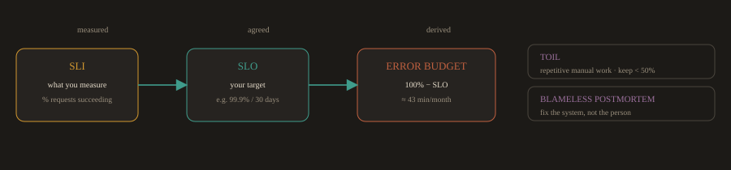
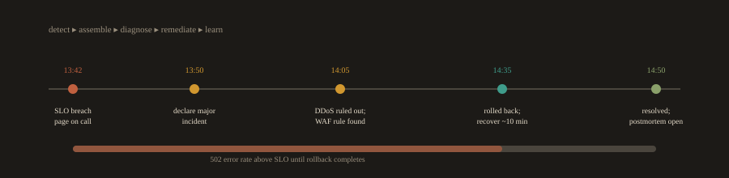

## F.4 SRE vs. DevOps

### What Is Site Reliability Engineering?

Site Reliability Engineering (SRE) was created at Google around 2003. Google was operating services at a scale no one had operated before, and the traditional operations model, where a separate team manually maintains systems, was not going to scale. The solution was to hire software engineers to do operations work and give them the tools to automate it.

The Google SRE book, published in 2016, defines it directly: "SRE is what happens when you ask a software engineer to design an operations team."

If DevOps is the philosophy that development and operations should work closely together, SRE is one concrete, opinionated way to implement that philosophy.

---
### Core SRE Concepts

**Fig. F.4a · From measurement to allowance**

*The SLI is measured, the SLO is agreed, the error budget falls out of the gap to 100%.*

---
**Service Level Indicator (SLI)**

A specific, measurable metric that represents one aspect of service quality. Examples:

- The percentage of HTTP requests that return a 2xx status code (availability SLI)

- The 95th percentile response time for API requests (latency SLI)

- The percentage of background jobs that complete successfully (correctness SLI)

**Service Level Objective (SLO)**

A target value for an SLI over a defined time window. Examples:

- 99.9% of requests must succeed over a rolling 30 day window

- The p95 latency for the search API must stay below 300ms

SLOs are internal agreements between the engineering team and the product team. They are not the same as SLAs (Service Level Agreements), which are contractual commitments to customers with financial penalties for breach.

---
**Error Budget**

The amount of unreliability the SLO allows. If the SLO is 99.9% availability, the error budget is 0.1%, which works out to about 43 minutes of downtime per month.

The error budget is the key mechanism that aligns development velocity and operational stability. When the error budget is healthy, the team can deploy frequently and take risks. When the error budget is nearly exhausted, the team applies its agreed error-budget policy: depending on the remaining budget and the risk involved, this may restrict risky releases, require additional safeguards, or temporarily prioritize reliability work. Teams agree on this policy upfront, which removes the need for negotiation during an incident.

---
**Toil**

Repetitive, manual, automatable operational work that does not produce lasting value. Restarting a service manually every time it crashes is toil. Writing a script that detects the crash and restarts it automatically eliminates that toil. Google's SRE organization sets an operating goal of keeping toil below 50% of an SRE's working time, with anything above that targeted for automation. Many teams adopt a similar target, but treat the 50% figure as a Google SRE operating goal rather than a universal rule.

---
**Blameless Postmortem**

A structured written analysis of an incident that focuses on what in the system or process failed, not on who made a mistake. The goal is to find action items that make the system safer. Blaming individuals does not prevent the next incident. Fixing the system does.

---
### DevOps vs. SRE

| Aspect | DevOps | SRE |
| --- | --- | --- |
| What it is | Cultural philosophy and set of practices | A specific engineering role and implementation model |
| Focus | Collaboration, automation, continuous delivery | Reliability, scalability, eliminating operational toil |
| Key concepts | CI/CD, IaC, shared ownership, feedback loops | SLOs, error budgets, toil reduction, blameless postmortems |
| Key metrics | Deployment frequency, lead time, change failure rate, failed deployment recovery time | Availability, latency, error rate, saturation |
| Core philosophy | "You build it, you help run it" | "Operations is a software engineering problem" |
| Prescriptiveness | Principles and values, teams implement them as they see fit | Specific job descriptions, defined toil cap, SLO framework |
| Origin | Community driven, popularized at the 2009 Velocity conference | Created at Google in 2003, published in the SRE book in 2016 |

The most important thing to understand: DevOps and SRE are not competing approaches. Most large organizations practice DevOps broadly across all their teams while having dedicated SRE teams focused specifically on reliability for their most critical services.

---
### SRE in Practice: A Real Incident

This example shows how SRE concepts apply during an actual outage.

**Situation:** Inspired by Cloudflare's July 2, 2019 outage. A globally deployed Web Application Firewall rule contained a regular expression that triggered catastrophic backtracking, exhausting CPU on every core handling HTTP/HTTPS traffic across the provider's network worldwide and producing widespread 502 errors for end users. (The timeline below is a lightly simplified retelling of that real incident.)

**Fig. F.4b · Incident timeline (approximately 27 minutes)**

*Outage to recovery in about 27 minutes; the postmortem targets the system, not the person.*

---
**Timeline:**

13:42 UTC: A new WAF managed rule is deployed globally in one step. Within minutes, 502 error rates spike and CPU saturates on the cores handling HTTP/HTTPS traffic worldwide. Synthetic monitoring pages the on call SRE and a P0 incident is declared.

13:50 UTC: The response team assembles (networking, security, and operations engineers in a shared incident channel) and begins triage.

14:00 UTC: A DDoS hypothesis is ruled out by traffic analysis. Live CPU data points to the WAF as the cause, and the offending managed ruleset is identified.

14:02 UTC: The team proposes a global "kill" of the WAF Managed Rulesets to drop CPU back to normal.

14:09 UTC: The global kill takes effect and traffic recovers, roughly 27 minutes after the outage began. Error rates return within SLO.

14:52 UTC: After reviewing the offending change, rolling back the specific rules, and testing the fix, the WAF Managed Rulesets are re-enabled. Postmortem document opened.

---
**Postmortem action items (targeting the system, not individuals):**

- Implement canary rollout for all WAF rule changes: deploy to 1% of edge servers, monitor for 30 minutes, then promote globally.

- Add synthetic traffic tests that run against the WAF in staging every 5 minutes.

- Move all firewall configuration into Git with pull request review required before any change can be applied.

- Update the on call runbook to include a "check CPU load on edge nodes" step as part of the initial triage checklist.

- Automate rollback: if CPU load or error rates spike above threshold within 10 minutes of a WAF rule deployment, trigger an automatic rollback without waiting for human intervention.

No individual was blamed in this postmortem. The action items target the process (no canary for WAF rules), the tooling (no synthetic monitoring in staging), and the documentation (incomplete runbook). Those are the things that, when fixed, prevent the next incident.

---
