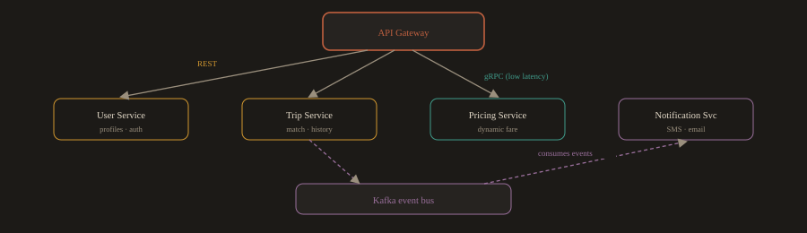

## F.6 Microservices Architecture

### The Monolith Problem

Most software starts as a monolith: a single application where all the features live in a single codebase and are deployed as a single unit. For a small team and a simple product, this is fine. Monoliths are easy to develop, test, and deploy in the early stages.

The problems emerge as the product and team grow:

- A bug in the payment module can crash the entire application, including the unrelated product catalog.

- Deploying a small change to one feature requires redeploying and retesting the entire application.

- The whole application must scale together. You cannot scale only the part that is under heavy load.

- Different parts of the system might benefit from different technologies, but the monolith forces one stack on everything.

**Fig. F.6a · Monolith vs. microservices**

*Monolith: one codebase, one shared database, one blast radius. Microservices: each owns its data and deploys on its own.*

---
### What Is a Microservice?

A microservice is an independently deployable service that handles exactly one business capability. A microservices architecture is an application built as a collection of these small services, each running in its own process, owning its own data, and communicating with other services through well defined APIs.

| Aspect | Monolith | Microservices |
| --- | --- | --- |
| Codebase | Single repository, single deployment unit | Multiple repositories, independent deployments |
| Scaling | The entire application scales together | Each service scales independently based on its own demand |
| Failure impact | One failing module can bring down the whole application | Failures are isolated to one service |
| Technology choice | One technology stack for everything | Each service uses whatever technology is best for it |
| Deployment speed | Slow, the whole application must be built and deployed | Fast, deploy one service without touching any others |
| Team ownership | All developers work in the same codebase | Small teams own and operate specific services |

---
### A Real Example: Ride Sharing Platform

**Fig. F.6b · Ride sharing services and how they talk**

*The gateway routes external calls; services talk over REST, gRPC, and Kafka events without direct coupling.*

| Service | Responsibility | Communication |
| --- | --- | --- |
| User Service | Manages rider and driver profiles, handles authentication | REST API |
| Trip Service | Matches riders to drivers, tracks trips, stores history | REST API + Kafka events |
| Pricing Service | Computes dynamic fares based on demand and distance | gRPC (low latency calls) |
| Notification Service | Sends SMS and email alerts for trip events | Consumes Kafka events |
| API Gateway | Routes all external requests to the correct internal service | REST API |

A few terms worth knowing here:

- **REST API:** 

A standard way for services to communicate over HTTP. The most common approach for service to service calls in web systems.

- **gRPC:** 

A faster, more efficient communication protocol used when low latency matters, such as for real time pricing calculations.

- **Kafka:** 

A message broker that lets services communicate asynchronously. The Trip Service publishes a "trip completed" event to Kafka, and the Notification Service picks it up and sends the receipt. Neither service needs to know about the other directly.

---
**Major design rules in microservices:**

As a design principle, each service owns its own database: no service queries another service's database directly, and all data access goes through the API. This is what keeps services truly independent. Transitional and legacy architectures may still share data stores, but direct cross service database access increases coupling and is something to migrate away from.

---
**Resilience patterns you will encounter:**

- **Circuit Breaker:** If the Pricing Service is down, the Trip Service falls back to a cached price rather than failing the entire booking.

- **Retry with Exponential Backoff:** If a network call fails due to a transient issue, the service retries automatically with increasing delays between attempts.

---
### Why This Matters for a DevOps Engineer

In a microservices environment, you are not managing one pipeline and one deployment. You are managing dozens or hundreds. Each service has its own CI/CD pipeline, its own container image, its own Kubernetes deployment manifest, and its own set of alerts.

Observability becomes critical. When a user reports a slow checkout, the problem could be in the API Gateway, the Trip Service, the Pricing Service, or the database. Distributed tracing, where each service passes a shared request ID through its logs and spans, lets you follow the full path of a request across all services and find exactly where the time was spent.

Tools you will use for this: Prometheus and Grafana for per service metrics, the Elastic Stack for centralized logs from all services, and OpenTelemetry with Jaeger for distributed traces.

**End of Part A: Foundations.* Part B continues with engineering level depth on each topic.*

---
---
