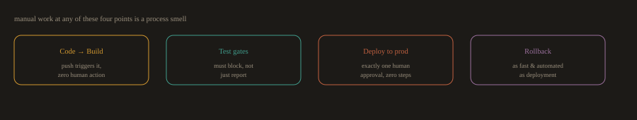
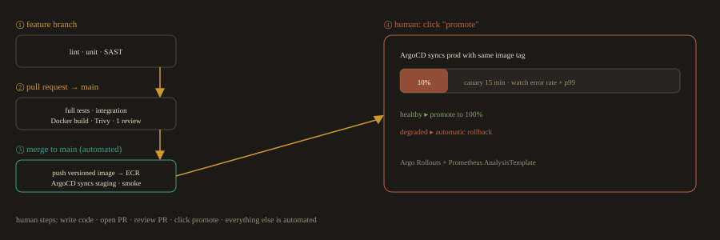

# Part B · Core Concepts in Depth

> **Prerequisites:** This section assumes you have completed Part A. You already understand what DevOps is, what the SDLC phases are, what CI/CD means conceptually, and the basic difference between Waterfall and Agile. This section builds on that foundation with engineering level depth and real delivery team context.

---
## 1. The DevOps Lifecycle in Practice

You already know the eight stages: Plan, Code, Build, Test, Release, Deploy, Operate, Monitor. What Part A did not cover is how these stages actually run inside an engineering team, who owns what, where the handoffs happen, and where teams consistently get stuck.

---
### Who Owns What

In a mature DevOps organization, ownership does not map neatly to one team per stage. It overlaps deliberately.

| Stage | Primary Owner | Supporting Roles | Common Tool |
| --- | --- | --- | --- |
| Plan | Engineering Manager, Product Owner | All engineers (story refinement) | Jira, Linear |
| Code | Individual engineer | Peers (PR review) | Git, GitHub |
| Build | CI system (automated) | Platform/DevOps engineer (pipeline maintenance) | GitHub Actions, Jenkins |
| Test | CI system (automated) | QA engineer (test authoring) | PyTest, Selenium, Trivy |
| Release | CI/CD system (automated) | DevOps engineer (gate configuration) | GitHub Actions, ArgoCD |
| Deploy | CD system (automated) | DevOps/Platform engineer | Kubernetes, Helm, ArgoCD |
| Operate | DevOps, SRE, or on call developer | All engineers (on call rotation) | Kubernetes, Ansible |
| Monitor | Observability platform (automated) | DevOps/SRE (dashboard and alert authoring) | Prometheus, Grafana, Jaeger |

Notice that Build, Test, Release, and Deploy are almost entirely automated in a healthy setup. The DevOps engineer's job at those stages is not to do the work manually. It is to build and maintain the systems that do it automatically.

---
### The Automation Points That Matter Most

Not every stage benefits equally from automation. These four are where automation has the highest leverage:

**Fig. 1a · The four highest leverage automation points**



*Automate these four hard, and everything between them tends to follow.*

**Code to Build:** 

The trigger that starts everything. A push to a feature branch or a merge to main should automatically kick off the pipeline with zero human action. If a developer has to manually start a build, that is a process smell.

**Test gates:** 

Tests must block the pipeline, not just report results. A failing unit test that lets the build proceed anyway is theater. The gate must be real: fail the step, fail the pipeline, block the merge.

**Deploy to production:** 

The promotion from staging to production should require exactly one human decision (approval in GitHub Environments or a similar gate) and zero manual steps after that. Every manual step in a deployment is a risk surface and a future incident waiting to happen.

**Rollback:** 

Rollback should be as fast and automated as deployment. If your team needs 45 minutes to roll back a bad release, your deployment pipeline is incomplete regardless of how fast the forward path is.

---
### Where Real Teams Get Stuck

**Long lived branches:** 

A feature branch that lives for two weeks accumulates conflicts. Integration problems discovered late in CI are expensive. The fix is trunk based development or strict branch lifetime limits (three to five days maximum).

**Slow test suites:** 

A CI pipeline that takes 45 minutes to complete trains developers to push and walk away. Feedback is useless if it arrives an hour late. Target under 10 minutes for the core CI loop. Move slow tests (end to end, load tests) to a separate nightly or pre release pipeline.

**Environment parity:** 

"It works on staging," followed by a production failure, is almost always an environment parity problem. The application behaves differently because staging and production are configured differently, run on different instance sizes, or use different versions of a dependency. IaC and containerization solve this. If your environments are not identical by construction, they will drift.

**Manual approval chains:** 

Every human approval step in a pipeline adds latency and becomes a bottleneck when the approver is unavailable. Approval gates should exist only at the production promotion step, and only because organizational policy requires them. Approval gates on every environment create bureaucracy that slows teams without improving safety.

**Observability added as an afterthought:** 

Teams that instrument their application after it goes to production spend weeks guessing at problems they could have observed directly. Instrumentation belongs in the development phase, before the first deployment.

---
### How This Looks in a Real Company

A mid sized SaaS company running on Kubernetes might have this pipeline for each microservice:

**Fig. 1b · A real per service pipeline (only 4 human steps)**



*The only manual actions are writing the code, opening the PR, reviewing it, and clicking promote.*

```
Developer pushes to feature branch
  GitHub Actions: lint, unit tests, SAST scan
  All pass: pipeline green, developer continues

Developer opens a pull request to main
  GitHub Actions: full test suite, integration tests, Docker build, Trivy scan
  Code review required: one peer approval
  All pass: merge allowed

Merge to main
  GitHub Actions: build and push versioned image to ECR, then update the image tag/digest in the staging GitOps repository
  ArgoCD detects the Git change in the staging overlay
  ArgoCD syncs the staging cluster automatically (no human step)
  Smoke tests run against staging
  All pass: staging deployment complete

Engineer triggers production promotion
  GitHub Actions: one click promotion workflow updates the image tag/digest in the production GitOps repository
  ArgoCD detects the Git change and syncs the production cluster using the same image
  Argo Rollouts: canary at 10% traffic for 15 minutes
  Prometheus AnalysisTemplate: monitors error rate and p99 latency
  If metrics healthy: promote to 100%
  If metrics degrade: automatic rollback to the previous version
```

The only human steps in this entire flow are: write the code, open the PR, review the PR, and click promote to production. Everything else is automated.

---
