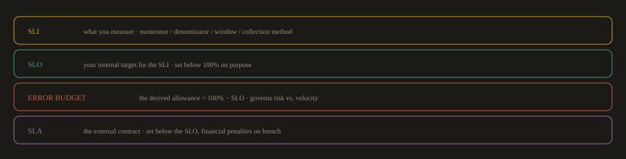
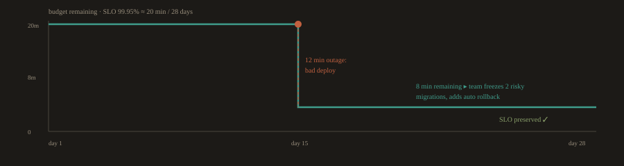

## 3. SRE vs. DevOps: Where They Overlap and Where They Diverge

### The Core Distinction

You learned in Part A that SRE is one concrete implementation of DevOps principles, specifically focused on reliability at scale. The operational distinction that matters for your day to day work is this:

A DevOps engineer primarily asks: how do we build and ship software faster and more reliably?

An SRE primarily asks: how do we define, measure, and protect the reliability of what we have already shipped?

In organizations with both roles, DevOps engineers focus on the pipeline and delivery infrastructure. SREs focus on production reliability, on call practices, and the SLO framework. At smaller organizations, one team does both.

---
### SLIs, SLOs, SLAs, and Error Budgets in Practice

These four concepts are often listed together but they operate at different layers. Understanding which layer each belongs to is what lets you use them correctly.

**Fig. 3a · Four concepts, four layers**



*SLI is measured, SLO is the internal target, the error budget is derived from it, and the SLA is the external promise sitting below the SLO.*

---
### SLI: What You Measure

A Service Level Indicator(SLI) is a specific, quantifiable measurement of one aspect of service behavior. The measurement must be something you can actually collect from your monitoring system.

Good SLIs:

- Request success rate: `(successful requests / total requests) * 100`

- Availability: `(uptime minutes / total minutes) * 100`

- Latency: p95 response time for the `/checkout` endpoint

- Queue freshness: the age of the oldest unprocessed message in the payment queue

Bad SLIs (things that sound measurable but are not specific enough):

- "User experience is good"

- "The system feels fast"

- "Errors are low"

Every SLI needs a numerator, a denominator, a time window, and a collection method before it is actionable.

---
### SLO: Your Internal Target

A Service Level Objective(SLO) is the target value you set for an SLI over a defined time window. It is an internal engineering agreement, not a customer commitment.

```
SLI:  request success rate over a rolling 28 day window
SLO:  >= 99.5%
```
```
SLI:  p95 latency for the search API over a rolling 28 day window
SLO:  <= 250ms
```
```
SLI:  availability of the payment service over a rolling 28 day window
SLO:  >= 99.9%
```

The SLO is deliberately set below the theoretical maximum. Setting an SLO of 100% availability is a mistake: it makes every planned maintenance window an SLO violation, it provides no room for safe experimentation, and it is impossible to achieve in any real system.

---
### Error Budget: The Derived Allowance

The error budget is what remains between your SLO and 100%. It is the calculated amount of unreliability you are permitted to have over the measurement window.

```
SLO: 99.9% availability over 28 days
28 days = 40,320 minutes
Error budget = 0.1% of 40,320 = 40.32 minutes of allowed downtime
```

The error budget is the mechanism that makes the SRE model work in practice. It transforms the conversation between product and engineering from subjective negotiation ("can we ship this risky change?") into an objective data question ("how much error budget do we have left?").

When the error budget is healthy (most of it remains), the team has permission to take risks: deploy frequently, run experiments, ship ambitious changes.

When the error budget is nearly exhausted, the team applies its agreed error-budget policy: depending on the remaining budget and the risk, it may restrict risky releases, require extra safeguards, or temporarily prioritize reliability work until the budget recovers. Teams agree to this policy upfront, so there is no negotiation at crisis time.

---
### SLA: The External Commitment

A Service Level Agreement(SLA) is a contractual commitment to customers, usually with financial consequences (service credits, penalties) for violation. SLAs are almost always set lower than SLOs.

```
Internal SLO:  99.9% availability
External SLA:  99.5% availability
```

The gap between SLO and SLA is deliberate. If the SLO is breached, engineering knows before the SLA is breached, which gives the team time to respond and recover without triggering contractual penalties.

SLAs are negotiated by legal, finance, and product teams. DevOps and SRE engineers set the SLOs that protect the SLAs.

---
### When Organizations Apply SRE Practices

SRE is not appropriate at every scale. Defining SLOs, error budgets, and running an on call rotation requires organizational maturity and a system that is running in production with real users.

Apply SRE practices when:

- The service has external users whose experience you are accountable for

- Incidents are happening frequently enough that you need a structured response process

- The team is large enough to support an on call rotation (typically five or more engineers)

- You need an objective mechanism to balance feature velocity against reliability investment

Do not apply full SRE practices when:

- The product is pre launch and there are no SLA commitments

- The team is too small to support a rotation without burning people out

- Reliability requirements are not yet understood (premature SLOs create false targets)

The entry point for most teams is simpler: define one or two SLIs for your most critical user journey, set a reasonable SLO, and instrument it in Grafana. That gives you the data you need before you formalize the full error budget process.

---
### A Concrete Error Budget Scenario

**Fig. 3b · Burning down an error budget over 28 days**



*Data, not politics: with 8 minutes left the team postponed risk and shipped the fix that was missing.*

A payments team has an SLO of 99.95% availability over 28 days. Their error budget is approximately 20 minutes over the 28 day window.

On the 15th of the month, a bad deployment causes a 12 minute outage. The error budget is now 8 minutes for the remaining 15 days of the window.

The on call SRE reviews the budget and flags to the engineering manager: two more incidents of similar severity will breach the SLO. The team makes two decisions: postpone two risky database migration changes scheduled for the next week, and add an automatic rollback trigger to the deployment pipeline that was missing before this incident.

By the end of the month, no further incidents occur. The SLO is preserved. The postponed changes ship in the next window, after the rollback trigger is in place.

This is error budgets working correctly: the team used data to make a risk decision, not intuition or politics.

---
