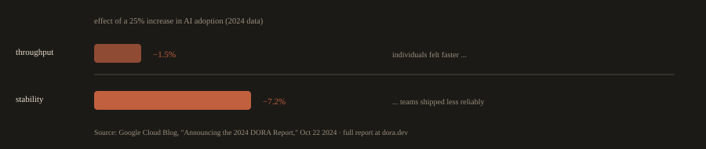

## 5. What the DORA Research Found About AI

This section covers findings from the 2024 and 2025 DORA Accelerate reports that are directly relevant to how you will work for the rest of this program and for the rest of your career. Module 24 goes deeper into AI in DevOps practice. This is the data that motivates Module 24's existence.

---
### The 2024 Finding: Throughput Up, Stability Down

The 2024 Accelerate State of DevOps report surveyed roughly 3,000 technology professionals and found that approximately 76% were already relying on AI for at least part of their job. The top uses were code writing, summarizing information, code explanation, code optimization, and documentation. About 75% of respondents reported productivity gains from using AI.

That is the headline most people read. The finding underneath it is the one that matters.

When the DORA team measured the effect of AI adoption on the team level delivery metrics they have been tracking for a decade, the numbers went the wrong way:

**Fig. 5 · 2024: +25% AI adoption, measured effect**

*Both things were true at once: the individual felt faster while the team's stability fell.*

- **A 25% increase in AI adoption was associated with an estimated 1.5% decrease in delivery throughput.**

- **The same 25% increase was associated with an estimated 7.2% decrease in delivery stability.**

---
>Source: Google Cloud Blog, "Announcing the 2024 DORA Report," October 22, 2024, and the full 2024 Accelerate State of DevOps Report published at dora.dev.
---

Individual engineers felt faster. Teams shipped less reliably. Both things were true at the same time.

---
### Why This Happens: Batch Size

The DORA team's primary explanation is batch size. AI makes it easy to write more code. More code per changeset means larger batches. Larger batches are riskier. This is not a new finding. DORA has shown for years that smaller changesets are safer. AI simply made it easier to violate that principle without noticing.

A developer using an AI assistant can produce a 500 line pull request in the time it used to take to write 100 lines. The PR looks clean. The tests pass. But the blast radius of that single deployment is five times larger than it used to be, and the reviewer is now reading five times more code, which makes it harder to catch the subtle bug on line 347 that the AI introduced confidently and incorrectly.

---
### The 2025 Finding: AI as Mirror and Multiplier

The 2025 DORA report, titled "State of AI-assisted Software Development," surveyed nearly 5,000 technology professionals. AI adoption had climbed to 90%, an increase of 14 percentage points from the prior year.

The central finding, stated directly by Google's announcement: "AI doesn't fix a team; it amplifies what's already there. Strong teams use AI to become even better and more efficient. Struggling teams will find that AI only highlights and intensifies their existing problems."

Source: Google Cloud Blog, "Announcing the 2025 DORA Report," September 23, 2025, and the full 2025 report published at dora.dev.

The 2025 report also noted a reversal: AI adoption was now associated with higher throughput (a positive change from 2024's negative throughput finding), but instability remained. As the report put it: "AI adoption not only fails to fix instability, it is currently associated with increasing instability."

The interpretation that best fits both years of data is the one the syllabus for this program states in its opening section: AI adoption tends to amplify the maturity, or the immaturity, of the delivery system it lands in. A team with strong tests, real observability, and a working rollback gets faster. A team without them gets faster at breaking things. Individual throughput rises across the board; at the team level, the stability gap widens for teams whose delivery system is weak and narrows for teams whose delivery system is strong.

---
### What This Means for You, Starting in Week 1

Every tool and practice in this program, the test gates, the pipeline structure, the observability stack, the rollback capability, the policy enforcement, the security scanning, exists partly because AI makes each one more important, not less.

You will use AI assistants throughout this course. You are expected to. But the assessment model (live defense of every graded artifact) and the disclosure requirement (which assistant, what it did, what it got wrong) exist because the 2024 and 2025 DORA data show that AI without strong surrounding practices makes teams less stable, and the review discipline is what separates useful AI adoption from expensive AI adoption.

Module 24 covers this in operational depth. The reason it is mentioned here, in Week 1, is that every lab you submit between now and then is building the system that decides whether the AI module helps you or hurts you.

---
