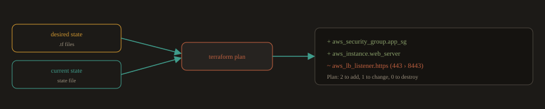

## 6. Infrastructure as Code: Beyond the Basics

You learned in Part A what IaC is and the difference between declarative and imperative tools. This section covers how IaC actually operates inside engineering workflows, the problems it creates when applied incorrectly, and the practices that make it work well.

### Configuration Drift: The Problem IaC Prevents

Configuration drift is what happens when the actual state of your infrastructure gradually diverges from what you intended or documented. It accumulates silently.

A common sequence that leads to drift:

**Fig. 6a · How an undocumented manual fix becomes an outage**


*The declared config is the single source of truth: anything changed outside the workflow is overwritten on the next run.*

1. An engineer SSHs into a production server to debug an incident and changes an nginx config to get it working.

2. The fix works. The incident is resolved. Nobody documents the change.

3. Three months later, Terraform runs and reverts the config to what it has in state.

4. Production breaks.

5. Nobody knows why because the undocumented change was invisible.

IaC prevents this by making the declared configuration the single source of truth. Any change made outside the IaC workflow is overwritten the next time the tool runs. This is painful when it first happens, but it enforces a discipline that keeps environments predictable.

---
> Never make manual changes to infrastructure managed by an IaC tool. If you need to make a change, make it in the code, commit it, and let the pipeline apply it. Emergency exceptions should be documented and followed immediately by a PR that captures the change in code.
---
### Desired State vs. Current State

Terraform and similar declarative tools work by comparing two states:

- **Desired state:** what you declared in your `.tf` files

- **Current state:** what actually exists, recorded in the state file

**Fig. 6b · terraform plan computes the diff**



*Approving the PR means you reviewed and accepted these infrastructure changes, not just the code.*

`terraform plan` computes the diff between these two states and shows you exactly what it will create, modify, or destroy. Nothing changes until you run `terraform apply`.

This diff is important enough to treat as a required review step. In production environments, a common practice is to run `terraform plan` in CI on every pull request and post the output as a PR comment. Reviewers can see exactly what infrastructure changes the PR will make before they approve it.

Example terraform plan output in a PR comment

```
Plan: 2 to add, 1 to change, 0 to destroy.

+ aws_security_group.app_sg
+ aws_instance.web_server
~ aws_lb_listener.https (port 443 > 8443)
```

Approving a PR with this output means you reviewed and accepted these infrastructure changes, not just the code changes. That is a meaningful shift in accountability.

---
### Version Controlled Infrastructure in Practice

Infrastructure code in Git gives you several capabilities you do not have with manual infrastructure:

**Rollback:** 

If a Terraform change breaks something, `git revert` the commit and re apply. The infrastructure returns to its previous state.

**Audit trail:** 

Every infrastructure change has a commit with an author, a timestamp, and a message. "Who changed the security group on March 3rd?" is a `git log` query, not an investigation.

**Environment parity through modules:** 

The same Terraform module can provision a development environment and a production environment, with the only differences being variable values (instance size, replica count, retention period). This makes drift between environments visible: if staging and production diverge, it shows up in the code as a difference in variable values, not as a hidden configuration difference on a server somewhere.

**Code review for infrastructure changes:** 

A firewall rule change, a new IAM policy, or a database parameter group modification all go through a pull request. Another engineer reviews it before it applies to production. This catches mistakes before they become incidents.

---
### Common IaC Mistakes

**Storing secrets in IaC files:** 

Never put passwords, API keys, or certificates in Terraform code or Ansible playbooks. Use a secrets manager (HashiCorp Vault, AWS Secrets Manager) and reference it in your IaC. Secrets in code leak through Git history, CI logs, and PR comments.

**Unreviewed `terraform apply` in production:** 

Running `terraform apply` directly from a local machine against a production environment bypasses the review process and can cause irreversible damage. Production applies should only happen through the CI/CD pipeline after a plan has been reviewed and a PR has been approved.

**Monolithic state files:** 

Storing all your infrastructure in one Terraform state file creates a bottleneck (only one operation can run at a time), a blast radius problem (an error in one resource can lock the entire state), and slow plan times as the infrastructure grows. Separate state files by environment and by logical component (networking, compute, data).

**Ansible for provisioning instead of configuration:** 

Ansible is excellent for configuring software on existing servers. It is a poor substitute for Terraform when it comes to provisioning infrastructure. Teams that write Ansible playbooks to create EC2 instances discover that idempotency is harder to guarantee and state management is significantly more complex than with Terraform. Use each tool for what it does best.

---
