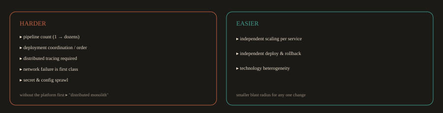

## 7. Microservices vs. Monolith: The DevOps Perspective

Part A introduced the architectural differences. This section focuses specifically on what microservices mean for a DevOps engineer: what gets harder, what gets easier, and what breaks if you are not prepared.

**Fig. 7 · The DevOps trade off of microservices**

*The wins are real, but only for teams that already have the operational foundation in place.*

---
### What Gets Harder

**Pipeline count:** A monolith has one CI/CD pipeline. A system of 30 microservices has 30 pipelines. Each one needs to be maintained, updated when the base image changes, kept current with security patches, and monitored for failures. The operational cost of pipeline maintenance is real and is often underestimated when teams migrate to microservices.

**Deployment coordination:** 

In a monolith, you deploy one artifact. In microservices, a single feature might require coordinated deployments across three services. If Service A expects a new API field that Service B provides, you must deploy Service B first, verify it, then deploy Service A. Getting deployment order wrong causes production failures. This is why GitOps and declarative deployment tooling (ArgoCD, Flux) are particularly valuable in microservices environments: you can version and test the deployment order as code.

**Distributed tracing requirement:** 

In a monolith, you can grep a log file. In a system with 30 services, a user's request might touch 8 of them before returning a response. Without distributed tracing, diagnosing a slow or failed request is nearly impossible. You need OpenTelemetry instrumented in every service, a trace collector, and a UI (Jaeger, Grafana Tempo) before you go to production, not after.

**Network failure as a first class concern:** 

In a monolith, function calls do not fail because of network timeouts. In microservices, every service to service call is a network call. Network calls fail. They time out. They return partial results. Every service must implement retry logic, circuit breakers, and graceful degradation. DevOps engineers need to test these failure modes deliberately (chaos engineering) rather than discovering them during incidents.

**Secret and configuration sprawl:**

A monolith has one set of environment variables. 30 microservices have 30 sets of secrets, each needing to be rotated independently, injected securely, and audited. Without a centralized secrets management strategy (Vault, AWS Secrets Manager, Kubernetes Secrets with External Secrets Operator), this becomes unmanageable quickly.

---
### What Gets Easier

**Independent scaling:** 

A monolith scales as a unit. If your search endpoint is under load, you scale the entire application. In Kubernetes with microservices, you scale the Search Service independently. This is significantly more cost efficient at scale and is one of the primary economic arguments for microservices at high traffic volumes.

**Independent deployment and rollback:** 

A bug in the Notification Service does not require rolling back the Trip Service. Each service can be deployed and rolled back independently without affecting others. This reduces the blast radius of any individual deployment significantly.

**Technology heterogeneity:** 

The Pricing Service can be written in Go for performance. The ML recommendation service can be in Python. The legacy payment integration can stay in Java. In a monolith, you are locked into one stack. This flexibility has real costs (multiple languages to hire for, multiple build systems to maintain), but for teams where different capabilities genuinely need different technology, it is a significant advantage.

---
### Operational Maturity Requirements

Microservices impose a minimum level of operational maturity. If these capabilities are not in place before you migrate to microservices, the migration will make things worse, not better:

| Capability | Why It Is Required for Microservices |
| --- | --- |
| Containerization | Services must be packaged consistently and run reliably across environments |
| Container orchestration (Kubernetes) | You cannot manage 30+ services manually |
| Service discovery | Services need to find each other dynamically as pods are created and destroyed |
| Centralized logging | Per service log files are unworkable at scale |
| Distributed tracing | You cannot debug cross service failures without it |
| Health checks and readiness probes | Kubernetes needs to know when a service is ready to receive traffic |
| Circuit breakers and retry logic | Network failures between services are not optional edge cases |
| Secrets management | 30 services with hardcoded secrets is a security disaster |

Teams that migrate a monolith to microservices without this foundation in place end up with what is sometimes called a "distributed monolith": all the operational complexity of microservices with none of the deployment independence, because the services are too tightly coupled to be deployed or scaled independently.

---
### Monolith First Is Not Wrong

For most teams and most products, starting with a well structured monolith is the correct engineering decision. Microservices introduce coordination overhead that is not worth paying when the team is small and the traffic volume does not require independent scaling.

The rule of thumb used at many experienced engineering organizations: start with a monolith, extract a service when one piece of the system genuinely needs to scale, deploy, or change at a different rate from everything else, and when the team is large enough to own that service independently.

---
