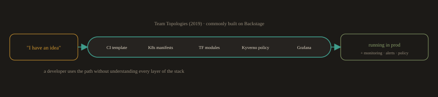

## 8. Platform Engineering and AI Assisted Operations:

This section is intentionally brief. Platform engineering is covered properly in Module 23 and AI in DevOps is covered in Module 24. The purpose here is to show you the road ahead so you can see where the pieces you are learning now fit into the larger picture.

---
### Platform Engineering

As organizations grow, every team faces the same problem: the cognitive load of holding Kubernetes, Terraform, the CI system, the observability stack, the policy engine, and their own product domain in their heads at the same time is too much. Teams make shortcuts. They skip the security scan because they do not know how to configure it. They copy another team's pipeline and change the app name without understanding the deployment strategy. They deploy to production with no monitoring because setting up Grafana dashboards was too many steps.

**Fig. 8 · The golden path**

*The platform team packages everything you build in this program into a paved, self service route.*

Platform engineering solves this by building a "golden path": a paved, tested, self service route from "I have an idea" to "it is running in production with monitoring, alerts, and policy enforcement." The platform team's job is to take everything you will build in this program, CI templates, Kubernetes manifests, Terraform modules, Kyverno policies, Grafana dashboards, and package it so that a product developer can use it without understanding every layer of the stack.

The concept comes from Team Topologies (Skelton and Pais, 2019), and the most common implementation tool is Backstage, an open source internal developer portal originally built at Spotify.

You will explore Backstage and design a golden path in Module 23. The capstone project (Module 25) asks you to write a platform style README that describes your whole pipeline as a golden path a new developer could follow on day one. That capstone component is platform engineering in miniature.

---
### AI Assisted Operations

AI is entering operational workflows in three ways:

**AI in the code pipeline.** 

Assistants that write code, generate Terraform, draft Kubernetes manifests, and review pull requests. You have been using these since Module 0. The key discipline, review everything before applying it, is the subject of Module 24.

**AIOps.** 

Language models and anomaly detection systems that watch metrics and logs, detect unusual patterns a fixed threshold alert would miss, and predict scaling needs from traffic patterns rather than reacting after the fact. This is operational AI that runs alongside Prometheus and Alertmanager rather than replacing them.

**Chat driven operations.** 

A language model that can query your observability stack and summarize an incident in plain language. "What changed in the last hour?" answered by an assistant that reads your Prometheus data, your deploy logs, and your recent Git commits, then produces a summary. Where this genuinely helps an on call engineer at 3am, and where it will confidently summarize an incident that is not the one you are having, is the subject of Module 24.

The thread that connects all three is the same one the DORA data surfaces: AI amplifies whatever system it lands in. If your pipeline has real tests, real scans, and a real rollback, AI makes you faster. If it does not, AI makes you faster at shipping broken things.

---
