# The Delivery Engineering Mindset

> Foundations first, then engineering depth: how modern software gets built, shipped, and kept running, and why DevOps grew up to connect the phases that once sat behind walls.

> This module is for anyone starting the DevOps course with little or no background in how software is built and delivered professionally. 

> If you have experience in software development, skim Part A and use it as a reference. If you are new, read it carefully before moving into Part B. 

---
# Part A · Foundations

## F.1 The Software Development Lifecycle

### What Is the SDLC?

Every software project, from a simple mobile app to a hospital management system, goes through roughly the same set of activities: figure out what to build, design it, build it, test it, ship it, and keep it running. The Software Development Lifecycle, or SDLC, is the structured framework that organizes these activities into defined phases with clear ownership, timelines, and outputs.

Without a structured process, teams build the wrong thing, miss deadlines, discover critical bugs after launch, or create systems that nobody can maintain six months later. The SDLC exists to prevent exactly these problems.

Think of it like a construction project. You do not start pouring concrete before the architect draws the plans. You do not move tenants in before the safety inspection. Software works the same way.

**Fig. F.1 · The seven phases as a flow**

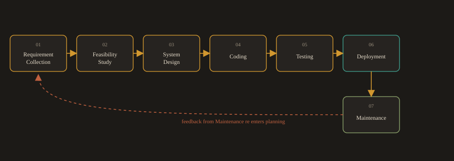

*Requirements flow forward through build and release; production learnings loop back to the start.*

---
## Why every DevOps engineer needs to understand SDLC:

DevOps does not replace the SDLC. It accelerates it. When you automate a pipeline, you are automating the Build and Test phases. When you set up monitoring, you are supporting the Maintenance phase. You cannot optimize a process you do not understand.

## The Seven Phases

#### Phase 1: Requirement Collection

The team gathers and documents what the software must do. This is the most expensive phase to get wrong. A missed or misunderstood requirement discovered after the code is written costs ten times more to fix than one caught here.

**Responsible:** Product Managers, Business Analysts, Stakeholders.

**Tools:** Jira for tracking user stories and tasks, Confluence for documenting decisions and meeting notes.

**Example:** 

A team building a fitness tracking app would document requirements like step counting, heart rate monitoring, sleep tracking, and Bluetooth sync with wearable devices. Each requirement becomes a user story in Jira: "As a user, I want to see my daily step count on the home screen so I can track my progress without opening a sub-menu."

#### Phase 2: Feasibility Study

Before committing budget and engineers, the team evaluates whether the project is actually achievable. This is not a formality. Projects get cancelled or descoped here when the numbers do not work out.

**Questions answered:** Can we afford to build and run this? Do we have engineers with the right skills? Are there legal or regulatory constraints? Is the timeline realistic?

**Example:** 

A startup building a smart home security app must confirm it can afford hardware integration testing, comply with IoT security standards in each target country, and hire embedded systems engineers before locking in a launch date.

#### Phase 3: System Design

Requirements are translated into a technical blueprint. This includes system architecture (how the pieces fit together), database schema (how data is structured and stored), API specifications (how services communicate), UI wireframes (what users see), and infrastructure design (where everything runs).

**Responsible:** System Architects, UI/UX Designers, Database Designers.

**Example:** 

For a ride sharing app, architects choose a microservices architecture with separate services for users, trips, pricing, and notifications. They design the database tables, draw the API contracts between services, and produce wireframes for the booking and payment flows. All of this is documented before a single line of code is written.

#### Phase 4: Coding

Developers implement the application based on the approved design. In modern teams, this does not mean one long period of coding followed by a handoff. It means short cycles: write a small piece, commit it, have it reviewed, merge it, repeat.

**Responsible:** Frontend Developers, Backend Developers.

**Example:** 

Backend developers build REST APIs in Python. Frontend developers build the browser interface in React. Database queries run against PostgreSQL. All code lives in Git, and every change goes through a pull request before it merges.

#### Phase 5: Testing

The QA team verifies that the software works correctly, handles edge cases, stays fast under load, and meets the original requirements. In modern DevOps, testing is not a separate phase that happens at the end. Tests run automatically on every code change, continuously throughout development.

**Responsible:** QA Engineers, Test Automation Engineers.

| Test Type | What It Checks | Example Tools |
| --- | --- | --- |
| Unit | Individual functions in isolation | PyTest, JUnit |
| Integration | How modules work together | TestNG, PyTest |
| End to End | Full user flows in a browser | Selenium, Playwright |
| Performance | Behavior under load | k6, JMeter |
| Security | Known vulnerabilities in code and dependencies | Semgrep, Trivy |

#### Phase 6: Deployment

The tested application is released to the production environment, where real users access it. In traditional teams, this meant a manual process handled by operations engineers, often late at night, following a long checklist. In DevOps, deployment is automated through a pipeline and can happen multiple times per day.

**Responsible:** DevOps Engineers, Platform Engineers.

**Example:** 

A GitHub Actions pipeline triggers on every merge to the main branch. It builds a Docker image, runs the test suite, scans for vulnerabilities, signs the image, and deploys it to a Kubernetes cluster. The whole process takes about eight minutes and requires no human steps.

#### Phase 7: Maintenance

After deployment, the team keeps the software running, secure, and aligned with evolving user needs. This never ends.

**Responsible:** Support Engineers, DevOps Engineers, SRE teams.

**Three kinds of maintenance:**

- **Corrective:** 

Fixing bugs discovered after launch (a crash on a specific device model).

- **Adaptive:** 

Updating compatibility (supporting a new operating system version or API version from a third party service).

- **Perfective:** 

Improving the product based on user feedback (adding dark mode because users keep requesting it).

---
### How SDLC Connects to DevOps

DevOps does not remove any of these phases. It removes the walls between them. In a traditional setup, each phase is handled by a different team in isolation, with slow, manual handoffs between them. In a DevOps setup, the same cross functional team owns the entire lifecycle, automation connects the phases, and feedback flows continuously from production back to planning.

**Fig. F.1b · Walls removed: siloed handoffs vs. shared ownership**

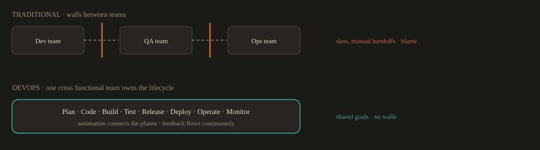

*DevOps keeps the phases; it dissolves the handoff boundaries between the teams that own them.*

| SDLC Phase | DevOps Practice That Accelerates It |
| --- | --- |
| Requirement Collection | User stories in Jira linked directly to Git commits |
| Design | Architecture documented as code using Mermaid or PlantUML |
| Coding | Short lived feature branches with automated checks on pull requests |
| Testing | Automated tests run in the CI pipeline on every push |
| Deployment | CI/CD pipeline deploys on every merge to main |
| Maintenance | Prometheus alerts detect and route issues automatically |

---
## F.2 Development Models

Two models have dominated software development for the last few decades. Understanding both, including why one fell out of favor and when it still makes sense, is important context for understanding why DevOps emerged.

---
### Waterfall

Waterfall is a linear, sequential model. Each phase must be fully completed and signed off before the next one begins. There is no going back without a formal change process.

The name comes from the visual: requirements flow downward into design, design flows into development, and so on. Water does not flow upward.

**Fig. F.2a · Waterfall: the cascade**

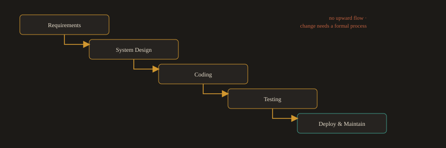

*Each phase is signed off before the next begins. Water does not flow upward.*

### How it works in practice:

| Phase | Typical Duration | Output |
| --- | --- | --- |
| Requirements | 3 weeks | Signed Software Requirements Specification (SRS) |
| System Design | 4 weeks | Architecture document, DB schema, UI wireframes |
| Coding | 10 weeks | Working codebase, unit test reports |
| Testing | 4 weeks | Test report, signed release candidate |
| Deployment | 1 week | Live system, runbooks |
| Maintenance | Ongoing | Bug fixes, patches, enhancement requests |

**When Waterfall makes sense:**

- Requirements are fixed, fully understood, and legally binding before work starts (government contracts, regulated medical devices, embedded firmware).

- Heavy documentation is a contractual or compliance requirement.

- The team is geographically distributed, and asynchronous collaboration is limited.


### Why it fails for most modern software:

The market changes. Users change their minds. Technologies evolve. In Waterfall, a requirement discovered to be wrong in week nine of coding requires going all the way back to phase one. By the time the product ships, it may be solving a problem that no longer exists.

**Real case:** 

The UK National Health Service launched a national IT programme in 2003, planned using a Waterfall approach. Requirements were locked before technology or clinical workflows were fully understood. The programme was cancelled in 2011 after spending over 10 billion pounds without delivering the core systems. The root cause: massive upfront requirements commitments that could not adapt to changing clinical needs.

---
### Agile

Agile is an iterative, incremental model. Instead of delivering everything at the end of a long process, the team ships working software in short cycles called sprints, typically one or two weeks long. Requirements evolve based on feedback. The plan adapts continuously.

The Agile Manifesto (2001) established four core values:

- Individuals and interactions over processes and tools

- Working software over comprehensive documentation

- Customer collaboration over contract negotiation

- Responding to change over following a plan

**Fig. F.2b · The sprint cycle**

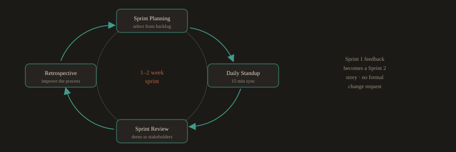

*Plan > build > demo > reflect, then repeat. The backlog reprioritizes instead of triggering paperwork.*

### How a sprint works:

1. **Sprint Planning:** 

The team selects stories from the prioritized backlog and commits to completing them within the sprint.

2. **Daily Standup:** 

A 15 minute daily sync. Each person answers: what did I finish yesterday, what will I do today, what is blocking me?

3. **Sprint Review:** 

At the end of the sprint, the team demos working software to stakeholders and collects feedback.

4. **Sprint Retrospective:** 

The team reflects on their process and agrees on one or two concrete improvements to make in the next sprint.

### Example: E-commerce site, built with Agile:

| Sprint | Delivered | Stakeholder Feedback |
| --- | --- | --- |
| 1 | User login, basic product catalog | "Add Google login, it is what our users expect" |
| 2 | Shopping cart, product search | "Add coupon codes before we launch the marketing campaign" |
| 3 | Checkout, payment gateway, order history | "Show a link to the confirmation email on the success screen" |

Notice that feedback from Sprint 1 becomes a story in Sprint 2. There is no formal change request process. The backlog simply gets reprioritized.


### When Agile works best:

- Requirements are expected to evolve or are not fully understood upfront, which describes most modern software.

- Fast time to market matters.

- Stakeholders can be engaged continuously, not just at milestones.

---
### The Major discipline Agile requires:

Agile does not mean "no planning." It means planning frequently in short horizons. Without discipline around scope, daily standups turn into status meetings, and sprints become mini Waterfalls. Agile also requires automated testing. If you cannot validate every sprint's work quickly, the pace of delivery breaks quality.

---
### Choosing the Right Model

| Factor | Waterfall | Agile |
| --- | --- | --- |
| Requirements stability | Fixed and fully known | Evolving or partially known |
| Feedback cadence | Formal reviews at phase gates | Continuous, every sprint |
| Tolerance for change | Low, changes are expensive | High, changes are expected |
| Documentation needs | Heavy, required for compliance | Lightweight, just enough |
| Delivery style | Single delivery at project end | Incremental delivery every sprint |
| Best suited for | Regulated systems, fixed contracts | SaaS products, mobile apps, most modern software |

---
## F.3 DevOps

### What Is DevOps?

DevOps is a cultural philosophy and a set of engineering practices that unifies software development and IT operations. The core goal is to deliver software faster, more reliably, and with fewer failures, while maintaining the ability to respond quickly when things go wrong.

Before DevOps, development and operations were separate teams with different goals and different incentives:

- Developers were measured on shipping features quickly.

- Operations teams were measured on system stability.

- These goals were in direct conflict. Developers wanted to change things. Operations wanted to keep things the same.

The result was slow, painful releases. Developers wrote code and handed it to operations with incomplete documentation. Operations deployed it manually, often following undocumented procedures. When something broke in production, both teams blamed each other.

DevOps eliminates this conflict through shared ownership, automation, and continuous feedback. The team that builds the software also operates it and is responsible for its reliability. When something breaks at 2am, the people who wrote the code are on call.

---
### The eight dimensions of DevOps:

**Fig. F.3a · The eight dimensions**


*Eight practice areas that together define a mature DevOps organization.*

| Dimension | What It Means in Practice |
| --- | --- |
| Culture and Collaboration | Shared goals, no blame culture, psychological safety to raise problems early |
| Automation | Build, test, provision, deploy, and remediate with code, not manual steps |
| CI/CD | Code integrates and ships in small, frequent, safe batches |
| Observability | Metrics, logs, and traces give real time visibility into system behavior |
| Lean Flow | Small batch sizes and fast feedback loops eliminate waste |
| Reliability Engineering | SLOs and error budgets govern the balance between velocity and stability |
| Security Shift Left | Security checks run in development and CI, not only before release |
| Continuous Learning | Blameless postmortems and experimentation drive steady improvement |

---
### The DevOps Lifecycle

The DevOps lifecycle is represented as an infinite loop to show that it never ends. Monitoring data feeds back into planning, which starts the next cycle. The eight stages are:

**Fig. F.3b · The infinite loop (signature)**

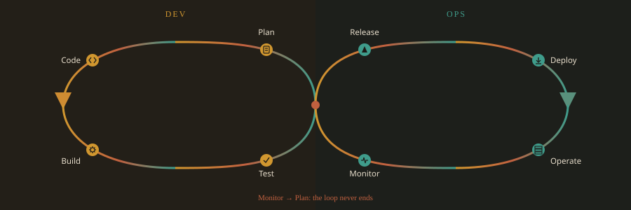

*Plan · Code · Build · Test · Release · Deploy · Operate · Monitor · and back to Plan.*

```
Plan > Code > Build > Test > Release > Deploy > Operate > Monitor > (back to Plan)
```

#### Stage 1: Plan

Teams define requirements, prioritize features, and break work into small, traceable tasks. Every piece of work ties to a user story. Commit messages reference ticket numbers so a change can be traced from the original requirement all the way to the production deployment.

**Tools:** Jira, GitHub Issues, Confluence.

#### Stage 2: Code

Developers write code on short lived feature branches and commit frequently. Small, focused commits are easier to review, easier to test, and easier to roll back if something goes wrong. Long running branches cause painful merge conflicts and delayed integration.

**Tools:** Git, GitHub, VS Code, IntelliJ.

**A typical branch workflow:**

Create a feature branch from the latest main
```bash
git checkout -b feat/user-password-reset
```

Make changes, stage and commit with a descriptive message
```bash
git add .
git commit -m "feat: add password reset email flow with 24h expiry token"
```

Push to remote and open a pull request
```bash
git push origin feat/user-password-reset
```

#### Stage 3: Build

On every push or pull request, a CI pipeline triggers automatically. It compiles the code, runs unit tests, runs static analysis, scans for known vulnerabilities, and produces a build artifact such as a container image or a JAR file. If any step fails, the pipeline stops immediately and notifies the developer.

**Tools:** GitHub Actions, Jenkins, GitLab CI.

A typical CI pipeline flow:
```
push to branch
  checkout code
  install dependencies
  compile or build
  run unit tests
  run static analysis (lint, SAST)
  scan dependencies for known CVEs (SCA)
  build container image
  push image to registry
```

**Fig. F.3c · A CI build pipeline, step by step**

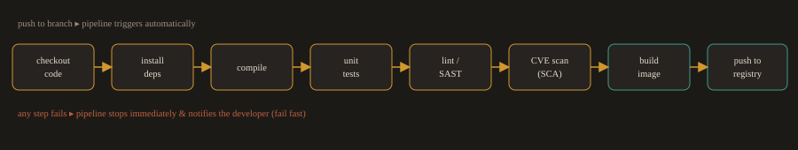

*Triggered on every push. If any gate fails, the pipeline halts and reports back at once.*

#### Stage 4: Test

Automated quality gates run at multiple levels. Tests are not a phase that happens at the end of development. They run continuously throughout.

| Test Type | What It Checks | Tools |
| --- | --- | --- |
| Unit | Individual functions in isolation | PyTest, JUnit |
| Integration | How modules work together | TestNG, PyTest |
| End to End | Full user flows in a browser | Selenium, Playwright |
| Performance | Behavior under high load | k6, JMeter |
| Security (SAST) | Code level vulnerabilities | Semgrep, SonarQube |
| Container scanning | Known CVEs in the base image and installed packages | Trivy, Grype |
| Policy | Infrastructure configuration compliance | Checkov, OPA |

Shifting left means running these tests earlier and earlier in the pipeline. A security vulnerability found during development costs a fraction of one found after deployment.

#### Stage 5: Release

Releasing is the decision to make a tested build available in production. Two related but distinct practices govern how that decision is made:

- **Continuous Delivery:** every passing build produces a release candidate that could be deployed to production. A human approves the final promotion to production.

- **Continuous Deployment:** every passing build deploys to production automatically, with no human step required.

Most organizations practice Continuous Delivery. Fully automated Continuous Deployment is common at high maturity organizations with very high test coverage and mature rollback capabilities. Release is also where the concepts of deploying and releasing separate: code can be deployed to production while the user facing feature stays hidden behind a feature flag until the business decides to turn it on.

**Tools:** GitHub Actions, ArgoCD, GitHub Environments.

#### Stage 6: Deploy

Deployment is the technical act of getting the released build running in the production environment. The strategy chosen controls how much risk each deployment carries:

**Fig. F.3d · Four deployment strategies**

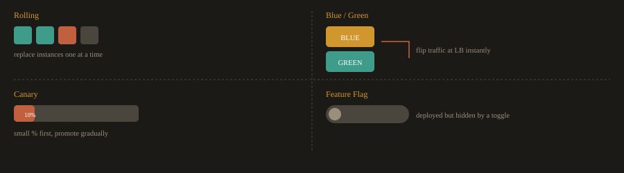

*Each strategy trades a different amount of risk against speed and blast radius.*

| Strategy | How It Works | Risk Level |
| --- | --- | --- |
| Rolling | Replace old instances one at a time, health check each one | Low |
| Blue/Green | Run two identical environments, switch traffic instantly at the load balancer | Very low |
| Canary | Route a small percentage of traffic to the new version first, promote gradually | Very low |
| Feature Flag | Deploy code to production but hide the feature behind a runtime toggle | Very low |

**Tools:** GitHub Actions, Jenkins, ArgoCD, Helm, Terraform, Ansible.

#### Stage 7: Operate

Once deployed, the application must be kept running. This includes configuration management, patching, scaling, and incident response. In a mature DevOps setup, all infrastructure is defined as code. No engineer makes manual changes directly to production servers. Every change goes through version control, code review, and the pipeline.

**Tools:** Ansible, Terraform, Kubernetes.

#### Stage 8: Monitor

Observability tools collect metrics, logs, and traces from the running system. Dashboards and alerts give the team visibility into what the system is doing right now, what happened at a specific moment in the past, and where a slow request spent its time.

The three pillars of observability:

**Fig. F.3e · The three pillars of observability**

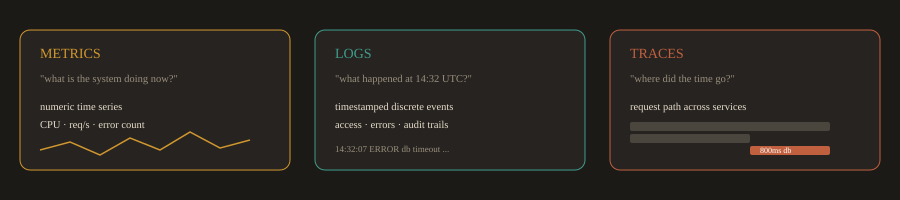

*Metrics (Prometheus/Grafana), logs (Elastic Stack), traces (OpenTelemetry/Jaeger).*

- **Metrics:** 

numeric time series data answering "what is the system doing right now?" Examples: CPU usage, requests per second, error count.

- **Logs:** 

timestamped records of discrete events answering "what happened at 14:32 UTC?" Examples: access logs, application error logs, audit trails.

- **Traces:** 

the path a request took through distributed services, answering "where did this slow request spend its time?" Examples: a trace showing a request spent 800ms waiting for a database query.

**Tools:** 

Prometheus and Grafana (metrics), Elastic Stack (logs), OpenTelemetry and Jaeger (traces).

Before a system goes live, the team defines Service Level Indicators (SLIs) and Service Level Objectives (SLOs). An SLI is the measurement (for example, the percentage of requests that succeed). An SLO is the target (for example, 99.9% of requests must succeed over a rolling 30 day window). When an SLO is at risk of being breached, alerts fire and the on call engineer responds.

---
### Closing the loop:

Monitoring data, incident reports, and retrospectives feed directly back into the Plan stage, which is why the lifecycle is drawn as an infinite loop rather than a straight line. After every significant incident, the team conducts a blameless postmortem: a structured analysis focused on what in the system or process allowed the failure to happen, not on who made a mistake. Every postmortem produces concrete action items that become work items in the next planning cycle.

---
## F.4 SRE vs. DevOps

### What Is Site Reliability Engineering?

Site Reliability Engineering (SRE) was created at Google around 2003. Google was operating services at a scale no one had operated before, and the traditional operations model, where a separate team manually maintains systems, was not going to scale. The solution was to hire software engineers to do operations work and give them the tools to automate it.

The Google SRE book, published in 2016, defines it directly: "SRE is what happens when you ask a software engineer to design an operations team."

If DevOps is the philosophy that development and operations should work closely together, SRE is one concrete, opinionated way to implement that philosophy.

---
### Core SRE Concepts

**Fig. F.4a · From measurement to allowance**


*The SLI is measured, the SLO is agreed, the error budget falls out of the gap to 100%.*

---
**Service Level Indicator (SLI)**

A specific, measurable metric that represents one aspect of service quality. Examples:

- The percentage of HTTP requests that return a 2xx status code (availability SLI)

- The 95th percentile response time for API requests (latency SLI)

- The percentage of background jobs that complete successfully (correctness SLI)

**Service Level Objective (SLO)**

A target value for an SLI over a defined time window. Examples:

- 99.9% of requests must succeed over a rolling 30 day window

- The p95 latency for the search API must stay below 300ms

SLOs are internal agreements between the engineering team and the product team. They are not the same as SLAs (Service Level Agreements), which are contractual commitments to customers with financial penalties for breach.

---
**Error Budget**

The amount of unreliability the SLO allows. If the SLO is 99.9% availability, the error budget is 0.1%, which works out to about 43 minutes of downtime per month.

The error budget is the key mechanism that aligns development velocity and operational stability. When the error budget is healthy, the team can deploy frequently and take risks. When the error budget is nearly exhausted, the team stops feature deployments and focuses entirely on reliability improvements. Both teams agree on this tradeoff upfront, which removes the need for negotiation during an incident.

---
**Toil**

Repetitive, manual, automatable operational work that does not produce lasting value. Restarting a service manually every time it crashes is toil. Writing a script that detects the crash and restarts it automatically eliminates that toil. SREs are expected to keep toil below 50% of their working time. Anything above that gets automated.

---
**Blameless Postmortem**

A structured written analysis of an incident that focuses on what in the system or process failed, not on who made a mistake. The goal is to find action items that make the system safer. Blaming individuals does not prevent the next incident. Fixing the system does.

---
### DevOps vs. SRE

| Aspect | DevOps | SRE |
| --- | --- | --- |
| What it is | Cultural philosophy and set of practices | A specific engineering role and implementation model |
| Focus | Collaboration, automation, continuous delivery | Reliability, scalability, eliminating operational toil |
| Key concepts | CI/CD, IaC, shared ownership, feedback loops | SLOs, error budgets, toil reduction, blameless postmortems |
| Key metrics | Deployment frequency, lead time, change failure rate, failed deployment recovery time | Availability, latency, error rate, saturation |
| Core philosophy | "You build it, you help run it" | "Operations is a software engineering problem" |
| Prescriptiveness | Principles and values, teams implement them as they see fit | Specific job descriptions, defined toil cap, SLO framework |
| Origin | Community driven, popularized at the 2009 Velocity conference | Created at Google in 2003, published in the SRE book in 2016 |

The most important thing to understand: DevOps and SRE are not competing approaches. Most large organizations practice DevOps broadly across all their teams while having dedicated SRE teams focused specifically on reliability for their most critical services.

---
### SRE in Practice: A Real Incident

This example shows how SRE concepts apply during an actual outage.

**Situation:** A CDN provider deployed a new Web Application Firewall rule. The rule caused a CPU spin loop during packet inspection on approximately half of their edge servers globally, producing cascading 502 errors for end users.

**Fig. F.4b · Incident timeline (68 minutes)**


*Detection to resolution in 68 minutes; the postmortem targets the system, not the person.*

---
**Timeline:**

13:42 UTC: Monitoring detects 502 error rates exceeding 5%, breaching the error rate SLO. PagerDuty pages the on call SRE.

13:50 UTC: The on call SRE declares a major incident and assembles a response team (networking, security, and operations engineers in a shared incident channel).

14:05 UTC: Initial hypothesis (DDoS attack) ruled out by traffic analysis. Log analysis on affected edge servers reveals the new WAF rule is causing the CPU spin loop.

14:35 UTC: Root cause confirmed. The WAF rule is rolled back globally. Affected servers recover within 10 minutes. Error rates return within SLO.

14:50 UTC: Incident resolved. Postmortem document opened.

---
**Postmortem action items (targeting the system, not individuals):**

- Implement canary rollout for all WAF rule changes: deploy to 1% of edge servers, monitor for 30 minutes, then promote globally.

- Add synthetic traffic tests that run against the WAF in staging every 5 minutes.

- Move all firewall configuration into Git with pull request review required before any change can be applied.

- Update the on call runbook to include a "check CPU load on edge nodes" step as part of the initial triage checklist.

- Automate rollback: if CPU load or error rates spike above threshold within 10 minutes of a WAF rule deployment, trigger an automatic rollback without waiting for human intervention.

No individual was blamed in this postmortem. The action items target the process (no canary for WAF rules), the tooling (no synthetic monitoring in staging), and the documentation (incomplete runbook). Those are the things that, when fixed, prevent the next incident.

---
## F.5 Infrastructure as Code

---
### The Problem Before IaC

Before Infrastructure as Code became standard practice, setting up a server meant logging in and running commands manually. A system administrator would install packages, edit configuration files, set up users, configure the firewall, and restart services, all by hand, following a document that was usually out of date. In cloud environments the same work was often done by clicking through the provider's web console, a practice now called ClickOps.

This created three serious problems:

**Fig. F.5a · ClickOps vs. Infrastructure as Code**

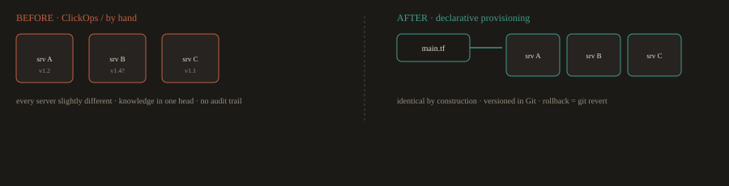

*The industry shift: from hand built, divergent "snowflake" servers to reproducible infrastructure from code.*

**Snowflake servers:** 

Every server was slightly different because every administrator made slightly different choices. What worked on one server might not work on another.

**Knowledge lock in:** 

The configuration existed only in the administrator's memory and in an incomplete wiki. When that person left, the institutional knowledge went with them.

**No auditability:** 

There was no record of who changed what, when, or why. Debugging a problem often meant comparing two servers and trying to spot the difference.

---
### What Is IaC?

Infrastructure as Code is the practice of defining and managing infrastructure, including servers, networks, databases, load balancers, and DNS records, using machine readable configuration files stored in version control.

The infrastructure is no longer a living artifact maintained by hand. It is a codebase. The same practices that apply to application code apply to infrastructure: version control, code review, automated testing, and deployment pipelines.

This is the shift the industry made away from ClickOps, provisioning infrastructure by manually clicking through a cloud console or running one off commands by hand, toward declarative provisioning, where the desired infrastructure is described in code and a tool makes reality match that description.

---
### Two Approaches

**Fig. F.5b · Declarative vs. imperative**

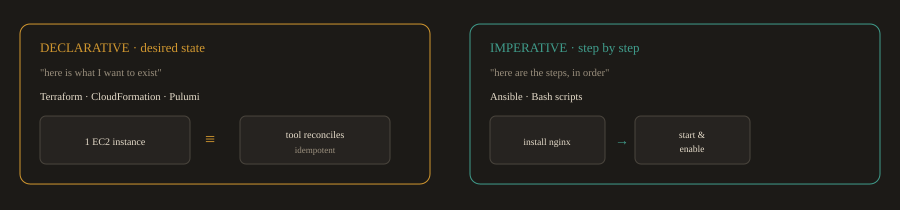

*Terraform provisions (creates the instance); Ansible configures it (installs and starts software). They complement each other.*

---
### Declarative (Desired State)

You describe what you want the infrastructure to look like. The tool compares your declaration to the current state and makes the changes needed to reconcile them.

Tools: Terraform, AWS CloudFormation, Pulumi.

```hcl
# Terraform: declare one EC2 instance
resource "aws_instance" "web" {
  ami           = "ami-0c02fb55956c7d316"
  instance_type = "t3.micro"
  tags = {
    Name = "web-server"
  }
}
```

Run `terraform apply` and Terraform creates the instance. Run it again and nothing happens because the instance already matches the declaration. This property is called idempotency: running the same operation multiple times produces the same result.

---
### Imperative (Step by Step)

You write the specific steps to execute in sequence. The tool runs them in order.

Tools: Ansible, Bash scripts.

```yaml
# Ansible: install and start nginx
- name: Install nginx
  dnf:
    name: nginx
    state: present

- name: Start and enable nginx
  service:
    name: nginx
    state: started
    enabled: true
```

In practice, Terraform and Ansible complement each other. Terraform provisions the infrastructure (creates the EC2 instance). Ansible configures it (installs nginx, copies config files, starts services).

---
### Why IaC Matters

**Speed:** Provision a complete environment in minutes instead of days. Spin up identical environments for development, testing, staging, and production on demand.

**Consistency:** Every environment is created from the same code. Configuration drift, where servers gradually diverge from each other due to manual changes, is eliminated.

**Auditability:** IaC files live in Git. Every change has a commit message, an author, a timestamp, and a diff showing exactly what changed. Rolling back is a `git revert`.

**Reproducibility:** Any team member can clone the repository and recreate the entire infrastructure with one command. No knowledge is locked in anyone's head.

**Cost control:** Environments can be torn down when not needed and recreated on demand. Development environments that used to run 24 hours a day can run only during working hours.

---
### IaC Tools

| Category | Tools | Primary Use |
| --- | --- | --- |
| Multi cloud provisioning | Terraform, Pulumi | Create and manage cloud resources across any provider |
| Cloud native provisioning | AWS CloudFormation, Azure ARM | Provision resources within a single provider's ecosystem |
| Configuration management | Ansible, Puppet, Chef | Configure software on already provisioned servers |

---
## F.6 Microservices Architecture

### The Monolith Problem

Most software starts as a monolith: a single application where all the features live in a single codebase and are deployed as a single unit. For a small team and a simple product, this is fine. Monoliths are easy to develop, test, and deploy in the early stages.

The problems emerge as the product and team grow:

- A bug in the payment module can crash the entire application, including the unrelated product catalog.

- Deploying a small change to one feature requires redeploying and retesting the entire application.

- The whole application must scale together. You cannot scale only the part that is under heavy load.

- Different parts of the system might benefit from different technologies, but the monolith forces one stack on everything.

**Fig. F.6a · Monolith vs. microservices**

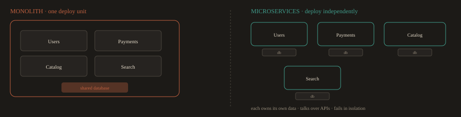

*Monolith: one codebase, one shared database, one blast radius. Microservices: each owns its data and deploys on its own.*

---
### What Is a Microservice?

A microservice is an independently deployable service that handles exactly one business capability. A microservices architecture is an application built as a collection of these small services, each running in its own process, owning its own data, and communicating with other services through well defined APIs.

| Aspect | Monolith | Microservices |
| --- | --- | --- |
| Codebase | Single repository, single deployment unit | Multiple repositories, independent deployments |
| Scaling | The entire application scales together | Each service scales independently based on its own demand |
| Failure impact | One failing module can bring down the whole application | Failures are isolated to one service |
| Technology choice | One technology stack for everything | Each service uses whatever technology is best for it |
| Deployment speed | Slow, the whole application must be built and deployed | Fast, deploy one service without touching any others |
| Team ownership | All developers work in the same codebase | Small teams own and operate specific services |

---
### A Real Example: Ride Sharing Platform

**Fig. F.6b · Ride sharing services and how they talk**


*The gateway routes external calls; services talk over REST, gRPC, and Kafka events without direct coupling.*

| Service | Responsibility | Communication |
| --- | --- | --- |
| User Service | Manages rider and driver profiles, handles authentication | REST API |
| Trip Service | Matches riders to drivers, tracks trips, stores history | REST API + Kafka events |
| Pricing Service | Computes dynamic fares based on demand and distance | gRPC (low latency calls) |
| Notification Service | Sends SMS and email alerts for trip events | Consumes Kafka events |
| API Gateway | Routes all external requests to the correct internal service | REST API |

A few terms worth knowing here:

- **REST API:** 

A standard way for services to communicate over HTTP. The most common approach for service to service calls in web systems.

- **gRPC:** 

A faster, more efficient communication protocol used when low latency matters, such as for real time pricing calculations.

- **Kafka:** 

A message broker that lets services communicate asynchronously. The Trip Service publishes a "trip completed" event to Kafka, and the Notification Service picks it up and sends the receipt. Neither service needs to know about the other directly.

---
**Major design rules in microservices:**

Each service owns its own database. No service queries another service's database directly. All data access goes through the API. This is what keeps services truly independent.

---
**Resilience patterns you will encounter:**

- **Circuit Breaker:** If the Pricing Service is down, the Trip Service falls back to a cached price rather than failing the entire booking.

- **Retry with Exponential Backoff:** If a network call fails due to a transient issue, the service retries automatically with increasing delays between attempts.

---
### Why This Matters for a DevOps Engineer

In a microservices environment, you are not managing one pipeline and one deployment. You are managing dozens or hundreds. Each service has its own CI/CD pipeline, its own container image, its own Kubernetes deployment manifest, and its own set of alerts.

Observability becomes critical. When a user reports a slow checkout, the problem could be in the API Gateway, the Trip Service, the Pricing Service, or the database. Distributed tracing, where each service passes a shared request ID through its logs and spans, lets you follow the full path of a request across all services and find exactly where the time was spent.

Tools you will use for this: Prometheus and Grafana for per service metrics, the Elastic Stack for centralized logs from all services, and OpenTelemetry with Jaeger for distributed traces.

**End of Part A: Foundations.* Part B continues with engineering level depth on each topic.*

---
---
# Part B · Core Concepts in Depth

> **Prerequisites:** This section assumes you have completed Part A. You already understand what DevOps is, what the SDLC phases are, what CI/CD means conceptually, and the basic difference between Waterfall and Agile. This section builds on that foundation with engineering level depth and real delivery team context.

---
## 1. The DevOps Lifecycle in Practice

You already know the eight stages: Plan, Code, Build, Test, Release, Deploy, Operate, Monitor. What Part A did not cover is how these stages actually run inside an engineering team, who owns what, where the handoffs happen, and where teams consistently get stuck.

---
### Who Owns What

In a mature DevOps organization, ownership does not map neatly to one team per stage. It overlaps deliberately.

| Stage | Primary Owner | Supporting Roles | Common Tool |
| --- | --- | --- | --- |
| Plan | Engineering Manager, Product Owner | All engineers (story refinement) | Jira, Linear |
| Code | Individual engineer | Peers (PR review) | Git, GitHub |
| Build | CI system (automated) | Platform/DevOps engineer (pipeline maintenance) | GitHub Actions, Jenkins |
| Test | CI system (automated) | QA engineer (test authoring) | PyTest, Selenium, Trivy |
| Release | CI/CD system (automated) | DevOps engineer (gate configuration) | GitHub Actions, ArgoCD |
| Deploy | CD system (automated) | DevOps/Platform engineer | Kubernetes, Helm, ArgoCD |
| Operate | DevOps, SRE, or on call developer | All engineers (on call rotation) | Kubernetes, Ansible |
| Monitor | Observability platform (automated) | DevOps/SRE (dashboard and alert authoring) | Prometheus, Grafana, Jaeger |

Notice that Build, Test, Release, and Deploy are almost entirely automated in a healthy setup. The DevOps engineer's job at those stages is not to do the work manually. It is to build and maintain the systems that do it automatically.

---
### The Automation Points That Matter Most

Not every stage benefits equally from automation. These four are where automation has the highest leverage:

**Fig. 1a · The four highest leverage automation points**


*Automate these four hard, and everything between them tends to follow.*

**Code to Build:** 

The trigger that starts everything. A push to a feature branch or a merge to main should automatically kick off the pipeline with zero human action. If a developer has to manually start a build, that is a process smell.

**Test gates:** 

Tests must block the pipeline, not just report results. A failing unit test that lets the build proceed anyway is theater. The gate must be real: fail the step, fail the pipeline, block the merge.

**Deploy to production:** 

The promotion from staging to production should require exactly one human decision (approval in GitHub Environments or a similar gate) and zero manual steps after that. Every manual step in a deployment is a risk surface and a future incident waiting to happen.

**Rollback:** 

Rollback should be as fast and automated as deployment. If your team needs 45 minutes to roll back a bad release, your deployment pipeline is incomplete regardless of how fast the forward path is.

---
### Where Real Teams Get Stuck

**Long lived branches:** 

A feature branch that lives for two weeks accumulates conflicts. Integration problems discovered late in CI are expensive. The fix is trunk based development or strict branch lifetime limits (three to five days maximum).

**Slow test suites:** 

A CI pipeline that takes 45 minutes to complete trains developers to push and walk away. Feedback is useless if it arrives an hour late. Target under 10 minutes for the core CI loop. Move slow tests (end to end, load tests) to a separate nightly or pre release pipeline.

**Environment parity:** 

"It works on staging," followed by a production failure, is almost always an environment parity problem. The application behaves differently because staging and production are configured differently, run on different instance sizes, or use different versions of a dependency. IaC and containerization solve this. If your environments are not identical by construction, they will drift.

**Manual approval chains:** 

Every human approval step in a pipeline adds latency and becomes a bottleneck when the approver is unavailable. Approval gates should exist only at the production promotion step, and only because organizational policy requires them. Approval gates on every environment create bureaucracy that slows teams without improving safety.

**Observability added as an afterthought:** 

Teams that instrument their application after it goes to production spend weeks guessing at problems they could have observed directly. Instrumentation belongs in the development phase, before the first deployment.

---
### How This Looks in a Real Company

A mid sized SaaS company running on Kubernetes might have this pipeline for each microservice:

**Fig. 1b · A real per service pipeline (only 4 human steps)**

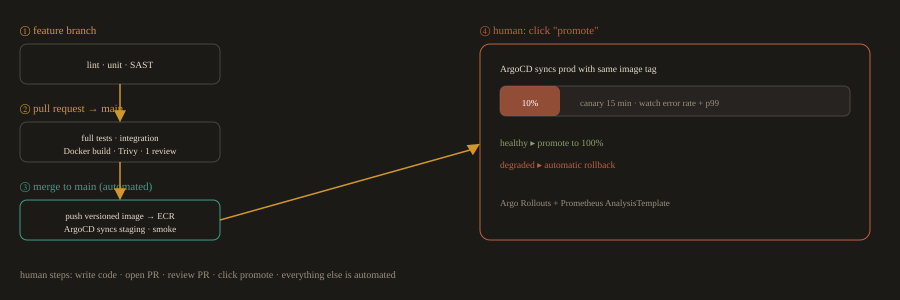

*The only manual actions are writing the code, opening the PR, reviewing it, and clicking promote.*

```
Developer pushes to feature branch
  GitHub Actions: lint, unit tests, SAST scan
  All pass: pipeline green, developer continues

Developer opens a pull request to main
  GitHub Actions: full test suite, integration tests, Docker build, Trivy scan
  Code review required: one peer approval
  All pass: merge allowed

Merge to main
  GitHub Actions: build and push versioned image to ECR
  ArgoCD detects a new image tag in the staging overlay
  ArgoCD syncs the staging cluster automatically (no human step)
  Smoke tests run against staging
  All pass: staging deployment complete

Engineer triggers production promotion
  GitHub Actions: one click promotion workflow
  ArgoCD syncs production cluster using the same image tag
  Argo Rollouts: canary at 10% traffic for 15 minutes
  Prometheus AnalysisTemplate: monitors error rate and p99 latency
  If metrics healthy: promote to 100%
  If metrics degrade: automatic rollback to the previous version
```

The only human steps in this entire flow are: write the code, open the PR, review the PR, and click promote to production. Everything else is automated.

---
## 2. Agile and DevOps: Different Problems, Overlapping Solutions


### The Distinction That Matters

---
Agile is a delivery methodology. It answers: how should teams organize and plan their work to ship software iteratively with fast feedback from stakeholders?


DevOps is an engineering and operational philosophy. It answers: how should teams build, ship, and operate software with speed, quality, and reliability?


**Fig. 2 · Two cadences that mesh**

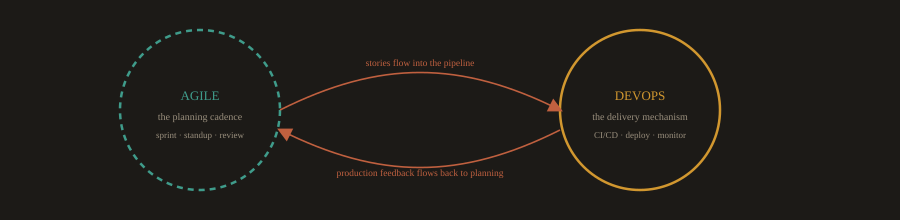

*The sprint sets the planning rhythm; the pipeline makes that rhythm viable at speed. Deploy inside the sprint, not at its boundary.*


They solve different problems but reinforce each other. An Agile team that does not practice DevOps ships working software in sprints but deploys it through a slow, manual, error prone process. A team practicing DevOps without Agile might have excellent pipelines but poor planning discipline, building the wrong things with great efficiency.

In practice, the two are nearly always used together. The sprint is the planning cadence. The CI/CD pipeline is the delivery mechanism that makes the sprint cadence viable at speed.

---
### How Agile Practices Shape DevOps Workflows

**Sprint cycles and deployment frequency:** 

A two week sprint does not mean you deploy once every two weeks. Sprint is the planning and review cadence. Deployment can and should happen multiple times per day independently of the sprint boundary. Teams that conflate "end of sprint" with "deployment day" are limiting deployment frequency artificially.

**Definition of Done and pipeline gates:** 

In Agile, a user story is not "done" until it meets the team's Definition of Done. In DevOps, the pipeline enforces this mechanically. A good Definition of Done for a DevOps team includes: all tests pass, security scan clean, image signed, deployed to staging, smoke tests pass. The pipeline either reflects the Definition of Done or it does not.

**Backlog refinement and technical debt:** 

DevOps work (platform improvements, pipeline fixes, observability instrumentation) competes with feature work for sprint capacity. Teams that do not explicitly allocate capacity for this work accumulate technical debt in their platform. A common pattern is a 20% allocation: 80% of sprint capacity on product features, 20% on platform and reliability work.

**Retrospectives and blameless postmortems:** 

The Agile retrospective and the SRE blameless postmortem are the same impulse applied to different scopes. The retrospective looks at process within the sprint. The postmortem looks at process failures that led to a production incident. Both produce action items. Both work best in a psychologically safe environment where identifying a process problem is not the same as blaming the person who ran that process.

---
### Where Teams Misapply the Relationship

A common mistake is treating Agile ceremonies as overhead that slows DevOps velocity. Daily standups get skipped. Sprint planning becomes informal. Retrospectives get cancelled. The result is a team with good automation but poor coordination, building features in parallel that conflict with each other, missing dependencies, and shipping things that were already built by another team.

Another common mistake is treating each sprint as a mini waterfall: spend the first week building, spend the second week testing, deploy on day fourteen. This defeats the purpose of both Agile (continuous feedback) and DevOps (continuous delivery). Each story should be tested as it is built and deployed as it passes tests, not held until the sprint boundary.

---
## 3. SRE vs. DevOps: Where They Overlap and Where They Diverge

### The Core Distinction

You learned in Part A that SRE is one concrete implementation of DevOps principles, specifically focused on reliability at scale. The operational distinction that matters for your day to day work is this:

A DevOps engineer primarily asks: how do we build and ship software faster and more reliably?

An SRE primarily asks: how do we define, measure, and protect the reliability of what we have already shipped?

In organizations with both roles, DevOps engineers focus on the pipeline and delivery infrastructure. SREs focus on production reliability, on call practices, and the SLO framework. At smaller organizations, one team does both.

---
### SLIs, SLOs, SLAs, and Error Budgets in Practice

These four concepts are often listed together but they operate at different layers. Understanding which layer each belongs to is what lets you use them correctly.

**Fig. 3a · Four concepts, four layers**


*SLI is measured, SLO is the internal target, the error budget is derived from it, and the SLA is the external promise sitting below the SLO.*

---
### SLI: What You Measure

A Service Level Indicator(SLI) is a specific, quantifiable measurement of one aspect of service behavior. The measurement must be something you can actually collect from your monitoring system.

Good SLIs:

- Request success rate: `(successful requests / total requests) * 100`

- Availability: `(uptime minutes / total minutes) * 100`

- Latency: p95 response time for the `/checkout` endpoint

- Queue freshness: the age of the oldest unprocessed message in the payment queue

Bad SLIs (things that sound measurable but are not specific enough):

- "User experience is good"

- "The system feels fast"

- "Errors are low"

Every SLI needs a numerator, a denominator, a time window, and a collection method before it is actionable.

---
### SLO: Your Internal Target

A Service Level Objective(SLO) is the target value you set for an SLI over a defined time window. It is an internal engineering agreement, not a customer commitment.

```
SLI:  request success rate over a rolling 28 day window
SLO:  >= 99.5%
```
```
SLI:  p95 latency for the search API over a rolling 28 day window
SLO:  <= 250ms
```
```
SLI:  availability of the payment service over a rolling 28 day window
SLO:  >= 99.9%
```

The SLO is deliberately set below the theoretical maximum. Setting an SLO of 100% availability is a mistake: it makes every planned maintenance window an SLO violation, it provides no room for safe experimentation, and it is impossible to achieve in any real system.

---
### Error Budget: The Derived Allowance

The error budget is what remains between your SLO and 100%. It is the calculated amount of unreliability you are permitted to have over the measurement window.

```
SLO: 99.9% availability over 28 days
28 days = 40,320 minutes
Error budget = 0.1% of 40,320 = 40.32 minutes of allowed downtime
```

The error budget is the mechanism that makes the SRE model work in practice. It transforms the conversation between product and engineering from subjective negotiation ("can we ship this risky change?") into an objective data question ("how much error budget do we have left?").

When the error budget is healthy (most of it remains), the team has permission to take risks: deploy frequently, run experiments, ship ambitious changes.

When the error budget is nearly exhausted, the team freezes feature deployments and focuses entirely on reliability work until the budget recovers. Both teams agreed to this policy upfront, so there is no negotiation at crisis time.

---
### SLA: The External Commitment

A Service Level Agreement(SLA) is a contractual commitment to customers, usually with financial consequences (service credits, penalties) for violation. SLAs are almost always set lower than SLOs.

```
Internal SLO:  99.9% availability
External SLA:  99.5% availability
```

The gap between SLO and SLA is deliberate. If the SLO is breached, engineering knows before the SLA is breached, which gives the team time to respond and recover without triggering contractual penalties.

SLAs are negotiated by legal, finance, and product teams. DevOps and SRE engineers set the SLOs that protect the SLAs.

---
### When Organizations Apply SRE Practices

SRE is not appropriate at every scale. Defining SLOs, error budgets, and running an on call rotation requires organizational maturity and a system that is running in production with real users.

Apply SRE practices when:

- The service has external users whose experience you are accountable for

- Incidents are happening frequently enough that you need a structured response process

- The team is large enough to support an on call rotation (typically five or more engineers)

- You need an objective mechanism to balance feature velocity against reliability investment

Do not apply full SRE practices when:

- The product is pre launch and there are no SLA commitments

- The team is too small to support a rotation without burning people out

- Reliability requirements are not yet understood (premature SLOs create false targets)

The entry point for most teams is simpler: define one or two SLIs for your most critical user journey, set a reasonable SLO, and instrument it in Grafana. That gives you the data you need before you formalize the full error budget process.

---
### A Concrete Error Budget Scenario

**Fig. 3b · Burning down an error budget over 28 days**


*Data, not politics: with 8 minutes left the team postponed risk and shipped the fix that was missing.*

A payments team has an SLO of 99.95% availability over 28 days. Their error budget is approximately 20 minutes over the 28 day window.

On the 15th of the month, a bad deployment causes a 12 minute outage. The error budget is now 8 minutes for the remaining 15 days of the window.

The on call SRE reviews the budget and flags to the engineering manager: two more incidents of similar severity will breach the SLO. The team makes two decisions: postpone two risky database migration changes scheduled for the next week, and add an automatic rollback trigger to the deployment pipeline that was missing before this incident.

By the end of the month, no further incidents occur. The SLO is preserved. The postponed changes ship in the next window, after the rollback trigger is in place.

This is error budgets working correctly: the team used data to make a risk decision, not intuition or politics.

---
## 4. DORA Metrics

The DORA (DevOps Research and Assessment) metrics are the industry standard for measuring software delivery performance. They came from multi year research across thousands of organizations and are the closest thing DevOps has to a universal engineering performance framework.

---
> The DORA metric set is an evolving research program, not a fixed list. The original four metrics (deployment frequency, lead time for changes, change failure rate, and mean time to recover) were defined in the *Accelerate* book (2018) and remained stable for several years. 

> The recovery metric was renamed and redefined as failed deployment recovery time in the 2023 report. The 2024 report then introduced further changes: rework rate was added as a new stability metric, and failed deployment recovery time was reclassified from stability to throughput. 

> The current grouping, as of the 2024 and 2025 reports, is: 

> **Throughput:** deployment frequency, lead time for changes, failed deployment recovery time 

> **Stability:** change failure rate, rework rate 
---

**Fig. 4a · The current DORA grouping**

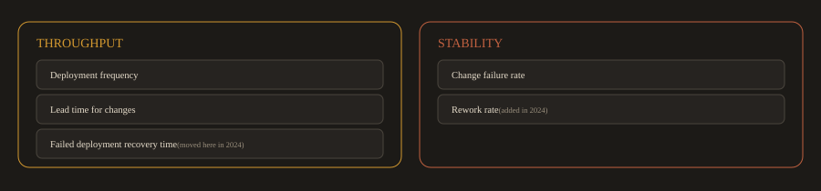

*These metrics cluster: high performing teams score high on all of them at once.*

The research finding that matters most: these metrics cluster. High performing teams are high on all of them simultaneously. You cannot game one metric without the others reflecting it.

---
### The Metrics

### Deployment Frequency

How often does the team successfully release to production?

| Performance Level | Deployment Frequency |
| --- | --- |
| Elite | Multiple times per day |
| High | Between once per day and once per week |
| Medium | Between once per week and once per month |
| Low | Less than once per month |

This metric measures how well your delivery pipeline enables teams to ship small, frequent changes. Low deployment frequency is almost always caused by batch size problems: teams are accumulating too much change before releasing, which makes each release large and risky.

---
### Lead Time for Changes

How long does it take from code committed to that code running in production?

| Performance Level | Lead Time |
| --- | --- |
| Elite | Less than one day |
| High | Between one day and one week |
| Medium | Between one week and one month |
| Low | More than one month |

---
> Early DORA research (the original *Accelerate*, 2018) set the Elite threshold at less than one hour. Subsequent State of DevOps reports revised Elite to less than one day, which reflects the real world pipeline overhead of code review, CI, and staged deployment even at high performing organizations. Some sources still cite the original one hour figure. The benchmarks shift year to year based on survey data, so treat these as directional targets rather than fixed cutoffs.
---

Lead time measures the efficiency of your entire delivery pipeline, from development through CI, review, staging, and production. Long lead times indicate queuing: work sitting somewhere in the process waiting for a human approval, a slow test suite, a manual step, or a deployment window.

---
### Change Failure Rate

What percentage of deployments to production cause a degraded service or require remediation (rollback, hotfix, patch)?

| Performance Level | Change Failure Rate |
| --- | --- |
| Elite | 0% to 15% |
| High | 16% to 30% |
| Medium | 16% to 30% |
| Low | 46% to 60% |

---
> High and Medium share an overlapping range in DORA's cluster analysis: this is an artifact of how the research clusters self reported survey data, not a document error. The Low tier is clearly distinct and significantly worse.
---

This metric measures the quality of your delivery process. A high change failure rate means either your testing is insufficient (bugs reach production), your deployment process is unreliable (deployments themselves cause failures), or your feature design process produces work that turns out not to meet user needs.

---
### Failed Deployment Recovery Time

When a deployment causes a service degradation or outage, how long does it take to restore normal service?

---
> This metric was called Mean Time to Recovery (MTTR) in earlier DORA reports. In the 2023 report, DORA renamed it to Failed Deployment Recovery Time (FDRT) and narrowed the definition to cover only failures caused by software changes (not external events like cloud provider outages or hardware failures). In 2024 it was reclassified from stability to throughput. The reasoning: fast recovery after a failed deployment supports delivery flow, helping teams deploy again sooner. MTTR remains in wide use as shorthand; the two terms refer to the same measurement in most team contexts.
---

| Performance Level | Failed Deployment Recovery Time |
| --- | --- |
| Elite | Less than one hour |
| High | Less than one day |
| Medium | Between one day and one week |
| Low | Between one week and one month |

**Fig. 4b · FDRT breaks into three intervals**

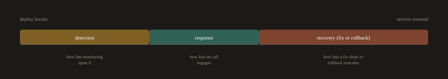

*Each interval has its own engineering fix · measuring FDRT exposes which one is slow.*

FDRT measures your ability to detect and respond to production problems caused by your own changes. It is a function of three things: how quickly monitoring detects the problem (detection time), how quickly the team is alerted and engages (response time), and how quickly a fix can be shipped or a rollback executed (recovery time). Each of these has specific engineering interventions.

---
### Rework Rate

What proportion of deployments are unplanned fixes for a production problem?

---
> The DORA team found a strong correlation between rework rate and change failure rate, and together they create a more reliable factor of software delivery stability than change failure rate alone. Rework rate specifically counts the deployments that exist only because a previous deployment broke something: reverts, hotfixes, and patches for bugs that reached production. A high rework rate means the team is spending delivery capacity on cleanup rather than forward progress.
---

Universal benchmarks for rework rate are still being established as the metric is newer. Track it over time for your own team and look for the trend rather than comparing to external cutoffs.

---
### Why These and Not Something Else

The DORA research team found that these metrics are the leading indicators of organizational outcomes: software delivery performance as measured by DORA predicts organizational performance (revenue growth, market share, customer satisfaction, employee burnout) better than almost any other engineering metric.

Metrics that are commonly tracked but are not in DORA, and why:

**Test coverage:** 

Correlates weakly with actual quality. Teams can have 90% coverage with poor tests that do not catch real bugs. Coverage is an input metric, not an outcome metric.

**Velocity (story points per sprint):**

Measures effort, not outcomes. Inflated story points are a common response to velocity pressure. It cannot be compared across teams.

**Uptime percentage:** 

A lagging indicator. By the time you measure it, the incident has already happened. FDRT is more actionable because it measures your recovery capability, which you can improve proactively.

---
### How These Metrics Appear in Real Companies

Most mature engineering organizations track DORA metrics in their engineering dashboards alongside business metrics. Some patterns that commonly appear:

**Deployment frequency and lead time move together.** 

Teams that deploy frequently have short lead times because they have built the pipeline infrastructure to support it. Teams with long lead times are almost always deploying infrequently because the process is too slow or too manual to support high frequency.

**Change failure rate and FDRT have an inverse relationship with confidence.** 

Teams with low FDRT are often willing to accept a slightly higher change failure rate because they know they can recover quickly. This is the error budget concept applied informally: if you can recover in 5 minutes, a failure is less costly than if you cannot recover for 4 hours.

**Measuring FDRT exposes on call problems.** 

Teams that have never measured FDRT often discover that their recovery time is terrible not because recovery is technically hard, but because detection is slow (alerts are noisy and get ignored) or response is slow (nobody knows who is on call, or the runbook is missing). Measuring FDRT forces this into the open.

---
### Using DORA Metrics Without Gaming Them

Once you start measuring something, people optimize for the measurement. Common gaming patterns and why they undermine the value:

**Splitting commits to inflate deployment frequency:** 

Small commits deployed frequently should reflect small, safe changes, not artificial fragmentation. If the changes are not logically independent, deploying them separately does not reduce risk.

**Marking incidents as resolved before they are:** 

FDRT pressure leads teams to close incidents when the immediate symptom is resolved rather than when the system is confirmed stable. This understates actual recovery time and hides underlying reliability problems.

**Excluding failed deployments from change failure rate:** 

If rollbacks or hotfixes are categorized differently from "real" deployments, the metric stops reflecting reality.

The correct way to use DORA metrics is as a team level signal over time, not as a performance review metric for individuals. A team's DORA metrics trending in the right direction over six months tells you the engineering practices are improving. Comparing individual engineers on deployment frequency or FDRT tells you nothing useful and creates perverse incentives.

---
## 5. What the DORA Research Found About AI

This section covers findings from the 2024 and 2025 DORA Accelerate reports that are directly relevant to how you will work for the rest of this program and for the rest of your career. Module 24 goes deeper into AI in DevOps practice. This is the data that motivates Module 24's existence.

---
### The 2024 Finding: Throughput Up, Stability Down

The 2024 Accelerate State of DevOps report surveyed roughly 3,000 technology professionals and found that approximately 76% were already relying on AI for at least part of their job. The top uses were code writing, summarizing information, code explanation, code optimization, and documentation. About 75% of respondents reported productivity gains from using AI.

That is the headline most people read. The finding underneath it is the one that matters.

When the DORA team measured the effect of AI adoption on the team level delivery metrics they have been tracking for a decade, the numbers went the wrong way:

**Fig. 5 · 2024: +25% AI adoption, measured effect**


*Both things were true at once: the individual felt faster while the team's stability fell.*

- **A 25% increase in AI adoption was associated with an estimated 1.5% decrease in delivery throughput.**

- **The same 25% increase was associated with an estimated 7.2% decrease in delivery stability.**

---
>Source: Google Cloud Blog, "Announcing the 2024 DORA Report," October 22, 2024, and the full 2024 Accelerate State of DevOps Report published at dora.dev.
---

Individual engineers felt faster. Teams shipped less reliably. Both things were true at the same time.

---
### Why This Happens: Batch Size

The DORA team's primary explanation is batch size. AI makes it easy to write more code. More code per changeset means larger batches. Larger batches are riskier. This is not a new finding. DORA has shown for years that smaller changesets are safer. AI simply made it easier to violate that principle without noticing.

A developer using an AI assistant can produce a 500 line pull request in the time it used to take to write 100 lines. The PR looks clean. The tests pass. But the blast radius of that single deployment is five times larger than it used to be, and the reviewer is now reading five times more code, which makes it harder to catch the subtle bug on line 347 that the AI introduced confidently and incorrectly.

---
### The 2025 Finding: AI as Mirror and Multiplier

The 2025 DORA report, titled "State of AI-assisted Software Development," surveyed nearly 5,000 technology professionals. AI adoption had climbed to 90%, a 14% increase from the prior year.

The central finding, stated directly by Google's announcement: "AI doesn't fix a team; it amplifies what's already there. Strong teams use AI to become even better and more efficient. Struggling teams will find that AI only highlights and intensifies their existing problems."

Source: Google Cloud Blog, "Announcing the 2025 DORA Report," September 23, 2025, and the full 2025 report published at dora.dev.

The 2025 report also noted a reversal: AI adoption was now associated with higher throughput (a positive change from 2024's negative throughput finding), but instability remained. As the report put it: "AI adoption not only fails to fix instability, it is currently associated with increasing instability."

The interpretation that best fits both years of data is the one the syllabus for this program states in its opening section: AI adoption tends to amplify the maturity, or the immaturity, of the delivery system it lands in. A team with strong tests, real observability, and a working rollback gets faster. A team without them gets faster at breaking things. Individual throughput rises across the board; at the team level, the stability gap widens for teams whose delivery system is weak and narrows for teams whose delivery system is strong.

---
### What This Means for You, Starting in Week 1

Every tool and practice in this program, the test gates, the pipeline structure, the observability stack, the rollback capability, the policy enforcement, the security scanning, exists partly because AI makes each one more important, not less.

You will use AI assistants throughout this course. You are expected to. But the assessment model (live defense of every graded artifact) and the disclosure requirement (which assistant, what it did, what it got wrong) exist because the 2024 and 2025 DORA data show that AI without strong surrounding practices makes teams less stable, and the review discipline is what separates useful AI adoption from expensive AI adoption.

Module 24 covers this in operational depth. The reason it is mentioned here, in Week 1, is that every lab you submit between now and then is building the system that decides whether the AI module helps you or hurts you.

---
## 6. Infrastructure as Code: Beyond the Basics

You learned in Part A what IaC is and the difference between declarative and imperative tools. This section covers how IaC actually operates inside engineering workflows, the problems it creates when applied incorrectly, and the practices that make it work well.

### Configuration Drift: The Problem IaC Prevents

Configuration drift is what happens when the actual state of your infrastructure gradually diverges from what you intended or documented. It accumulates silently.

A common sequence that leads to drift:

**Fig. 6a · How an undocumented manual fix becomes an outage**

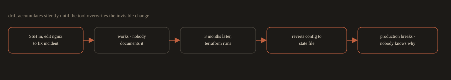

*The declared config is the single source of truth: anything changed outside the workflow is overwritten on the next run.*

1. An engineer SSHs into a production server to debug an incident and changes an nginx config to get it working.

2. The fix works. The incident is resolved. Nobody documents the change.

3. Three months later, Terraform runs and reverts the config to what it has in state.

4. Production breaks.

5. Nobody knows why because the undocumented change was invisible.

IaC prevents this by making the declared configuration the single source of truth. Any change made outside the IaC workflow is overwritten the next time the tool runs. This is painful when it first happens, but it enforces a discipline that keeps environments predictable.

---
> Never make manual changes to infrastructure managed by an IaC tool. If you need to make a change, make it in the code, commit it, and let the pipeline apply it. Emergency exceptions should be documented and followed immediately by a PR that captures the change in code.
---
### Desired State vs. Current State

Terraform and similar declarative tools work by comparing two states:

- **Desired state:** what you declared in your `.tf` files

- **Current state:** what actually exists, recorded in the state file

**Fig. 6b · terraform plan computes the diff**


*Approving the PR means you reviewed and accepted these infrastructure changes, not just the code.*

`terraform plan` computes the diff between these two states and shows you exactly what it will create, modify, or destroy. Nothing changes until you run `terraform apply`.

This diff is important enough to treat as a required review step. In production environments, a common practice is to run `terraform plan` in CI on every pull request and post the output as a PR comment. Reviewers can see exactly what infrastructure changes the PR will make before they approve it.

Example terraform plan output in a PR comment

```
Plan: 2 to add, 1 to change, 0 to destroy.

+ aws_security_group.app_sg
+ aws_instance.web_server
~ aws_lb_listener.https (port 443 > 8443)
```

Approving a PR with this output means you reviewed and accepted these infrastructure changes, not just the code changes. That is a meaningful shift in accountability.

---
### Version Controlled Infrastructure in Practice

Infrastructure code in Git gives you several capabilities you do not have with manual infrastructure:

**Rollback:** 

If a Terraform change breaks something, `git revert` the commit and re apply. The infrastructure returns to its previous state.

**Audit trail:** 

Every infrastructure change has a commit with an author, a timestamp, and a message. "Who changed the security group on March 3rd?" is a `git log` query, not an investigation.

**Environment parity through modules:** 

The same Terraform module can provision a development environment and a production environment, with the only differences being variable values (instance size, replica count, retention period). This makes drift between environments visible: if staging and production diverge, it shows up in the code as a difference in variable values, not as a hidden configuration difference on a server somewhere.

**Code review for infrastructure changes:** 

A firewall rule change, a new IAM policy, or a database parameter group modification all go through a pull request. Another engineer reviews it before it applies to production. This catches mistakes before they become incidents.

---
### Common IaC Mistakes

**Storing secrets in IaC files:** 

Never put passwords, API keys, or certificates in Terraform code or Ansible playbooks. Use a secrets manager (HashiCorp Vault, AWS Secrets Manager) and reference it in your IaC. Secrets in code leak through Git history, CI logs, and PR comments.

**Unreviewed `terraform apply` in production:** 

Running `terraform apply` directly from a local machine against a production environment bypasses the review process and can cause irreversible damage. Production applies should only happen through the CI/CD pipeline after a plan has been reviewed and a PR has been approved.

**Monolithic state files:** 

Storing all your infrastructure in one Terraform state file creates a bottleneck (only one operation can run at a time), a blast radius problem (an error in one resource can lock the entire state), and slow plan times as the infrastructure grows. Separate state files by environment and by logical component (networking, compute, data).

**Ansible for provisioning instead of configuration:** 

Ansible is excellent for configuring software on existing servers. It is a poor substitute for Terraform when it comes to provisioning infrastructure. Teams that write Ansible playbooks to create EC2 instances discover that idempotency is harder to guarantee and state management is significantly more complex than with Terraform. Use each tool for what it does best.

---
## 7. Microservices vs. Monolith: The DevOps Perspective

Part A introduced the architectural differences. This section focuses specifically on what microservices mean for a DevOps engineer: what gets harder, what gets easier, and what breaks if you are not prepared.

**Fig. 7 · The DevOps trade off of microservices**


*The wins are real, but only for teams that already have the operational foundation in place.*

---
### What Gets Harder

**Pipeline count:** A monolith has one CI/CD pipeline. A system of 30 microservices has 30 pipelines. Each one needs to be maintained, updated when the base image changes, kept current with security patches, and monitored for failures. The operational cost of pipeline maintenance is real and is often underestimated when teams migrate to microservices.

**Deployment coordination:** 

In a monolith, you deploy one artifact. In microservices, a single feature might require coordinated deployments across three services. If Service A expects a new API field that Service B provides, you must deploy Service B first, verify it, then deploy Service A. Getting deployment order wrong causes production failures. This is why GitOps and declarative deployment tooling (ArgoCD, Flux) are particularly valuable in microservices environments: you can version and test the deployment order as code.

**Distributed tracing requirement:** 

In a monolith, you can grep a log file. In a system with 30 services, a user's request might touch 8 of them before returning a response. Without distributed tracing, diagnosing a slow or failed request is nearly impossible. You need OpenTelemetry instrumented in every service, a trace collector, and a UI (Jaeger, Grafana Tempo) before you go to production, not after.

**Network failure as a first class concern:** 

In a monolith, function calls do not fail because of network timeouts. In microservices, every service to service call is a network call. Network calls fail. They time out. They return partial results. Every service must implement retry logic, circuit breakers, and graceful degradation. DevOps engineers need to test these failure modes deliberately (chaos engineering) rather than discovering them during incidents.

**Secret and configuration sprawl:**

A monolith has one set of environment variables. 30 microservices have 30 sets of secrets, each needing to be rotated independently, injected securely, and audited. Without a centralized secrets management strategy (Vault, AWS Secrets Manager, Kubernetes Secrets with External Secrets Operator), this becomes unmanageable quickly.

---
### What Gets Easier

**Independent scaling:** 

A monolith scales as a unit. If your search endpoint is under load, you scale the entire application. In Kubernetes with microservices, you scale the Search Service independently. This is significantly more cost efficient at scale and is one of the primary economic arguments for microservices at high traffic volumes.

**Independent deployment and rollback:** 

A bug in the Notification Service does not require rolling back the Trip Service. Each service can be deployed and rolled back independently without affecting others. This reduces the blast radius of any individual deployment significantly.

**Technology heterogeneity:** 

The Pricing Service can be written in Go for performance. The ML recommendation service can be in Python. The legacy payment integration can stay in Java. In a monolith, you are locked into one stack. This flexibility has real costs (multiple languages to hire for, multiple build systems to maintain), but for teams where different capabilities genuinely need different technology, it is a significant advantage.

---
### Operational Maturity Requirements

Microservices impose a minimum level of operational maturity. If these capabilities are not in place before you migrate to microservices, the migration will make things worse, not better:

| Capability | Why It Is Required for Microservices |
| --- | --- |
| Containerization | Services must be packaged consistently and run reliably across environments |
| Container orchestration (Kubernetes) | You cannot manage 30+ services manually |
| Service discovery | Services need to find each other dynamically as pods are created and destroyed |
| Centralized logging | Per service log files are unworkable at scale |
| Distributed tracing | You cannot debug cross service failures without it |
| Health checks and readiness probes | Kubernetes needs to know when a service is ready to receive traffic |
| Circuit breakers and retry logic | Network failures between services are not optional edge cases |
| Secrets management | 30 services with hardcoded secrets is a security disaster |

Teams that migrate a monolith to microservices without this foundation in place end up with what is sometimes called a "distributed monolith": all the operational complexity of microservices with none of the deployment independence, because the services are too tightly coupled to be deployed or scaled independently.

---
### Monolith First Is Not Wrong

For most teams and most products, starting with a well structured monolith is the correct engineering decision. Microservices introduce coordination overhead that is not worth paying when the team is small and the traffic volume does not require independent scaling.

The rule of thumb used at many experienced engineering organizations: start with a monolith, extract a service when one piece of the system genuinely needs to scale, deploy, or change at a different rate from everything else, and when the team is large enough to own that service independently.

---
## 8. Platform Engineering and AI Assisted Operations:

This section is intentionally brief. Platform engineering is covered properly in Module 23 and AI in DevOps is covered in Module 24. The purpose here is to show you the road ahead so you can see where the pieces you are learning now fit into the larger picture.

---
### Platform Engineering

As organizations grow, every team faces the same problem: the cognitive load of holding Kubernetes, Terraform, the CI system, the observability stack, the policy engine, and their own product domain in their heads at the same time is too much. Teams make shortcuts. They skip the security scan because they do not know how to configure it. They copy another team's pipeline and change the app name without understanding the deployment strategy. They deploy to production with no monitoring because setting up Grafana dashboards was too many steps.

**Fig. 8 · The golden path**


*The platform team packages everything you build in this program into a paved, self service route.*

Platform engineering solves this by building a "golden path": a paved, tested, self service route from "I have an idea" to "it is running in production with monitoring, alerts, and policy enforcement." The platform team's job is to take everything you will build in this program, CI templates, Kubernetes manifests, Terraform modules, Kyverno policies, Grafana dashboards, and package it so that a product developer can use it without understanding every layer of the stack.

The concept comes from Team Topologies (Skelton and Pais, 2019), and the most common implementation tool is Backstage, an open source internal developer portal originally built at Spotify.

You will explore Backstage and design a golden path in Module 23. The capstone project (Module 25) asks you to write a platform style README that describes your whole pipeline as a golden path a new developer could follow on day one. That capstone component is platform engineering in miniature.

---
### AI Assisted Operations

AI is entering operational workflows in three ways:

**AI in the code pipeline.** 

Assistants that write code, generate Terraform, draft Kubernetes manifests, and review pull requests. You have been using these since Module 0. The key discipline, review everything before applying it, is the subject of Module 24.

**AIOps.** 

Language models and anomaly detection systems that watch metrics and logs, detect unusual patterns a fixed threshold alert would miss, and predict scaling needs from traffic patterns rather than reacting after the fact. This is operational AI that runs alongside Prometheus and Alertmanager rather than replacing them.

**Chat driven operations.** 

A language model that can query your observability stack and summarize an incident in plain language. "What changed in the last hour?" answered by an assistant that reads your Prometheus data, your deploy logs, and your recent Git commits, then produces a summary. Where this genuinely helps an on call engineer at 3am, and where it will confidently summarize an incident that is not the one you are having, is the subject of Module 24.

The thread that connects all three is the same one the DORA data surfaces: AI amplifies whatever system it lands in. If your pipeline has real tests, real scans, and a real rollback, AI makes you faster. If it does not, AI makes you faster at shipping broken things.

---
## Common Mistakes at This Level

**Treating monitoring as optional until launch:** 

Instrumentation added after deployment means your first production incidents are investigated blind. Build the `/metrics` endpoint and structured logging into the application before it ships.

**Setting SLOs without historical data:** 

A new service has no baseline. Setting an aggressive SLO on day one sets up the team for immediate budget exhaustion. Start by measuring for 30 days, then set the SLO based on what you actually observed minus a reasonable margin.

**Treating IaC as a solo activity:** 

IaC code that no one else understands creates the same bus factor problem as the manual infrastructure it replaced. Pull requests, code review, and documentation apply to infrastructure code exactly as they apply to application code.

**Conflating deployment frequency with release frequency:** 

Continuous deployment to production does not mean every deployment is immediately visible to every user. Feature flags let you deploy code to production while hiding the feature behind a toggle. This separates deployment (a technical event) from release (a business decision).

**Migrating to microservices before building the platform:** 

Containerization, Kubernetes, centralized logging, distributed tracing, and secrets management must exist before microservices, not be built alongside them. Teams that try to build the platform and migrate the architecture simultaneously usually end up with neither working correctly.

**Trusting AI generated infrastructure without reading the plan:** 

An AI assistant can produce a syntactically valid Terraform module in seconds. Syntactically valid is not the same as correct, secure, or cost effective. Read `terraform plan` every time, especially when you did not write the code yourself.

---
**End of Module 1 Theory Notes.* 
Next: Module 1 Labs (1A, 1B, 1C, 1D) and Foundation Labs (FM1.A, FM1.B, FM1.C).*

---