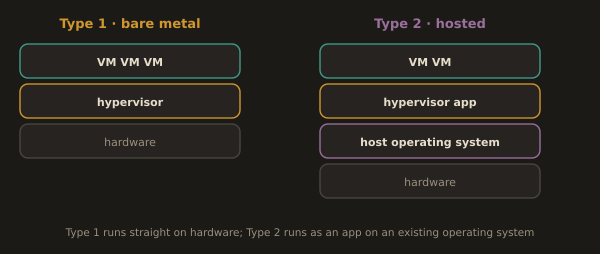
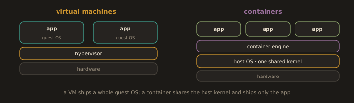
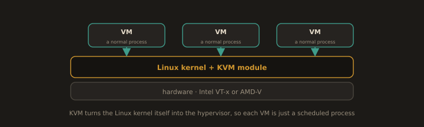

# Part 1: Virtualization and Why Linux

---
> **What Part 1 does.** It establishes the platform before you start typing commands on it. You will finish it knowing what a hypervisor is, where a Type 1 differs operationally from a Type 2, how a container differs from a virtual machine, and why Linux rather than anything else is the substrate the whole industry standardised on. Part 2 then puts you on the command line, and Part 3 returns to systemd in depth. The VM versus container comparison here is deliberately short: it is the setup for Module 6, where containers are the subject rather than the contrast.
---
## Hypervisors:

### Type 1 vs Type 2

**Fig. 1 · Two kinds of hypervisor**

*A Type 1 hypervisor sits directly on the hardware; a Type 2 hypervisor runs as an application on a host operating system.*

The textbook definition, that a Type 1 runs on bare metal and a Type 2 runs on a host operating system, is where most courses stop. The engineering question is the one that follows: why does where the hypervisor sits in the stack actually change how things behave?

A Type 1 hypervisor has direct, unmediated access to the CPU, RAM, storage, and network hardware. When a VM needs CPU time, the hypervisor scheduler grants it directly. When a VM writes to disk, the hypervisor coordinates that write directly with the storage controller. There is no host operating system inserting itself into that path.

A Type 2 hypervisor has to ask permission. Every operation a VM performs must pass through the host operating system first, which then passes it on to the hardware. The host OS is a middleman that adds latency, consumes its own share of CPU and memory, and introduces its own failure modes. A kernel panic in the host OS takes every Type 2 VM with it, not just one.

This is why cloud providers exclusively run Type 1. AWS, Google Cloud, and Azure are running millions of virtual machines simultaneously on their hardware. Each additional software layer between those VMs and the hardware costs money in wasted cycles and degrades the performance tenants pay for. At that scale, even a one or two percent performance overhead from a host OS translates to enormous wasted capacity across a fleet of hundreds of thousands of physical servers.

For your lab work, Type 2 is the correct choice because you are working on a laptop or desktop that already runs an operating system. You are not in the business of dedicating an entire machine to nothing but running VMs. The performance overhead is real but perfectly acceptable for learning environments and local development.

### VMs vs Containers:

**Fig. 2 · VMs carry an OS, containers share one**

*Each VM runs a full guest operating system over a hypervisor; containers share the host kernel and package just the application.*

Both VMs and containers provide isolation. They provide it at fundamentally different levels, and that difference determines which one is appropriate for a given situation.

A VM virtualizes an entire machine. Each VM has its own kernel, its own operating system, its own init system, and its own completely separate view of the hardware underneath. The isolation is strong enough that a kernel exploit inside one VM does not compromise other VMs on the same host, because each VM has its own kernel to exploit.

A container virtualizes a process namespace, not a machine. Containers on the same host share the host kernel. They have their own filesystem view, their own network namespace, their own process namespace, but underneath all of that isolation, they are still processes running on the exact same kernel. A kernel exploit that breaks out of container isolation can potentially affect everything else on that host.

| Consideration | Virtual Machine | Container |
|---|---|---|
| Isolation level | Full kernel and OS separation | Process namespace, shared kernel |
| Startup time | Tens of seconds to minutes | Milliseconds to seconds |
| Memory overhead | Hundreds of megabytes per VM minimum | Megabytes, sometimes less |
| Security boundary | Strong, hardware assisted | Process level, weaker |
| Portability | Tied to hypervisor format | OCI standard, runs anywhere with a container runtime |
| Best for | Full OS environments, different OS types, strong isolation requirements | Microservices, CI/CD workloads, packaging applications consistently |

In practice, most modern production environments use both at the same time. Containers run inside VMs. The VM provides the strong security boundary and the isolation from the hardware layer. The containers inside the VM provide the fast startup, lightweight packaging, and consistent runtime environment that makes deploying many small services practical. Kubernetes worker nodes are VMs. The application pods running on those nodes are containers.

### KVM:

**Fig. 3 · KVM makes the kernel the hypervisor**

*With the KVM module loaded, the Linux kernel becomes a hypervisor and each virtual machine runs as an ordinary process.*

KVM (Kernel based Virtual Machine) sits in an interesting position that causes genuine confusion. When the KVM module loads into the Linux kernel, the kernel itself becomes a Type 1 hypervisor with direct hardware access through Intel VT-x or AMD-V extensions. In that specific sense, KVM is a Type 1 hypervisor.

However, in practice, KVM is almost always used together with QEMU, a separate user space process that handles device emulation: virtual disks, virtual network cards, virtual USB controllers. QEMU runs as a process on top of the Linux OS, which makes the full KVM/QEMU combination look more like a Type 2 deployment from an operational standpoint. Most classification schemes put KVM in a hybrid category rather than forcing it cleanly into Type 1 or Type 2.

For DevOps work, what matters practically is that KVM/QEMU is the dominant hypervisor in Linux based production infrastructure. When you provision a virtual machine in your on premises data center or see bare metal virtualization running on RHEL or Fedora, KVM is almost certainly what is running underneath. Proxmox, the enterprise virtualization platform, runs on top of KVM. This is also the reason RHEL systems include native tools like `virsh` and `virt-manager` for managing KVM VMs directly.

---
