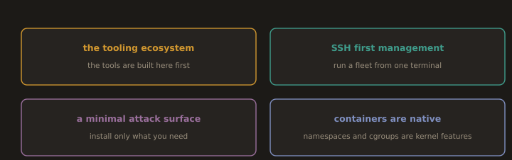

## Why Linux Dominates DevOps

**Fig. 4 · Why DevOps lives on Linux**

*The tools are built for it first, it is designed to be run remotely, it can be stripped down, and containers are made of its own kernel features.*

This is not an accident or a tribal preference. There are specific technical reasons Linux became the default platform for servers, containers, and DevOps tooling, and understanding them helps you make better decisions about when to use what.

### The Tooling Ecosystem

Linux ships with or has trivial access to every tool a DevOps engineer needs for scripting, automation, and system administration. `grep`, `awk`, `sed`, `find`, `curl`, `ssh`, `git`, `openssl`, these are not third party additions. They are part of the ecosystem and available everywhere without installation.

This matters for automation. A Bash script written on one Linux machine runs on any other Linux machine with the same distribution and version. A Python or Go binary compiled on Linux runs on any Linux machine with the same architecture. When you write Ansible playbooks, GitHub Actions workflows, or Terraform configurations, you are almost always targeting a Linux environment, because Linux provides a consistent, predictable base to build automation on top of.

Contrast this with Windows, where the same automation often requires PowerShell for some things, WSL for others, specific installed tools for others, and where paths, line endings, and permission models differ enough from Unix to create constant friction in cross platform tooling.

### SSH First Management

Every Linux server is manageable via SSH from the moment it boots, without any additional configuration in most modern distributions. SSH provides encrypted remote access, a terminal, and a file transfer mechanism. It is text based, which means it works over slow or intermittent connections. It uses public key authentication, which is more secure than passwords and easier to automate than interactive password entry.

This matters enormously for DevOps. Ansible manages servers over SSH with no agent installed. GitHub Actions runners connect to deployment targets over SSH. Kubernetes node provisioning scripts execute over SSH. The entire model of remotely managing infrastructure at scale was built around SSH because Linux made it universally available.

Compared to Windows, where remote management historically required either Remote Desktop (graphical, bandwidth heavy, not scriptable) or WinRM (which requires explicit configuration and has its own credential management complexity), Linux's SSH based model is simpler, more consistent, and better suited to automation.

### Minimal Attack Surface

A base Linux server installation for a cloud workload installs only the packages explicitly needed for that workload. A RHEL or Fedora server with no GUI, no printer subsystem, no Bluetooth stack, and no unused services presents an attack surface consisting almost entirely of the things it actually needs to do its job.

This is a genuine security advantage. Every package installed is a package that needs security patches. Every service running is a service that might have a vulnerability. A minimal Linux server running only a web application, a database connector, and SSH has fewer things to exploit than a full featured OS installation loaded with optional components.

Containers take this principle further. A well built container image contains only the application binary and its direct dependencies, sometimes less than ten megabytes. When Trivy or Grype scans that image for known CVEs, it scans a much smaller surface area than a full operating system image.

### Containers Are Native to Linux

Docker, Kubernetes, and the entire container ecosystem are built on Linux kernel primitives: namespaces (for isolation), cgroups (for resource limits), and union filesystems (for layered images). These are not features added to Linux to support containers. They are fundamental kernel capabilities that containers are built on top of.

This means containers run with zero overhead on Linux. On Windows and macOS, running Docker requires running a Linux VM underneath because containers need a Linux kernel to run on. When you run Docker Desktop on a Mac, you are running a small Linux VM managed transparently by Docker Desktop, and your containers run inside that VM. The Linux kernel handling those containers is not your Mac's kernel.

For a DevOps engineer, this means Linux is not just a preference for production workloads. It is a technical requirement for anything involving containers at scale.

---
