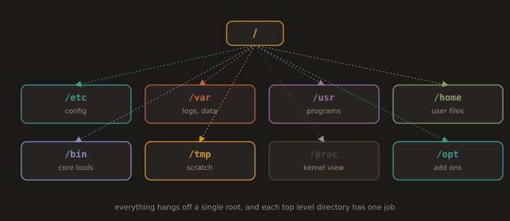
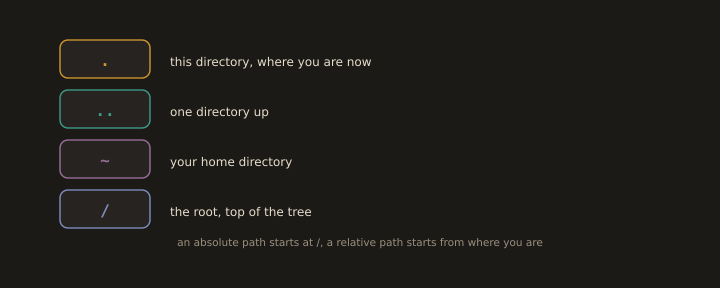

# Part 2: Linux for DevOps

## 1. Fundamental Linux Commands

### Session Basics

When you log in to a Linux system, the shell prompt tells you who you are and where you are:

- **`$`**: Normal user prompt
- **`#`**: Root user prompt
- **`~`**: Shorthand for the current user's home directory
---


---
### System Information Commands

`System Information Commands` are tools that allow users to inspect the current state and configuration of a Linux system. They are essential for monitoring performance, diagnosing issues, and understanding the hardware and software environment.

`uname -a` displays kernel and system information. `hostname` shows the system's hostname, and `uptime` reports how long the system has been running along with load averages. `top` and `htop` provide real time views of running processes and resource usage. `df` reports disk space usage and `du` shows the size of files and directories. `free` displays memory and swap usage. `lscpu` shows CPU details, `lsblk` lists block devices, and `lspci` lists PCI hardware components. `dmidecode` retrieves detailed hardware information from the system's BIOS.

> Examples:

* System hostname
```bash
hostname                  
```
* Kernel name, hostname, version, architecture
```bash
uname -a              
```
---


---
* Distribution name and version
```bash
cat /etc/os-release
```
---


---
* Detailed host and Operating System metadata
```bash
hostnamectl           
```
* CPU architecture summary
```bash
lscpu             
```
* Detailed per CPU information
```bash
cat /proc/cpuinfo
```
* Users currently logged in
```bash
who                        
```
---
### Changing the Hostname

* Syntax:
```bash
sudo hostnamectl set-hostname <new-hostname>
```
* Reload the shell session
```bash
exec bash
```
* Verify the hostname
```bash
hostname
```
---


---
### Linux Filesystem Hierarchy

**Fig. 5 · One tree, rooted at slash**



*There are no drive letters; every directory descends from a single root, and each top level folder has a defined purpose.*

`Linux Filesystem Hierarchy` refers to the standardized directory structure used by Linux systems, defined by the **Filesystem Hierarchy Standard (FHS)**. It organizes files and directories in a tree structure rooted at `/`, ensuring consistency across distributions and making system administration predictable.

`/` is the root directory, the starting point of the entire filesystem. `/bin` contains essential user binaries, and `/sbin` holds system administration binaries. `/etc` stores system wide configuration files. `/home` contains user home directories, and `/root` is the home directory of the root user. `/var` holds variable data such as logs and spool files. `/tmp` stores temporary files cleared on reboot. `/usr` contains user programs and libraries, `/lib` holds shared libraries, and `/dev` contains device files. `/proc` and `/sys` are virtual filesystems exposing kernel and hardware information.

---
| Path | Purpose |
|---|---|
| `/` | Root of the entire filesystem |
| `/boot` | Boot loader, kernel image, and initrd |
| `/dev` | Device files (disks, terminals, etc.) |
| `/etc` | System wide configuration files |
| `/home` | User home directories |
| `/lib` | Shared libraries for `/bin` and `/sbin` |
| `/media` | Mount points for removable media |
| `/mnt` | Temporary mount points |
| `/opt` | Optional third-party application packages |
| `/proc` | Virtual filesystem: process and kernel information |
| `/root` | Home directory for the root user |
| `/run` | Runtime data since last boot |
| `/sbin` | System administration binaries |
| `/srv` | Data served by system services |
| `/sys` | Virtual filesystem exposing kernel and hardware info |
| `/tmp` | Temporary files, cleared on reboot |
| `/usr` | User utilities and applications |
| `/usr/bin` | User commands |
| `/usr/local` | Locally installed software (not managed by the package manager) |
| `/var` | Variable data: logs, mail spools, caches |
| `/var/log` | System and application log files |

---


---
### Filesystem Navigation

`Filesystem Navigation` refers to the ability to move through and explore the Linux directory structure from the command line. It is one of the most fundamental skills in Linux, enabling users to locate files, change directories, and understand their position within the filesystem.

`pwd` prints the current working directory. `cd` changes the directory, with `cd ..` moving up one level and `cd ~` returning to the home directory. `ls` lists directory contents, with `-l` for detailed output and `-a` to include hidden files. `tree` displays the directory structure in a visual tree format. `find` searches for files and directories based on name, type, size, or other attributes.

> Examples:

* List files in the current directory
```bash
ls
```
* Long format: permissions, owner, size, date
```bash
ls -l
```
* Include hidden files (names starting with .)
```bash
ls -la
```
* Change to an absolute path
```bash
cd /var/log
```
* Print current directory
```bash
pwd
```
* Go down one directory level
```bash
cd ..
```
* Go to your home directory
```bash
cd ~
```
* Search a prebuilt database of filenames (requires updatedb)
```bash
locate sshd_config
```
---
> If nothing is found, update the database: `sudo updatedb`
---


---


---
### File Viewing

`File Viewing` refers to the ability to read and inspect file contents directly from the command line without opening a text editor. It is essential to examine configuration files, logs, and other text based files quickly and efficiently.

`cat` displays the entire contents of a file. `less` and `more` allow scrollable viewing of large files one page at a time. `head` displays the first ten lines of a file and `tail` displays the last ten, both accepting a `-n` flag to specify a custom number of lines. `tail -f` follows a file in real time, useful for monitoring live log files. `grep` filters and displays lines matching a pattern within a file.

> Examples:

* Print entire file
```bash
cat /etc/passwd
```
* Print with line numbers
```bash
cat -n <File_Name>
```
* Print file in reverse (last line first)
```bash
tac /etc/passwd
```
* Page through file (forward only)
```bash
more /etc/passwd
```
* Page through file (forward and backward; q to quit)
```bash
less /etc/passwd
```
* Same as less, but with line numbers
```bash
less -N /etc/passwd
```
* Show first 10 lines
```bash
head /etc/passwd
```
* Show first N lines
```bash
head -n 5 <File_Name>
```
* Show last 10 lines
```bash
tail /etc/passwd
```
* Show last N lines
```bash
tail -n 20 /etc/passwd
```
* Follow file in real time (log monitoring)
```bash
tail -f /var/log/messages
```

---
### File Operations

`File Operations` refers to the ability to create, copy, move, rename, and delete files and directories from the command line. These are among the most frequently used tasks in Linux system administration and daily use.

`touch` creates an empty file or updates a file's timestamp. `cp` copies files or directories, with `-r` for recursive copying of directories. `mv` moves or renames files and directories. `rm` removes files, and `rm -r` removes directories recursively. `mkdir` creates a new directory, and `rmdir` removes an empty one. `ln` creates links, with `-s` for symbolic links. `file` identifies the type of a file based on its contents rather than its extension.

> Examples:

* Create an empty file or update the timestamp
```bash
touch emptyfile
```
```bash
vi emptyfile
```
---
> Open file in vi editor (press **i** to insert, Esc, then **:wq** to save)
---
* Copy file to /tmp/
```bash
cp emptyfile /tmp/
```
* Copy directory recursively
```bash
cp -r <dir_name> <destination_path>
```
* Rename a file or directory
```bash
mv <Old_name> <New_name>
```
* Move the file to another location
```bash
mv emptyfile /tmp/
```
* Change a directory
```bash
cd /tmp
```
* Delete a file
```bash
rm emptyfile
```
* Delete a directory and its contents
```bash
rm -r <dir_name>
```
---


---


---


---
---
### Directory Operations

> Examples:
* Create a single directory
```bash
mkdir devops
```
* Create multiple directories at once
```bash
mkdir dir1 dir2 dir3
```
* Create a nested tree structure
```bash
mkdir -p SoftTech/{Admin,Developer,Operation}
```
* Show directory tree (install with: dnf install tree)
```bash
tree SoftTech
```
---


---
### Hidden Files and Special Characters

>Examples:

* Create a hidden directory
```bash
mkdir .hiddendir
```
* Create a hidden file
```bash
touch .hiddenfile
```
* List normal files (hidden files do not appear)
```bash
ls
```
* List all files, including hidden files
```bash
ls -a
```
* List all files with details, including hidden files
```bash
ls -la
```
---


---
Files and directories beginning with `.` are hidden in Linux/Unix systems and are not shown by `ls` unless you use the `-a` option.

---
* Create a file with spaces in the name (using quotes)
```bash
touch "backup file"
```
* Create a directory with spaces and special characters
```bash
mkdir "my new @dir"
```
* Create a file/directory with escaped spaces
```bash
touch New\ File
mkdir my\ new\ directory
```
* Access files with spaces using quotes
```bash
cat "backup file"
```
* Access files with spaces using escape characters
```bash
cat backup\ file
```
---


---
### Path Specifications

**Fig. 6 · The four symbols in every path**



*A dot is here, two dots is up, a tilde is home, and a leading slash is the root of the whole tree.*

`Path Specifications` define how file and directory locations are expressed in Linux. Understanding paths is essential for navigating the filesystem and executing commands correctly.

Linux supports two types of paths. An **absolute path** starts from the root directory `/` and gives the full location of a file, such as `/home/user/documents`. A **relative path** is defined in relation to the current working directory, such as `documents/file.txt`. Special path symbols include `.` for the current directory, `..` for the parent directory, and `~` for the current user's home directory.


> Example:

```bash
cd ~/SoftTech/Developer/
```

A relative path starts from the current directory:

```bash
 cd ../Operation/          # Go down one level, then into Operations
```
---


---
