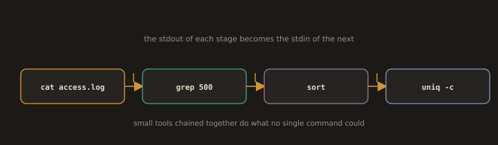
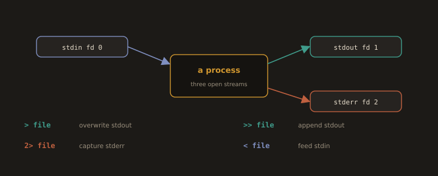

## 3. Text Processing and Pipelines

`Text Processing and Pipelines` are the everyday tools for searching file contents with pattern matching, editing text streams, extracting fields, and chaining commands so the output of one becomes the input of the next. A DevOps engineer relies on them constantly to filter logs, reshape command output, and build one line data pipelines.

`grep` searches for patterns, `sed` edits streams, and `awk`, `cut`, `sort`, `uniq`, and `wc` extract and summarise fields. `find` locates files by attribute, pipelines (`|`) join commands together, and I/O redirection (`>`, `>>`, `<`, `2>`) and `tee` route their input and output.

---
---
### Searching Within Files

`Searching Within Files` refers to the ability to locate specific text, patterns, or data within files directly from the command line. It is essential for analyzing logs, auditing configuration files, and processing text data efficiently.

`grep` searches for a pattern within files and prints matching lines, supporting basic and extended regular expressions with the `-E` flag. `grep -r` searches recursively through directories, `-i` makes the search case insensitive, `-n` includes line numbers, and `-v` inverts the match to show non matching lines. `awk` is a versatile text processing tool used to search, filter, and manipulate structured data. `sed` is a stream editor that searches and replaces text within files or output using pattern matching.

> Examples:

* Search for a pattern inside a file
```bash
grep usr /etc/passwd
```
* Search for a pattern using pipe (`|`)
```bash
cat /etc/passwd | grep nologin
```
* Search recursively through all files in a directory
```bash
grep -r "404" /var/www/html/
```
* Search and display matching line numbers
```bash
grep -n "error" /var/log/messages
```
* Search case insensitively
```bash
grep -i "error" /var/log/messages
```
* Count the number of matching lines
```bash
grep -c "error" /var/log/messages
```
* Show lines that do **not** match the pattern
```bash
grep -v "error" /var/log/messages
```
* Search for an exact word match
```bash
grep -w "root" /etc/passwd
```
* Search multiple patterns
```bash
grep -e "error" -e "failed" /var/log/messages
```
---
---
### `find`: Advanced File Searching

`find` is one of the most powerful tools for locating files based on name, type, size, permissions, owner, or modification time. In DevOps work it is commonly used for cleanup scripts, auditing, and deployment tasks.

> Examples:

* Find all `.conf` files under `/etc`
```bash
sudo find /etc -name "*.conf"
```
* Find files modified in the last 7 days
```bash
find /var/log -mtime -7
```
* Find files larger than 100 MB
```bash
find / -size +100M -type f 2>/dev/null
```
* Find files owned by a specific user
```bash
find /home -user harry
```
* Find files with specific permissions
```bash
find /etc -perm 644
```
* Find and delete files older than 30 days (common in log cleanup scripts)
```bash
find /tmp -mtime +30 -type f -delete
```
* Find files and execute a command on each result
```bash
find /etc -name "*.conf" -exec ls -lh {} \;
```
> The `{}` placeholder is replaced with each file found, and `\;` ends the `-exec` block.

---
---
### Pipelines

**Fig. 8 · A pipeline chains small tools**



*The pipe sends one command's output straight into the next, so simple filters combine into something powerful.*

`Pipelines` connect commands using the `|` operator, passing the output of one command as the input to the next. This allows multiple commands to be chained together to perform complex text processing and data manipulation in a single line.

`sort` arranges input lines alphabetically or numerically, `uniq` removes duplicate lines, and `cut` extracts specific fields or characters from input. `tee` splits output, writing it to both a file and standard output simultaneously. For example, `ls -l | grep ".txt"` filters the output of `ls` to show only `.txt` files, demonstrating how pipelines combine simple commands into powerful operations.

> Examples:

* Count users with bash/nologin as their shell?
```bash
cat /etc/passwd | grep '/bin/bash' | wc -l   
```
```
cat /etc/passwd | grep '/sbin/nologin' | wc -l 
```
* Top 5 processes by CPU usage
```bash
ps aux | sort -rk 3,3 | head -n 5             
```
* Filter ls output
```bash
ls -l | grep ".conf"                          
```
---


---
---
### I/O Redirection

**Fig. 9 · Redirecting the three streams**



*Every process has stdin, stdout, and stderr, and the shell can point each at a file instead of the terminal.*

`I/O Redirection` allows the input and output of commands to be redirected to and from files or other commands rather than the default terminal. It is essential for scripting, logging, and automating tasks efficiently.

`>` redirects standard output to a file, overwriting its contents, while `>>` appends output to an existing file. `<` redirects input from a file to a command. `2>` redirects standard error to a file, and `2>&1` combines standard error with standard output. `/dev/null` is a special file used to discard unwanted output silently.

>Examples:
* Write to file (overwrite)
```bash
echo "DevOps" > output.txt           
```
* Append to file
```bash
echo "Cloud" >> output.txt         
```
* Feed file as input
```bash
cat < output.txt                    
```
* Redirect stderr to a file
```bash
ls /home /nonexistent 2> error.log   
```
>`cat error.log `

* Redirect both stdout and stderr
```bash
ls /home /nonexistent &> all.log          
```
>`cat all.log`

* Discard all output
```bash
pwd > /dev/null 2>&1            
```
---


---
### tee

`tee` reads from standard input and writes to both standard output and one or more files simultaneously. It is useful when the output of a command needs to be both displayed on the terminal and saved to a file at the same time. For example, `ls -l | tee output.txt` prints the directory listing to the terminal while also saving it to `output.txt`. The `-a` flag appends output to an existing file rather than overwriting it.

> Examples:
* Write HTML and JS code to a file while displaying it
```bash
echo '<script>console.log("Hello, World!")</script>' | tee index.html 
```


---
---
### Text Processing Tools

`Text Processing Tools` are essential for a DevOps engineer. You will constantly work with log files, configuration outputs, CSV data, and command output that needs to be filtered, reformatted, or summarized. `awk`, `sed`, `cut`, `sort`, `uniq`, and `wc` are the core tools for this work.

---
#### `wc`: Word and Line Count

`wc` counts lines, words, and characters in a file or input stream.

> Examples:

* Count lines in a file
```bash
wc -l /etc/passwd
```
* Count words
```bash
wc -w /etc/passwd
```
* Count characters
```bash
wc -c /etc/passwd
```
* Count lines from a pipeline
```bash
ps aux | wc -l
```

---
---
#### `cut`: Extract Columns

`cut` extracts specific fields or characters from each line of a file. It is commonly used to pull values from delimited files like `/etc/passwd` or CSV output.

> Examples:

* Extract the first field (username) from `/etc/passwd` using `:` as the delimiter
```bash
cut -d: -f1 /etc/passwd
```
* Extract multiple fields (username and home directory)
```bash
cut -d: -f1,6 /etc/passwd
```
* Extract characters 1 to 10 from each line
```bash
cut -c1-10 /etc/passwd
```
* Get just the service name from `ss` output
```bash
ss -tlnp | cut -d' ' -f1
```

---
---
#### `sort` and `uniq`: Sorting and Deduplication

`sort` arranges lines alphabetically or numerically. `uniq` removes consecutive duplicate lines and is almost always used after `sort`.

> Examples:
* Sort a file alphabetically
```bash
sort /etc/passwd
```
* Sort numerically
```bash
sort -n file.txt
```
* Sort in reverse order
```bash
sort -r file.txt
```
* Sort by the third field, using `:` as delimiter
```bash
sort -t: -k3 -n /etc/passwd
```
* Remove duplicate lines (must sort first)
```bash
sort file.txt | uniq
```
* Count how many times each line appears
```bash
sort file.txt | uniq -c
```
* Show only duplicate lines
```bash
sort file.txt | uniq -d
```

---
---
#### `awk`: Column Based Text Processing

`awk` is a full text processing language. In practice, it is most useful for extracting and reformatting columns from structured output. Think of it as a smarter, programmable version of `cut`.

> Examples:
* Print the first column of a file (space delimited by default)
```bash
awk '{print $1}' /etc/passwd
```
* Print with a custom delimiter (`:`)
```bash
awk -F: '{print $1}' /etc/passwd
```
* Print username and home directory
```bash
awk -F: '{print $1, $6}' /etc/passwd
```
* Print lines where the third field is 1000 or greater (regular user UIDs)
```bash
awk -F: '$3 >= 1000 {print $1, $3}' /etc/passwd
```
* Calculate total disk usage from `du` output
```bash
du -sh /var/log/* | awk '{sum += $1} END {print sum}'
```
* Print line count and a custom message
```bash
awk 'END {print "Total lines: " NR}' /etc/passwd
```
* Extract process CPU from `ps aux`
```bash
ps aux | awk 'NR>1 {print $1, $3, $11}' | sort -k2 -rn | head -5
```

> `NR` is the current line number, `$0` is the full line, `$1` through `$NF` are individual fields.
---
---
#### `sed`: Stream Editor

`sed` is used to find and replace text in files or pipelines. It is extremely common in automation scripts for modifying config files without opening an editor.

---
> cat > file.txt
> Hello World
> Cloud World
> DevOps World
> Ctrl + D
---
> Examples:

* Replace the first occurrence of a word on each line
```bash
sed 's/old/new/' file.txt
```


---
* Replace all occurrences on each line (`g` flag)
```bash
sed 's/old/new/g' file.txt
```


---
* Replace in place (modify the file directly)
```bash
sed -i 's/old/new/g' file.txt
```
* Delete lines matching a pattern
```bash
sed '/^#/d' /etc/ssh/sshd_config        # Remove comment lines
```
* Delete blank lines
```bash
sed '/^$/d' file.txt
```
* Print only lines matching a pattern
```bash
sed -n '/error/p' /var/log/messages
```
* Replace a specific line number
```bash
sed '5s/old/new/' file.txt
```
---
> *`sed -i` modifies the file directly. Always test without `-i` first to confirm the substitution is correct before applying it to a real config file.*

---
---
#### Combining Text Tools in Pipelines

Real DevOps work combines these tools. Here are practical examples:

* List the top 5 most common IP addresses in an Nginx access log
```bash
awk '{print $1}' /var/log/nginx/access.log | sort | uniq -c | sort -rn | head -5
```
* Count failed SSH login attempts by username
```bash
grep "Failed password" /var/log/secure | awk '{print $9}' | sort | uniq -c | sort -rn
```
* Extract all unique HTTP status codes from an access log
```bash
awk '{print $9}' /var/log/nginx/access.log | sort | uniq -c | sort -rn
```
* Get a list of all users with a login shell
```bash
awk -F: '$7 ~ /bash/ {print $1}' /etc/passwd
```

---
---
