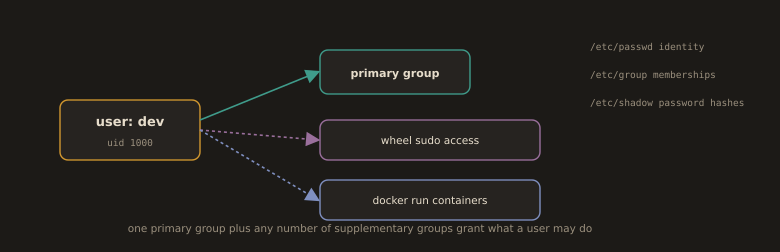

## 5. Managing Users and Groups

**Fig. 10 · A user and the groups that empower them**



*Each user has one primary group and can join supplementary groups, and three files under etc record who they are and what they may do.*

A **user** is an account that represents a person or process on the system, identified by a unique **UID**. A **group** is a collection of users that share the same permissions, identified by a **GID**. Users and groups are fundamental to Linux security, controlling access to files, directories, and system resources through ownership and permissions.

`useradd` creates a new user, `usermod` modifies an existing user, and `userdel` removes one. `passwd` sets or changes a user's password. `groupadd` creates a new group, `groupmod` modifies it, and `groupdel` removes it. `id` displays a user's UID, GID, and group memberships, and `whoami` returns the current username. Account information is stored in `/etc/passwd`, group information in `/etc/group`, and passwords in `/etc/shadow`.

User and group management is a core responsibility for DevOps engineers. Access control, security auditing, and automation all depend on correctly managed users and groups.

---
**User types:**

 - Normal users: People who log in and run applications
   
 - System accounts: Used by services and daemons (www-data, nobody, sshd); do not log in interactively
   
 - Root: Full administrative access to everything on the system

---
**Group types:**

 - Primary group: Assigned at user creation; files created by the user belong to this group
   
 - Secondary groups: Additional group memberships that extend a user's access

---
**Important files:**

 - `/etc/passwd`: User account information: `username:x:UID:GID:comment:home:shell`
   
 - `/etc/shadow`: Encrypted passwords and password policy
   
 - `/etc/group`: Group definitions: `groupname:x:GID:members`

---
### Group Management

> Examples:

* Creates a new group
```bash
sudo groupadd developer
```
```bash
sudo groupadd operation
```
```bash
sudo groupadd helpdesk
```
* Creates a group with a specific GID
```bash
sudo groupadd -g 1009 admin
```
* Renames an existing group
```bash
sudo groupmod -n administration admin
```
* Displays all local groups
```bash
cat /etc/group
```
* Queries group entries from system databases
```bash
getent group
```
>Local + Network/Centralized groups.
* Deletes a group from the system
```bash
sudo groupdel helpdesk
```
---


---


---


---
### User Management

> Examples:

* Creates a new user without a home directory
```bash
sudo useradd harry
```
> Creating home directory depends on OS configuration e.g. `CREATE_HOME yes`
* Creates a user with a home directory
```bash
sudo useradd -m natasha
```
* Creates a user with home, bash shell, and wheel (sudo) group
```bash
sudo useradd -m -s /bin/bash -G wheel thomas
```
* Creates a user with primary and secondary groups
```bash
sudo useradd -g developer -G operation david
```
---


---
* Sets or changes a user's password
```bash
sudo passwd harry
```
* Sets or changes another user's password as an administrator
```bash
sudo passwd thomas
```
---
* Switches to another user with a login shell
```bash
su - natasha
```
```bash
whoami
```
* Exits the current user session and returns to the previous user
```bash
exit
```
* Locks a user account (disables login)
```bash
sudo passwd -l natasha
```
```bash
su - natasha
```
* Unlocks a user account
```bash
sudo passwd -u natasha
```
```bash
su - natasha
```
---


---
* Checks if a user exists in the system
```bash
cat /etc/passwd | grep thomas
```
* Shows group memberships of a user
```bash
groups thomas
```
---


---
### Modifying Existing Users

> Examples:

* Adds a user to a supplementary group without removing existing groups
```bash
sudo usermod -a -G operation thomas
```
* Changes a user's primary group
```bash
sudo usermod -g developer thomas
```
---


---
* Changes a user's default login shell
```bash
sudo usermod -s /bin/bash thomas
```
---


---
* Renames an existing user account
```bash
sudo usermod -l newname oldname
```
---


---
* Changes and moves a user's home directory
```bash
sudo usermod -d /new/home -m username
```
---


---
* Deletes a user but keeps their home directory
```bash
sudo userdel david
```
* Deletes a user and removes their home directory and mail spool
```bash
sudo userdel -r david
```
---


---
---
### Sudo Management

**Sudo** (superuser do) allows users with permission to execute commands with elevated privileges, typically as root, without logging in as root directly. It provides controlled, auditable access to administrative tasks, making it essential for system security.

`sudo` runs a command with elevated privileges, and `sudo -i` opens an interactive root shell. `visudo` safely edits the sudoers configuration file, which defines who can use sudo and with what restrictions. `sudo -l` lists the commands a user is permitted to run. Sudo activity is logged to `/var/log/auth.log` or `/var/log/secure`, providing an audit trail of privileged actions.

> Example:

```bash
sudo visudo
```
---


---
Common sudoers entries:

- Full admin access for javadeveloper
```
javadeveloper ALL=(ALL:ALL) ALL
```
- Complete example:
---


---


---
- Allow Bob to manage only nginx
```
bob ALL=(ALL) /usr/bin/systemctl restart nginx, /usr/bin/systemctl status nginx
```
- Group based full sudo
```
%wheel ALL=(ALL) ALL
```
- Passwordless sudo for backup operations
```
%backup ALL=(ALL) NOPASSWD: /usr/bin/rsync
```
- Log all sudo commands
```
Defaults logfile="/var/log/sudo.log"
```

---
---
