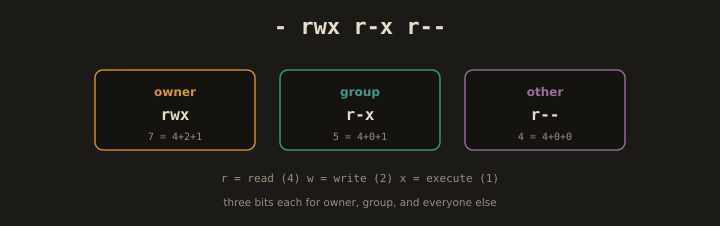
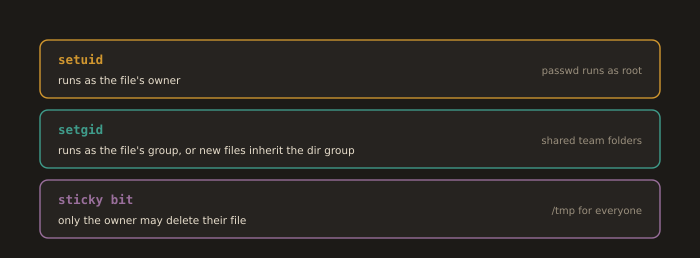

## 6. Managing Permissions and Ownership

**Permissions** define what actions a user can perform on a file or directory: **read (r)**, **write (w)**, and **execute (x)**. **Ownership** determines which user and group a file belongs to. Together, they form the foundation of Linux access control, protecting files and system resources from unauthorized access.

`chmod` changes file permissions, accepting either symbolic (`u+x`) or octal (`755`) notation. `chown` changes the owner of a file, and `chgrp` changes the group ownership. `umask` sets the default permissions for newly created files. `ls -l` displays the permissions and ownership of files. Permissions are applied at three levels, **owner**, **group**, and **others**, giving fine grained control over file access.

---
### Viewing Permissions

> Examples:

* Shows file permissions and ownership details
```bash
ls -l file.txt
```

* Shows directory permissions and ownership details
```bash
ls -ld directory/
```

Permissions are shown as: `-rwxr-xr--`
 - Character 1: file type (`-` = file, `d` = directory, `l` = symlink)
 - Characters 2-4: owner permissions (user)
 - Characters 5-7: group permissions
 - Characters 8-10: others' permissions

- Complete examples:
---


---


---
### Permission Values

**Fig. 11 · Reading a permission string**



*Three groups of read, write, and execute bits, for the owner, the group, and everyone else, add up to the familiar octal number.*

| Permission | Symbol | Numeric |
|---|---|---|
| Read | r | 4 |
| Write | w | 2 |
| Execute | x | 1 |
| None | - | 0 |

Add values for each class: `rwx` = 7, `r-x` = 5, `r--` = 4, `---` = 0.

---
### `chmod`: Change Permissions

> Examples:

* Adds execute permission for the file owner
```bash
chmod u+x script.sh
```
* Removes write permission from the group
```bash
chmod g-w file.txt
```
* Sets read and write permissions for all users
```bash
chmod a=rw file.txt
```
* Sets owner, group, and others permissions separately
```bash
chmod u=rwx,g=rx,o= mydir
```
- Example:
---


---
**OR**

* Sets permissions using octal mode: owner full, others read/execute
```bash
sudo chmod 755 mydir
```
---


---
* Sets the owner full and group read/execute permissions
```bash
sudo chmod 750 mydir
```
* Sets owner read/execute permissions only
```bash
sudo chmod 500 mydir
```
* Sets permissions using octal mode: owner read/write, others read
```bash
sudo chmod 664 file.txt
```
---


---
* Sets full permissions only for the owner
```bash
sudo chmod 700 script.sh
```
---


---
### `chown`: Change Ownership

> Example:

* Changes file owner to a specific user
```bash
sudo chown systemadmin file.txt
```
---


---
* Changes file owner and group
```bash
sudo chown systemadmin:operation file.txt
```
---


---
* Recursively changes directory ownership
```bash
sudo chown -R harry html
```
---


---
### `chgrp`: Change Group

> Example:

* Changes group ownership of a file
```bash
sudo chgrp developer file.txt
```
* Recursively changes group ownership of a directory
```bash
sudo chgrp -R <group_name> <dir_name>
```
---


---
---
### `umask`: Default Permission Mask

`umask` sets the default permission mask applied when new files and directories are created. It works by subtracting permissions from the system default `666` for files and `777` for directories. For example, a `umask` of `022` results in file permissions of `644` and directory permissions of `755`. Running `umask` without arguments displays the current mask value.

* Shows the current default file permission mask
```bash
umask
```

> Examples:
* Sets default permissions so new files become 644 and directories 755
```bash
umask 022
```
```bash
touch f1
```
```bash
mkdir d1
```
- Verify:
```bash
umask
```

* Sets stricter default permissions so files become 640 and directories 750
```bash
umask 027
```
---
**To set permanently for the current user:**

* Adds a permanent umask setting to the user's bash startup file
```bash
echo "umask 022" >> ~/.bashrc
```
* Reloads the bash configuration to apply changes immediately
```bash
source ~/.bashrc
```
---
---
### Special Permissions

**Fig. 12 · The three special permission bits**



*setuid and setgid change which identity a program runs as, and the sticky bit stops people deleting each other's files in a shared directory.*

`sticky bit` is a special permission that restricts file deletion within a directory. When set, only the file's owner, the directory's owner, or root can delete or rename files inside it, even if other users have write permission on the directory. It is commonly applied to shared directories such as `/tmp`. The sticky bit is represented as `t` in the execute position of the others field in `ls -l` output, and is set using `chmod +t` or `chmod 1777`.

The `/tmp` directory uses this, displays directory permissions, and verifies the sticky bit (`t`) is set:
```bash
ls -ld /tmp
```
---


---
> Syntax:

* Adds sticky bit to a directory to restrict file deletion to owners
```bash
chmod +t <dir_name>
```
* Sets full permissions with sticky bit using octal notation
```bash
chmod 1777 <dir_name>
```
---
---
**Setuid:**

`setuid` is a special permission that allows a file to be executed with the privileges of the file's owner rather than the user running it. This is commonly used for programs that require elevated privileges, such as `passwd`, which needs root access to modify `/etc/shadow`. The setuid bit is represented as `s` in the execute position of the owner field in `ls -l` output, and is set using `chmod u+s` or `chmod 4755`.

> Syntax:
* Sets the setuid bit so the program runs with the file owner's privileges
```bash
chmod u+s <file_name>
```
* Sets setuid bit using octal notation
```bash
chmod 4755 <file_name>
```
* Displays permissions and verifies the setuid bit (`s`) is set
```bash
ls -l <file_name>
```
>`s` in the 3rd position
>Lowercase `s`: execute bit is ON
>Uppercase `S`: execute bit is OFF

---
---
**Setgid:**

`setgid` is a special permission that allows a file to be executed with the privileges of the file's group rather than the user's primary group. When applied to a directory, new files created inside inherit the directory's group ownership rather than the creator's group. This is useful for shared project directories where all files should belong to a common group. The setgid bit is represented as `s` in the execute position of the group field in `ls -l` output, and is set using `chmod g+s` or `chmod 2755`.

> Syntax:
* Adds setgid bit so new files inherit group ownership
```bash
chmod g+s <file/dir_name>
```
* Sets permissions with setgid using octal notation
```bash
chmod 2770 <file/dir_name>
```
* Displays permissions and verifies the setgid bit (`s`) is set
```bash
ls -l <file_name>
```
> `s` in the 6th position
---
---
### Access Control Lists (ACLs)

`ACLs` (Access Control Lists) extend the standard Linux permission model by allowing fine grained permissions to be assigned to specific users or groups beyond the traditional owner, group, and others. This is useful when multiple users need different levels of access to the same file or directory. `getfacl` displays the ACL entries of a file, and `setfacl` sets or modifies them. For example, `setfacl -m u:username:rwx file` grants a specific user read, write, and execute permissions. ACL support must be enabled on the filesystem, and entries are visible as a `+` sign in `ls -l` output.

> Examples:
* Shows Access Control Lists on a file
```bash
getfacl file.txt
```
---


---
* Grants a user read, write, and execute access
```bash
setfacl -m u:javadeveloper:rwx file.txt
```
* Grants a group read only access
```bash
setfacl -m g:javadeveloper:r-- file.txt
```
* Removes a user ACL entry
```bash
setfacl -x u:javadeveloper file.txt
```
* Removes all ACL entries from a file
```bash
setfacl -b file.txt
```
* Applies an ACL recursively to a directory
```bash
setfacl -R -m g:dev:r-- dir/
```
* Sets a default ACL for new files in a directory
```bash
setfacl -d -m u:javadeveloper:rwx dir/
```
---
> The filesystem must be mounted with ACL support. On most modern Linux distributions, this is enabled by default. If not, add `acl` to the mount options in `/etc/fstab`.
---
> **Note**: **Chmod vs ACLs**
> chmod sets basic permissions restricted to exactly one owner, one group, and everyone else.
> ACLs allow granular permissions for multiple specific users and groups on a single file.
---
---
