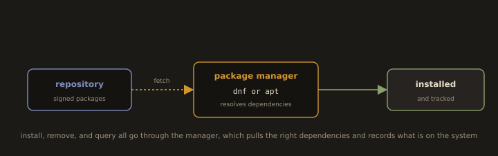

## 7. Package Management

**Fig. 13 · Packages come from a managed repository**



*The package manager fetches signed packages from a repository, pulls in their dependencies, and keeps a record of everything installed.*

`Package Management` is the process of installing, updating, configuring, and removing software on a Linux system. Packages are pre-compiled bundles of software that include binaries, configuration files, and dependencies. A package manager automates these tasks and resolves dependencies automatically.

`apt` is the package manager for Debian based systems such as Ubuntu. `apt install` installs a package, `apt remove` uninstalls it, and `apt update` refreshes the package index. 

`yum` and `dnf` serve the same role on Red Hat based systems such as CentOS and Fedora. `rpm` handles low level package operations on Red Hat-based systems, and `dpkg` on Debian-based systems. `snap` and `flatpak` are universal package formats that work across distributions.

---
**Package Managers by Distribution:**

| Distribution | High level tool | Low level tool |
|---|---|---|
| RHEL, CentOS Stream, Fedora | `dnf` | `rpm` |
| Debian, Ubuntu | `apt` | `dpkg` |
| Arch Linux | `pacman` | — |
| openSUSE | `zypper` | `rpm` |

---
> Note on `yum`: `yum` is a legacy alias for `dnf` on RHEL 8+ and CentOS Stream 9+. On CentOS Stream 9 and 10, `dnf` is the correct command to use. `yum` may still work as a compatibility shim, but `dnf` is the authoritative tool.
---
### Querying Packages

* Searches available packages by keyword in repositories
>Example:
```bash
dnf search apache
```
* Searches packages using wildcard patterns
>Example:
```bash
dnf search *database*
```
* Shows detailed information about a specific package
>Example:
```bash
dnf info httpd
```
---


---
* Displays package details for the gzip utility
  
> Examples: 

```bash
dnf info gzip
```
* Lists all installed packages on the system
```bash
dnf repoquery --installed
```
* Filters installed RPM packages matching a name
>Examples
```bash
rpm -qa | grep httpd
```
```bash
rpm -qa | grep zip
```
---


---
* Finds which package owns a specific file
>Example:
```bash
rpm -qf /usr/bin/tar
```
* Lists all files installed by a package
>Examples:
```bash
rpm -ql httpd
```
```bash
rpm -ql zip
```

---
---
### Installing and Removing Packages

* Updates all installed packages to the latest versions from repositories
```bash
sudo dnf update
```
* Installs the Apache HTTP server package
```bash
sudo dnf install httpd -y
```
* Installs multiple packages in one command
>Example:
```bash
sudo dnf install git mariadb nginx
```
* Removes an installed package from the system
>Example:
```bash
sudo dnf remove httpd -y
```
* Removes unused dependencies from the system
```bash
sudo dnf autoremove
```
---
* Installs a local RPM package with dependency resolution
> Syntax:
```bash
sudo dnf install ./package.rpm
```
* Installs a local RPM package without dependency resolution
> Syntax:
```bash
sudo rpm -ivh package.rpm
```
---
### Ubuntu/Debian Package Management

* Refreshes package index from repositories
```bash
sudo apt update
```
* Upgrades all installed packages
```bash
sudo apt upgrade
```
* Installs a package on Debian based systems
>Example:
```bash
sudo apt install nginx -y
```
* Upgrades packages with dependency changes allowed
```bash
sudo apt full-upgrade
```
* Removes a package but keeps configuration files
>Example:
```bash
sudo apt remove nginx
```
* Removes a package and its configuration files
>Example:
```bash
sudo apt purge nginx
```
* Removes unused dependencies
```bash
sudo apt autoremove
```
---
---
### Managing Services

* Shows the current status of a service
>Example:
```bash
systemctl status nginx
```
---


---
* Starts a system service immediately
>Example:
```bash
sudo systemctl start httpd
```
---


---
* Stops a running system service
>Example:
```bash
sudo systemctl stop httpd
```
* Restarts a service (stop + start)
>Example:
```bash
sudo systemctl restart httpd
```
* Reloads service configuration without a full restart
>Example:
```bash
sudo systemctl reload httpd
```
* Enables service to start automatically at boot
>Example:
```bash
sudo systemctl enable httpd
```
* Disables service from starting at boot
>Example:
```bash
sudo systemctl disable httpd
```
* Checks if a service is enabled at boot
>Example:
```bash
systemctl is-enabled httpd
```
---
> The difference between restart and reload: `restart` stops and starts the service, briefly interrupting connections. `reload` re-reads the configuration file without dropping connections. Use `reload` when you change an Apache or Nginx configuration file and need it applied without downtime.
---
---
### Installing Software from Source and Prebuilt Binaries

`Installing Software from Source` refers to the process of compiling and installing software directly from its source code rather than using a package manager. It is useful when a package is unavailable in a distribution's repository or when a specific version or custom configuration is needed.

The typical process follows three steps. `./configure` checks the system for required dependencies and prepares the build environment. `make` compiles the source code into binaries. `make install` installs the compiled binaries and files into the appropriate system directories. Dependencies such as `gcc`, `make`, and development libraries must be present before building. Source tarballs are typically downloaded and extracted using `tar -xzvf` before the build process begins. The worked example below installs Node.js from the project's **official prebuilt binaries** rather than compiling it, which is the usual approach when upstream already ships binaries for your architecture; the `./configure && make && make install` sequence is what you use when you must build from a source tarball instead.

**Example: Install Node.js 24.x on Fedora/RHEL**

Node.js follows a predictable LTS schedule. Up to Node.js 26, even numbered versions transition to Long Term Support and are maintained for roughly 30 months in total. As of July 2026, Node.js 20 has reached end of life (30 April 2026) and Node.js 22 has dropped to Maintenance LTS. The Active LTS line, and therefore the version to install, is **Node.js 24.x**. Part 4 carries the current table and the note that this convention itself changes at Node.js 27.

* Shows system architecture of your server (e.g., x86_64, ARM)
```bash
uname -m
```
---
> Visit: [Node.js's Website](https://nodejs.org/en)
> Click on: `Get Node.js`
> Then choose your server's operating system and architecture.
> Right click on the package name and `Copy link address`
> 
---
* Downloads Node.js binary archive from the official source
```bash
wget https://nodejs.org/dist/v24.18.0/node-v24.18.0-linux-x64.tar.xz
```
* Extracts the downloaded tar.xz archive
```bash
tar -xvf node-v24.*.*-linux-x64.tar.xz
```
* Installs Node.js system wide by copying files to /usr/local
```bash
cd node-v24.18.0-linux-x64 && sudo cp -r bin include lib share /usr/local/
```
* Checks installed Node.js and npm versions
```bash
node -v
```
```bash
npm -v
```

---
>Always check the official Node.js release schedule at `nodejs.org/en/about/previous-releases` before downloading. Only install Active LTS or Maintenance LTS versions in lab and production environments.

---
---
### systemd Unit Files

> This is the working introduction. Part 3 covers unit types, targets, journald, and socket activation properly. Read it once you are comfortable starting and stopping services here.

`systemd Unit Files` are configuration files that define how systemd manages services, sockets, devices, mounts, and other system resources. They replace the older SysVinit scripts and provide a consistent, declarative way to control system behavior at startup and runtime.

Unit files are stored in `/etc/systemd/system/` for custom and administrator-defined units, and `/lib/systemd/system/` for distribution-provided units. A service unit file consists of three main sections. `[Unit]` contains metadata such as the service description and dependencies. `[Service]` defines how the service is started, stopped, and restarted, including the `ExecStart` directive pointing to the binary. `[Install]` specifies the target under which the service is enabled, commonly `multi-user.target`. After creating or modifying a unit file, `systemctl daemon-reload` must be run to reload the configuration.

* Lists systemd unit files provided by installed packages
```bash
ls /usr/lib/systemd/system/
```
* Lists administrator created or overridden systemd unit files
```bash
ls /etc/systemd/system/
```
* Reloads systemd manager configuration after unit file changes
```bash
sudo systemctl daemon-reload
```
* Shows dependency tree for a service
> Example:
```bash
systemctl list-dependencies httpd
```

---
---
### Troubleshooting Services

`Troubleshooting Services` refers to the process of diagnosing and resolving issues with system services managed by systemd. It is essential for identifying why a service has failed, is behaving unexpectedly, or is not starting correctly.

`systemctl status` displays the current state of a service, including recent log entries and any error messages. `systemctl start`, `stop`, and `restart` control the running state of a service. `journalctl -u` filters the system journal for a specific service, and `-f` follows the log output in real time. `systemctl is-enabled` checks whether a service is configured to start at boot. `systemctl list-units --state=failed` lists all currently failed units, providing a quick overview of services requiring attention.

* Shows logs for a specific systemd service
> Example:
```bash
journalctl -u nginx
```
---


---
* Follows service logs in real time
> Example:
```bash
journalctl -u nginx -f
```
* Shows service logs from today
```bash
journalctl -u httpd --since today
```
* Shows only error level logs for a service
> Example:
```bash
journalctl -p err -u nginx
```
* Shows logs from a specific date and time
> Example:
```bash
journalctl --since "2025-01-01 00:00:00"
```
* Checks systemd unit file syntax
> Example:
```bash
systemd-analyze verify nginx.service
```
* Confirms a service is listening on port 80
```bash
ss -tlnp | grep :80
```
---


---
---
