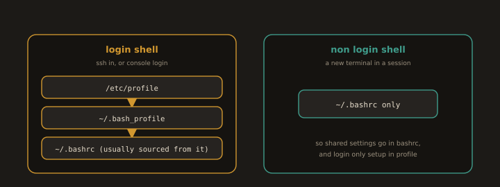

## 9. Shell Environment and Configuration

Understanding the shell environment helps you write better scripts, set up tools correctly, and avoid common issues where commands work in your terminal but not in cron or CI/CD pipelines.

---
### Shell Startup Files

**Fig. 14 · Which startup file the shell reads**



*A login shell reads the profile files, a non login shell reads only bashrc, which is why shared settings belong in bashrc.*

When you open a terminal or log in, Bash reads configuration files in a specific order. Knowing which file to edit for which purpose prevents a lot of confusion.

| File | When it runs | What to put there |
|---|---|---|
| `~/.bashrc` | Every new interactive shell (terminal tab) | Aliases, functions, PS1 prompt |
| `~/.bash_profile` | Login shells only (SSH login, console login) | Environment variables, PATH additions |
| `~/.profile` | Login shells when `.bash_profile` does not exist | Same as `.bash_profile` |
| `/etc/profile` | System wide login shell settings | Global environment variables |
| `/etc/bashrc` | System wide interactive shell settings | Global aliases, prompt |

> The most common practice is to put everything in `~/.bashrc` and have `~/.bash_profile` source it:
```bash
# Inside ~/.bash_profile
if [ -f ~/.bashrc ]; then
    source ~/.bashrc
fi
```
---
---
### Customizing PATH

`PATH` is a colon-separated list of directories where the shell looks for executables when you type a command. If a binary is not in any of these directories, the shell cannot find it.

* View current PATH
```bash
echo $PATH
```
* Add a directory to PATH for the current session
```bash
export PATH=$PATH:/usr/local/myapp/bin
```
* Add permanently (in ~/.bashrc)
```bash
echo 'export PATH=$PATH:/usr/local/myapp/bin' >> ~/.bashrc
source ~/.bashrc
```
---
---
### Aliases

Aliases let you create shortcuts for long commands. They are stored in `~/.bashrc`.

* Create a temporary alias (current session only)
```bash
alias ll='ls -la'
alias gs='git status'
alias update='sudo dnf update -y'
```
* View all current aliases
```bash
alias
```
* Remove an alias
```bash
unalias ll
```
* Make aliases permanent (add to ~/.bashrc)
```bash
echo "alias ll='ls -la'" >> ~/.bashrc
source ~/.bashrc
```
---
> Aliases do not work inside scripts by default. Use functions instead when you need reusable shortcuts in scripts.
---
---
### Applying Changes

Every time you edit `~/.bashrc` or `~/.bash_profile`, you need to reload the file in your current session:

```bash
source ~/.bashrc
```
or
```bash
. ~/.bashrc          # The dot command is the same as source
```

Without running `source`, changes only take effect in new terminal sessions.

---
---
