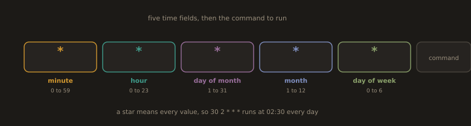
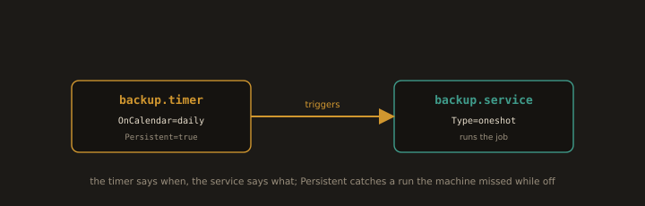

## 11. Scheduling Tasks

`Scheduling Tasks` in Linux refers to automating the execution of commands or scripts at specified times or intervals. It is essential for system maintenance, backups, log rotation, and other recurring administrative tasks.

`cron` is the traditional task scheduler, configured through `crontab` files. `crontab -e` opens the current user's crontab for editing, and `crontab -l` lists existing entries. A cron expression consists of five fields representing minute, hour, day of month, month, and day of week, followed by the command to execute. `@reboot` runs a command once at system startup. `systemd timers` are a modern alternative to cron, defined as unit files and managed with `systemctl`. `at` schedules a one time task to run at a specific time, and `anacron` handles tasks on systems that are not running continuously.

---
### 11.1 Cron for Recurring Jobs

**Fig. 15 · The five fields of a cron line**



*Minute, hour, day of month, month, and day of week decide when the command runs; a star means every value.*

Cron runs commands on a schedule. Each user has their own crontab, and system wide cron configuration is in `/etc/crontab` and `/etc/cron.d/`.

---
### Check cron service status

```bash
systemctl status crond    # RHEL / CentOS / Fedora
```
- If the service is not installed, install it:
```bash
sudo dnf -y install cronie 
```
---
- Managing crontabs:
```bash
crontab -l                          # list your current cron jobs
```
```bash
crontab -e                          # edit your crontab
```
```bash
crontab -r                          # remove ALL your cron jobs (be careful!)
```
```bash
sudo crontab -u username -e         # edit another user's crontab (root only)
```

- Cron expression format
```
Minute  Hour  Day-of-Month  Month  Day-of-Week    Command
  *       *         *          *        *         /path/to/command
```
| Field | Range | Notes |
|-------|-------|-------|
| Minute | 0-59 | |
| Hour | 0-23 | |
| Day of Month | 1-31 | |
| Month | 1-12 | |
| Day of Week | 0-6 | 0 = Sunday |

---
**Operators**
  
| Operator | Meaning | Example |
|----------|---------|---------|
| `*` | every value | every minute/hour/day |
| `*/5` | every 5 units | every 5 minutes |
| `1-5` | range | Monday to Friday |
| `1,15` | specific values | 1st and 15th |
| `8-18/2` | every 2 units in range | every 2 hours between 8-18 |

---
**Aliases**

| Alias | Equivalent | Meaning |
|-------|------------|---------|
| `@reboot` | — | once at startup |
| `@hourly` | `0 * * * *` | every hour |
| `@daily` | `0 0 * * *` | every day at midnight |
| `@weekly` | `0 0 * * 0` | every Sunday at midnight |
| `@monthly` | `0 0 1 * *` | 1st of every month |

---
### Cron examples for DevOps

```bash
crontab -e
```
---
```bash
*/5 * * * * echo "$(/usr/bin/date)" >> $HOME/disk-monitor.log && /usr/bin/df -h >> $HOME/disk-monitor.log
```


---
```bash
* * * * * /usr/bin/systemctl is-active nginx >> $HOME/nginx-check.log              # every minute check nginx service status
```


---
```bash
*/5 * * * * /usr/bin/journalctl -p err -S "5 minutes ago" >> $HOME/cron-errors.log  # every 5 minutes, capture systemd error logs
```
---
```bash
0 3 * * * /usr/bin/dnf upgrade -y >> $HOME/dnf-auto-upgrade.log 2>&1               # daily at 3 AM auto apply dnf updates with logging
```
---
```bash
15 9 * * 1-5 /usr/bin/systemctl restart rsyslog                                        # weekdays at 9:15 AM, restart log daemon
```
---
```bash
30 2 1 * * /usr/bin/dnf autoremove -y >> $HOME/dnf-cleanup.log 2>&1                # 1st of every month at 2:30 AM, clean unused packages
```
---
```bash
*/2 * * * * (echo "=== $(/usr/bin/date) ==="; /usr/bin/systemctl list-units --state=failed) >> $HOME/failed-units.log  # every 2 minutes, log failed systemd units
```
---
> `2>&1` Redirects stderr into stdout, so both normal output and errors go into the log file.
---
**Important notes:**
- Always use absolute paths for commands in cron. Cron runs with a minimal PATH.
- Redirect output to a log file or `/dev/null`, cron will email output if a local mail system is configured.
- The `%` character is special in cron (converted to newline). Escape as `\%` if needed.
---
---
**Where cron reads jobs from:**

| Location | Contents |
|---|---|
| `crontab -e` output > `/var/spool/cron/crontabs/<user>` | Per user cron jobs (5 field format) |
| `/etc/crontab` | System crontab (6 field format: includes username) |
| `/etc/cron.d/` | Drop-in files (6 field format) |
| `/etc/cron.hourly/`, `/etc/cron.daily/`, etc. | Scripts run by `run-parts` |

---
**6 field format (for `/etc/crontab` and `/etc/cron.d/`):**
```
# m  h  dom  mon  dow  user  command
15   1   *    *    *   root  /usr/local/bin/rotate-keys
```

---
**Always set PATH and MAILTO at the top of your crontab:**
```
SHELL=/bin/bash
PATH=/usr/local/sbin:/usr/local/bin:/usr/sbin:/usr/bin:/sbin:/bin
MAILTO=""    # Empty to suppress email output
```
---
---
### 11.2 systemd Timers

**Fig. 16 · A timer triggers a service**



*The timer unit holds the schedule and the matching service unit holds the work, and Persistent makes up a run missed while the machine was off.*

`systemd Timers` are unit files that schedule service execution at specified times or intervals, serving as a modern, more flexible alternative to cron. They integrate directly with systemd, providing better logging, dependency management, and control.

A timer unit file uses the `.timer` extension and is paired with a corresponding `.service` unit file that defines the command to run. `OnCalendar` specifies a real-time schedule using calendar expressions such as `daily`, `weekly`, or `Mon *-*-* 08:00:00`. `OnBootSec` and `OnUnitActiveSec` define monotonic timers that trigger relative to system boot or the last activation. `systemctl enable --now` activates a timer immediately and enables it at boot. `systemctl list-timers` displays all active timers along with their next and last trigger times. `journalctl -u` retrieves logs for the associated service, providing full visibility into execution history.

Here's a complete hands-on example — a real backup job using a systemd timer.

---
**Example:**

- Create the script
```bash
sudo vim /usr/local/bin/myjob.sh
```
```bash
#!/bin/bash
echo "Backup started at $(date)" >> ~/myjob.log
cp -r /var/log ~/backup_$(date +%F)
echo "Backup done at $(date)" >> ~/myjob.log
```
```bash
sudo chmod +x /usr/local/bin/myjob.sh
```

- Create the timer file
```bash
sudo vim /etc/systemd/system/myjob.timer
```
```ini
[Unit]
Description=Run myjob daily

[Timer]
OnCalendar=daily
Persistent=true

[Install]
WantedBy=timers.target
```

- Create the service file
```bash
sudo vim /etc/systemd/system/myjob.service
```
```ini
[Unit]
Description=Run myjob script

[Service]
Type=oneshot
ExecStart=/usr/local/bin/myjob.sh
```
- Enable and start
```bash
sudo systemctl daemon-reload              
sudo systemctl enable --now myjob.timer
```
- Verify and monitor
```bash
systemctl list-timers
```
```bash
systemctl status myjob.timer                  # check timer is active
```
```bash
journalctl -u myjob.service                   # view run logs
```
- Test it manually without waiting
```bash
sudo systemctl start myjob.service             # run the job right now
```
```bash
cat ~/myjob.log                                # check the log
```
---


---


---
---
**Cron vs systemd Timers**

| Feature | Cron | systemd Timer |
| :--- | :--- | :--- |
| **Config style** | Single crontab line | Two files (`.timer` + `.service`) |
| **Logging** | Manual (`>> logfile`) | Automatic via `journalctl` |
| **Missed job handling** | Skipped if system was off | Can catch up with `Persistent=true` |
| **Dependencies** | None | Can depend on network, mounts, etc. |
| **Per user support** | Yes (`crontab -e`) | Yes (`systemctl --user`) |
| **Email on failure** | Manual setup | Built-in with `OnFailure=` |
| **Monitoring** | Hard to check status | `systemctl status` built-in |
| **Fedora preference** | Legacy | Recommended modern way |

---
---
### 11.3 One Time Jobs with `at`

`One Time Jobs with at` refers to scheduling a command or script to execute once at a specific future time, without repeating. It is useful for delayed tasks that do not need to be recurring.

`at` accepts a time argument in flexible formats such as `now + 5 minutes`, `10:30`, or `midnight`. Commands are entered interactively after running `at`, and the job is submitted by pressing `Ctrl+D`. `atq` lists all pending `at` jobs for the current user, and `atrm` removes a job by its job number. Output from `at` jobs is sent to the user's local mail by default, as they run detached from the terminal. The `at` daemon `atd` must be running for jobs to execute, and access can be controlled through `/etc/at.allow` and `/etc/at.deny`.

---
- Complete example with `at`:
  
- Check `atd` is running
```bash
systemctl status atd
```
---
> If not running: `sudo systemctl enable --now atd`
---
- Manage jobs
```bash
atq                                   # list pending jobs
```
```bash
at -c 1                               # see what job 1 will run
```
```bash
atrm 2                                # cancel job 2
```
```bash
atq                                   # confirm job 2 is gone
```
- Create a script to schedule
```bash
vim ~/cleanup.sh
```
```bash
#!/bin/bash
echo "Cleanup started at $(date)" >> ~/at_jobs.log
rm -f /tmp/*.tmp
echo "Cleanup done at $(date)" >> ~/at_jobs.log
```
```bash
chmod +x ~/cleanup.sh
```

- Schedule interactively
```bash
at now +3 minute
```
```
at> echo "Hello from atjob" >> ~/atjob
at> Ctrl+d      
```
- Verify the job ran
```bash
cat ~/atjob
```


---
- Schedule non interactively
```bash
echo 'echo "Hello" >> /tmp/atlog' | at now + 1 hour
```
```bash
at -f ~/cleanup.sh 09:00 tomorrow     # run script at 9 AM tomorrow
```
---
> `atd`is the background service that watches for scheduled `at` jobs and runs them at the right time; without it, nothing runs.

---
---
