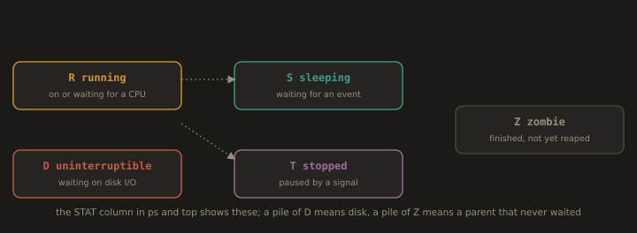
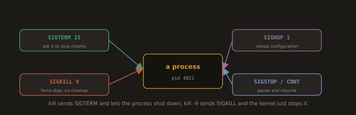
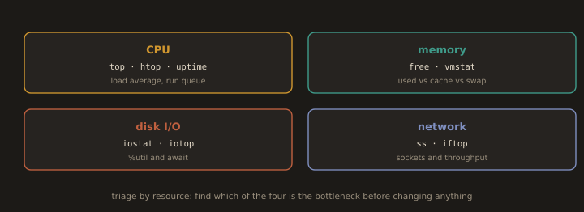

## 13. Process Management, System Monitoring, and Performance Tuning

`Process Management` in Linux involves controlling and monitoring running processes to ensure system stability and efficient resource utilization.

`ps aux` lists all running processes with their PID, CPU and memory usage, and command name. `top` and `htop` provide real-time interactive process views, with `htop` offering a more user-friendly interface with color and mouse support. `kill PID` sends a signal to a process, defaulting to `SIGTERM`, and `kill -9 PID` sends `SIGKILL` for immediate forceful termination. `pkill` and `killall` terminate processes by name rather than PID. `bg` and `fg` move processes between background and foreground, and `jobs` lists active background jobs in the current shell session. `nice -n value command` starts a process with a specified priority, and `renice` adjusts the priority of an already running process. `nohup` runs a command immune to hangups, keeping it running after the user logs out.

---
- `pidof`: Find the PID of a service
```bash
pidof sshd                  # Returns all PIDs of sshd
```
---
### 13.1 Process Monitoring Tools

**Fig. 17 · What a process state tells you**



*Running, sleeping, uninterruptible on disk, stopped, and zombie are the states in the ps STAT column, and each points at a different cause.*

**`ps`: process snapshot:** Snapshot of currently running processes.

- View all processes
```bash
ps aux                      # BSD style: all processes with CPU and memory usage
```


---
- Output explained (`ps aux`):

| Column | Meaning |
|--------|---------|
| `USER` | process owner |
| `PID` | process ID |
| `%CPU` | CPU usage |
| `%MEM` | memory usage |
| `VSZ` | virtual memory size |
| `RSS` | actual RAM used |
| `STAT` | process state |
| `COMMAND` | command that started it |

- STAT codes:
  
| Code | Meaning |
|------|---------|
| `S` | sleeping |
| `R` | running |
| `Z` | zombie (dead but not cleaned up) |
| `D` | uninterruptible sleep (waiting on I/O) |
| `s` | session leader |
| `+` | foreground process |

---
```bash
ps -ef                      # Unix style: all processes with PID and PPID
```
```bash
ps auxf                     # Process tree: Shows parent child relationships
```
---
- Filter processes
```bash
ps -u <user_name>                 # Processes owned by user cnode
```
> Examples:
```bash
ps -u vagrant
```


---
```bash
ps -C sshd                  # Processes named sshd
```
```bash
ps aux | grep nginx         # Filter by name using grep
```
- Custom output columns
```bash
ps -eo pid,ppid,user,%cpu,%mem,command    # Choose exactly what columns to show
```
- Useful combinations
```bash
ps aux --sort=-%cpu | head -10                         # Top 10 CPU consuming processes
```


---
```bash
ps aux --sort=-%mem | head -10                          # Top 10 memory consuming processes
```
```bash
ps -eo pid,user,%cpu,command --sort=-%cpu | head -5    # custom columns, sorted by CPU
```
---
> **`ps aux` vs `ps -ef`**: Both show all processes. `aux` adds `%CPU` and `%MEM` columns, which makes it more useful for quick diagnostics.
---
---
**Additional tools:**

Process tree and lookup tools find and target processes by name.

- `pstree`: Visual process hierarchy
```bash
pstree                      # Display all processes as a tree
```
```bash
pstree -p                   # Include PIDs in the tree
```

- `pgrep`: Find PIDs by name
> Examples
```bash
pgrep nginx                 # returns PID(s) of nginx
```
```bash
pgrep -u cnode              # all PIDs owned by user cnode
```
```bash
pgrep -la nginx             # show PID and full command
```


---
- `pkill`: Send a signal to a process by name
  
> Examples:

```bash
pkill nginx                 # Send SIGTERM to all nginx processes (graceful stop)
```
```bash
pkill -9 nginx              # Send SIGKILL (force kill, no cleanup)
```


---
```bash
pkill -u vagrant              # Kill all processes owned by cnode
```
---
- Useful combinations:
  
> Examples:
```bash
pgrep -la nginx                           # See all `nginx` related processes
```


---
```bash
pstree -p $(pgrep nginx | head -1)      # Show tree starting from nginx
```


---
```bash
pkill -HUP nginx                        # Reload nginx config without killing it
```
---
> **`pkill` vs `kill`** — `kill` needs a PID, `pkill` works directly with the process name, faster for quick actions.
---
---
### 13.2 Process Signals

**Fig. 18 · Signals ask, or tell, a process to act**



*SIGTERM asks a process to stop cleanly, SIGKILL forces it with no chance to clean up, and SIGHUP is the common reload signal.*

`kill`: send signals to processes to stop, reload, or force quit them.

- `kill`: send signal by PID
```bash
kill -15 <PID>               # SIGTERM: Graceful shutdown (default, can be caught)
```
```bash
kill -9 <PID>                # SIGKILL: Force kill (cannot be caught or ignored)
```
```bash
kill -1 <PID>                # SIGHUP: Reload config without restarting
```
---
- `killall` and `pkill`: kill by name
  
> Example:

```bash
killall -9 nginx            # Force kill ALL processes named nginx
```
```bash
pkill firefox               # Graceful kill by name (SIGTERM)
```
---
- Common signals:
  
| Signal | Number | Meaning |
|--------|--------|---------|
| `SIGHUP` | `1` | reload config |
| `SIGINT` | `2` | interrupt (same as Ctrl+C) |
| `SIGKILL` | `9` | force kill — no cleanup |
| `SIGTERM` | `15` | graceful stop — default |
| `SIGCONT` | `18` | resume paused process |
| `SIGSTOP` | `19` | pause process |

---
---
**- The right order to kill a process**
  
> Examples:

```bash
kill -15 <PID>               # Try graceful first
```
```bash
kill -9 <PID>                # Force kill only if -15 didn't work
```

- Useful combinations
  
> Examples:

```bash
kill -9 $(pgrep nginx)      # Force kill nginx using pgrep for PID
```
```bash
kill -1 $(pidof sshd)       # Reload sshd config
```
```bash
killall -15 httpd           # Graceful stop all httpd processes
```
---
---
> **Always try `SIGTERM (-15)` before `SIGKILL (-9)`** — SIGTERM lets the process clean up files, close connections, and exit properly. SIGKILL cuts it off immediately with no cleanup and can cause data corruption.

---
**Zombie processes:** A process that has finished but whose parent has not yet collected its exit status. The entry remains in the process table. Usually harmless in small numbers. If zombies accumulate, the parent process has a bug.

---
---
### 13.3 Background Job Control

```bash
sleep 180 &              # Start a command in the background
jobs                     # List current background jobs
jobs -l                  # List with PIDs
```


---
```bash
fg %1                    # Bring job 1 to the foreground
Ctrl+Z                   # Suspend the current foreground job
bg %1                    # Resume job 1 in the background
```


---
```bash
kill %1                  # Terminate background job 1
```
```bash
disown %1                # Detach job from shell (survives terminal close)
```
```bash
nohup ./script.sh &      # Run and ignore hangup signal (survives logout)
```

Job references: `%1` = job number 1, `%sleep` = job named sleep, `%%` = current job.

---
---
### 13.4 System Performance Monitoring

**Fig. 19 · Four resources, one tool set each**



*Performance work starts by deciding whether CPU, memory, disk, or the network is the limit, because each has its own tools and its own symptoms.*

`System Performance Monitoring` in Linux involves collecting and analyzing data about CPU, memory, disk, and network usage to identify bottlenecks and ensure optimal system operation.

`top` and `htop` provide real time overviews of CPU and memory usage across all running processes. `vmstat` reports statistics on virtual memory, CPU activity, and system I/O, and `iostat` monitors disk read and write performance per device. `free -h` displays total, used, and available memory including swap space. `sar` collects historical performance data and can report on CPU, memory, disk, and network activity over time. `mpstat` reports CPU usage per core, useful for identifying load imbalance on multi core systems. `netstat` and `ss` display network connections, listening ports, and socket statistics. `dstat` combines CPU, disk, network, and memory statistics into a single real time output. `uptime` shows system load averages over the last 1, 5, and 15 minutes.

---
**`top`:**

```bash
top
```
Interactive commands in `top`:

| Key | Action |
|---|---|
| `k` | Kill a process (prompts for PID) |
| `M` | Sort by memory |
| `P` | Sort by CPU |
| `u` | Filter by user |
| `1` | Show individual CPU cores |
| `q` | Quit |

Major Metrics:
```
PID=process ID, USER=process owner, PR=process priority, NI=nice value (CPU priority adjustment), VIRT=total virtual memory, RES=actual RAM used, SHR=shared memory, S=process state, %CPU=CPU usage, %MEM=memory usage, TIME+=total CPU time consumed, COMMAND=process/program name
```
---
**`htop`:**

- Install
```bash
sudo dnf install htop -y    # RHEL/CentOS
```
- Run
```bash
htop
```
Interactive Key in `htop`:

| Key | Action |
|---|---|
| F3 | Search |
| F4 | Filter |
| F5 | Tree view |
| F6 | Sort |
| F9 | Kill process |
| F10 | Quit |

Major Metrics:
```
PID=process ID, USER=process owner, PRI=priority, NI=nice value, VIRT=virtual memory, RES=actual RAM used, SHR=shared memory, S=process state, CPU%=CPU usage, MEM%=memory usage, TIME+=total CPU time, Command=process/program name, Tasks=number of processes, thr=threads, kthr=kernel threads, Load average=system load (1/5/15 min), Mem=used/total RAM, Swp=used/total swap, Uptime=system running time
```
> `htop` advantages over `top`: color-coded display, mouse support, vertical scrolling, easier process killing.

---
**`vmstat`: Virtual memory statistics:**

```bash
vmstat 1            # One snapshot per second
```
```bash
vmstat 2 10         # Every 2 seconds, 10 times
```


Major Metrics:
```
r=running processes, b=blocked processes, swpd=swap used, free=free memory, buff=buffer memory, cache=filesystem cache, si=swap in, so=swap out, bi=blocks read, bo=blocks written, in=interrupts, cs=context switches, us=user CPU, sy=system CPU, id=idle CPU, wa=I/O wait, st=stolen CPU (virtualized hosts), gu=guest CPU (KVM host only, newer kernels)
```

---
**`iostat`: I/O statistics:**

```bash
sudo dnf install sysstat -y
```
```bash
iostat
```
```bash
iostat -x 1             # Extended I/O stats, 1-second interval
```


Major Metrics:
```
%user=user CPU, %nice=low priority CPU, %system=kernel CPU, %iowait=CPU waiting for I/O, %steal=hypervisor taken CPU, %idle=unused CPU, tps=I/O operations/sec, kB_read/s=disk read speed, kB_wrtn/s=disk write speed, kB_dscd/s=disk discard speed, kB_read=total data read (~MB/GB), kB_wrtn=total data written (~MB/GB), kB_dscd=total discarded data, dm-0=device mapper/LVM disk, sda=physical disk, sr0=CD/DVD device, zram0=compressed RAM swap
```

---
**`free`: Memory usage**

```bash
free -h              # Human readable memory and swap usage
```
Major metrics:
```
total=total installed RAM, used=memory in use, free=unused memory, shared=memory used by tmpfs, buff/cache=buffer and page cache (reclaimable), available=estimated memory available for new applications
```

---
**`sar`: System Activity Reporter:**

```bash
sudo systemctl enable sysstat && sudo systemctl start sysstat
```
```bash
sudo systemctl start sysstat-collect.service
sleep 5
sudo systemctl start sysstat-collect.service
```
```bash
sar -u              # CPU statistics
sar -r              # Memory usage
sar -b              # I/O statistics
sar -u 1 5          # CPU every 1 second, 5 times
```


---
**`mpstat`:** `mpstat` reports CPU utilization statistics, either overall or per individual core, useful for spotting imbalanced load across multiple processors.

```bash
sudo dnf install sysstat -y     # same package provides mpstat, iostat, sar
```
```bash
mpstat 1 5           # Overall CPU stats, 1-second interval, 5 times
```


Major Metrics:
```
CPU=processor/core, %usr=user CPU time, %nice=low priority user CPU time, %sys=kernel/system CPU time, %iowait=CPU waiting for disk I/O, %irq=hardware interrupt CPU time, %soft=software interrupt CPU time, %steal=CPU time taken by hypervisor, %guest=CPU time used by virtual machines, %gnice=guest nice CPU time, %idle=unused/available CPU time, all=all CPUs combined, Average=average CPU usage over interval
```
---
```bash
mpstat -P ALL 1      # Per core breakdown, useful for spotting load imbalance
```
---
**`netstat` / `ss`: Network connections and sockets:**

```bash
ss -tuln              # TCP/UDP listening sockets, numeric ports
```
```
Netid=network protocol (tcp/udp), State=connection state, Recv-Q=receive queue waiting data, Send-Q=send queue waiting data/backlog, Local Address:Port=server IP address and listening port, Peer Address:Port=remote client IP and port, UNCONN=UDP socket without connection, LISTEN=TCP port waiting for connections, tcp=connection-oriented protocol, udp=connectionless protocol, 0.0.0.0=all IPv4 interfaces, [::]=all IPv6 interfaces, 127.0.0.1=localhost IPv4, [::1]=localhost IPv6, *:*=any address/port
```


---
```bash
ss -s                 # Socket summary statistics
```


---
```bash
netstat -tuln         # Legacy equivalent
```
---
> `ss` reads directly from the kernel instead of `/proc/net` and is the preferred tool on modern RHEL/Fedora systems; `netstat` still works but is considered legacy.
---
---
**`dstat`:** `dstat` is a real time system resource monitoring tool that combines CPU, disk, network, and memory statistics in a single, customizable view.

```bash
sudo dnf install pcp-system-tools -y
```
---
>On RHEL 8+ and modern Fedora, dstat is provided by the `pcp-system-tools` package. The `dstat` command itself continues to work identically after installation.
---
```bash
dstat                 # CPU, disk, network, memory in one view
```
```bash
dstat -cdngy 2        # CPU, disk, network, paging, system, 2-second interval
```


Major Metrics:
```
usr=user CPU usage, sys=system/kernel CPU usage, idl=idle CPU time, wai=CPU waiting for I/O, stl=stolen CPU by hypervisor, read=disk read speed, writ=disk write speed, recv=network received data, send=network sent data, in=pages swapped in, out=pages swapped out, int=interrupts per second, csw=context switches per second, times=time column, total-usage=CPU usage summary, dsk/total=disk activity, net/total=network activity, paging=memory paging activity, system=system activity
```
---
---
**`uptime`:**

Load average is the average number of processes running or waiting for the CPU, measured over 1, 5, and 15 minutes.

```bash
uptime                # Load averages for last 1, 5, and 15 minutes
```


---
> A CPU load average measures the amount of computational work your system is performing over time, rather than just the active CPU percentage.
---
---
### 13.5 Performance Tuning

`Performance Tuning` in Linux involves optimizing system configuration and resource allocation to improve responsiveness, throughput, and efficiency under varying workloads.

`nice` and `renice` adjust process scheduling priority, and `taskset` pins a process to specific CPU cores to improve cache efficiency and reduce context switching. `sysctl` modifies kernel parameters at runtime, with settings in `/etc/sysctl.conf` persisting across reboots. Common tunable parameters include `vm.swappiness` to control swap usage, `net.core.somaxconn` for network connection queuing, and `kernel.pid_max` for maximum process IDs. `tuned` is a daemon that applies predefined performance profiles such as `throughput-performance`, `latency-performance`, and `powersave` based on workload type. `ionice` adjusts I/O scheduling priority for disk intensive processes. `ulimit` sets resource limits for user processes, controlling maximum file descriptors, stack size, and CPU time. `cpupower` manages CPU frequency scaling and power states to balance performance and energy consumption.

---
**`nice` / `renice`:** `nice` sets a process's scheduling priority (niceness, -20 to 19) at launch, while `renice` changes the priority of an already running process.

```bash
nice -n 10 <command>         # Start a process with lower priority (range: -20 to 19, Higher=Lower Priority)
```
> Example:
```bash
nice -n 15 dnf update -y      # Runs updates without slowing down other tasks.
```
```bash
ps -aux | grep update
```


---
```bash
sudo nice -n -5 <command>         # Start with higher priority (requires root)
```
> Example:
```bash
sudo nice -n -5 systemctl restart nginx
```
---
```bash
renice 5 -p <Process_ID>            # Change priority of running process 1234
```
> Example:
```
ps aux | grep update      # Find PID
```
```
renice 10 -p 8543
```
---
```bash
renice -5 -u <User_name>          # Change priority for all processes owned by cnode
```
---
**`taskset`:** Sets or retrieves the CPU affinity of a process, restricting which CPU cores it can run on.

```bash
taskset -c 0,1 <command>      # Pin a new process to CPU cores 0 and 1
```
> Example:
```
taskset -c 0,1 dnf update -y
```
---
```bash
taskset -cp 0 <PID>          # Pin running process 1234 to CPU core 0
```
> Example:
```
ps aux | grep mysqld        # Find the PID first

sudo taskset -cp 0 1234      # Then pin it to core 0
```
> Locks MySQL (PID 1234) to core 0 so it doesn't bounce across CPUs.
---
```bash
taskset -cp <PID>            # Show current CPU affinity of process 1234, meaning it's allowed to run on available cores shown on the result.
```
---
- **Complete Example:**
```
nproc                                             # check how many cores your server has
```
```
taskset -c 0 dd if=/dev/zero of=/dev/null &      # start a CPU stress test pinned to core 0 only
```
```
ps -eo pid,psr,comm | grep dd                    # confirm it's actually running on core 0
```
> The PSR column shows which core it's actually executing on; it should stay at 0.
```
kill 7511                                          # stop the test            
```


---
---
**`sysctl`:** `sysctl` views and dynamically modifies kernel parameters at runtime (e.g., networking, memory, and security settings) without requiring a reboot.

| Parameter | Purpose |
|---|---|
| `vm.swappiness` | How aggressively the kernel swaps (0-100, lower = prefer RAM) |
| `net.core.somaxconn` | Max queued connections per listening socket |
| `kernel.pid_max` | Maximum number of process IDs |

```bash
sysctl -a | less                       # List all current kernel parameters
```
```bash
sysctl vm.swappiness                   # Show current value
```
```bash
sudo sysctl -w vm.swappiness=10        # Change value temporarily (runtime only, lost on reboot)
```
---
**- Make it Persistent:**

    Add to `/etc/sysctl.conf` or a file under `/etc/sysctl.d/`:
```
vm.swappiness = 10
net.core.somaxconn = 4096
kernel.pid_max = 65536
```
```bash
sudo sysctl -p              # Reload settings from /etc/sysctl.conf
```
---
---
**`tuned`:** `tuned` is a dynamic system tuning daemon that applies predefined performance and power saving profiles to optimize the system for specific workloads.

```bash
sudo dnf install tuned -y
sudo systemctl enable --now tuned
```
```bash
tuned-adm list                                     # Show available profiles
```
```bash
tuned-adm active                                   # Show currently active profile
```


---
```bash
sudo tuned-adm profile throughput-performance      # Optimize for throughput
```
```bash
sudo tuned-adm profile latency-performance         # Optimize for low latency
```
```bash
sudo tuned-adm profile powersave                    # Optimize for power savings
```
---
---
**`ionice`:** `ionice` sets or retrieves a process's I/O scheduling class and priority, controlling how much disk I/O bandwidth it gets relative to other processes.

```bash
ionice -c 2 -n 0 <command>        # Best effort class, highest priority within class
```
```bash
ionice -c 3 <command>             # Idle class, only runs when disk is otherwise idle
```
```bash
ionice -p <PID>                   # Show I/O priority of process 1234
```

> I/O classes: `1` = real time, `2` = best effort (default), `3` = idle.

---
---
**`cpupower`:** `cpupower` is a utility for inspecting and configuring CPU frequency scaling and power saving governors on Linux systems.

```bash
sudo dnf install kernel-tools -y
```
```bash
cpupower frequency-info                    # Show the current scaling driver and governor
```
```bash
cpupower frequency-set -g performance       # Set governor to performance
```
```bash
cpupower frequency-set -g powersave          # Set governor to powersave
```
---
>Drivers might not be available.
---
---
**`ulimit`:** `ulimit` sets or displays per process resource limits (e.g., open files, memory, CPU time) for the current shell and its child processes.

```bash
ulimit -a                  # Show all current limits
```
```bash
ulimit -n                  # Open file descriptors
```
```bash
ulimit -u                  # Maximum user processes
```
```bash
ulimit -n 4096             # Set file descriptor limit for current session
```

- **Persistent limits edit:** `/etc/security/limits.conf`
  
> Example:
```
# user        type   resource   limit
harry         soft   nofile     4096
javadeveloper hard   nofile     8192
@admins       soft   nproc      2048
*             hard   core       0       # Disable core dumps for all users
```
> Limits are applied at login. Existing sessions are not affected.
---
---
