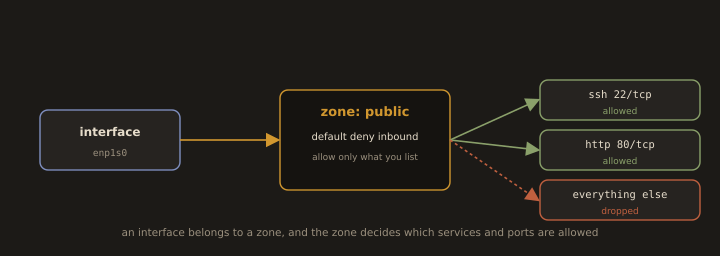

## 15. Firewall Management

Linux servers use a firewall to control which network traffic is allowed in and out. On RHEL and CentOS systems, `firewalld` is the default. On Debian and Ubuntu, `ufw` (Uncomplicated Firewall) is more common. Both manage the underlying `iptables` or `nftables` kernel rules.

---
### 15.1 firewalld (RHEL/CentOS/Fedora)

**Fig. 20 · firewalld sorts traffic by zone**



*Each interface is assigned a zone, and the zone applies a default deny with an explicit list of the services and ports it permits.*

`firewalld` uses zones to group rules. A zone defines the trust level for a network connection. The default zone for most servers is `public`.

---
* Check if firewalld is running
```bash
sudo systemctl status firewalld
```
---
* Start and enable firewalld
```bash
sudo systemctl enable --now firewalld
```
---
* Show the current firewall configuration
```bash
sudo firewall-cmd --list-all
```


---
* Show all available zones
```bash
sudo firewall-cmd --get-zones
```
---
* Show the active zone
```bash
sudo firewall-cmd --get-active-zones
```
---
---
**Opening and closing ports:**

---
* Allow a service by name (firewalld knows common services)
```bash
sudo firewall-cmd --permanent --add-service=http
```
```bash
sudo firewall-cmd --permanent --add-service=https
```
```bash
sudo firewall-cmd --permanent --add-service=mysql
```
---
* Allow a specific port
```bash
sudo firewall-cmd --permanent --add-port=8080/tcp
```
```bash
sudo firewall-cmd --permanent --add-port=3306/tcp
```
---
* Remove a service or port
```bash
sudo firewall-cmd --permanent --remove-service=http
```
```bash
sudo firewall-cmd --permanent --remove-port=8080/tcp
```
---
* Apply permanent changes (always required after --permanent changes)
```bash
sudo firewall-cmd --reload
```
---
---
**Common services firewalld knows by name:**

* List all predefined services
```bash
sudo firewall-cmd --get-services
```

>Common Services: `ssh`, `http`, `https`, `ftp`, `mysql`, `postgresql`, `dns`, `smtp`, `nfs`

---
---
**Temporary vs Permanent rules:**

Without `--permanent`, a rule is added immediately but disappears after a reload or reboot. With `--permanent`, it survives reboots but requires a `--reload` to become active immediately.

---
---
> **Always allow SSH before enabling a firewall on a remote server**, or you will lock yourself out. Run `sudo firewall-cmd --permanent --add-service=ssh` before enabling the firewall.
---
---
