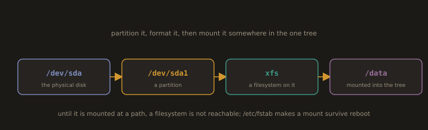

## 16. Disk Management

DevOps engineers regularly work with disk space: resizing volumes, adding storage to servers, mounting filesystems, and troubleshooting disk usage.

---
### Checking Disk Usage

* Show disk usage of all mounted filesystems in human readable format
```bash
df -h
```


---
* List block devices with sizes and mount points
```bash
lsblk
```


---
* Show filesystem type alongside disk usage
```bash
df -hT
```
---
* Show the disk usage of a specific directory
> Example:
```bash
sudo du -sh /var/log
```
---
* Find the largest files on the system
```bash
sudo find / -type f -size +100M -exec ls -lh {} \
2>/dev/null | sort -k5 -rh | head -10
```
---
---
### Mounting and Unmounting

**Fig. 21 · From a disk to a usable directory**



*A disk is partitioned, a partition is formatted with a filesystem, and the filesystem becomes reachable only once it is mounted at a path.*

`mount` attaches a filesystem to a directory in the filesystem tree. `umount` detaches it.

* Show all currently mounted filesystems
```bash
mount | column -t
```
---
* Mount a device to a directory
> Example:
```bash
sudo mount /dev/sdb1 /mnt/data
```
---
* Unmount a filesystem
> Example:
```bash
sudo umount /mnt/data
```
---
* Mount with a specific filesystem type
> Example:
```bash
sudo mount -t ext4 /dev/sdb1 /mnt/data
```
---
---
**Persistent mounts with `/etc/fstab`:**

`/etc/fstab` defines filesystems that are automatically mounted at boot. Each line has six fields: device, mount point, filesystem type, options, dump, and pass.

- View current fstab
```bash
cat /etc/fstab
```

Example entry for a data disk:
```
/dev/sdb1    /mnt/data    ext4    defaults    0    2
```
---
> Always test an `fstab` entry before rebooting. A bad entry can prevent the system from booting. Use `sudo mount -a` to attempt mounting all entries in `fstab` without rebooting, and fix any errors before you restart.

---
### Disk Partitioning Basics

You will encounter disk partitioning when adding a new disk to a server or resizing storage in a VM or cloud instance.

* View the partition table of a disk
```bash
sudo fdisk -l /dev/sdb
```
---
* Interactive partitioning tool (for MBR disks)
```bash
sudo fdisk /dev/sdb
```
---
* `parted` works with both MBR and GPT partition tables
```bash
sudo parted /dev/sdb print
```
---
---
**Example:** **Add and use a new disk:**

1. Check that the new disk is visible
```bash
lsblk
```
```
sudo fdisk -l /dev/sda
```
---
2. Create a partition
```bash
sudo fdisk /dev/sdb
```
> Press n (new), p (primary), 1 (first partition), accept defaults, w (write)
---
3. Format the partition
```bash
sudo mkfs.ext4 /dev/sdb1
```
---
4. Create a mount point and mount it
```bash
sudo mkdir /mnt/data
sudo mount /dev/sdb1 /mnt/data
```
---
5. Add to `/etc/fstab` for persistence
```bash
echo "/dev/sdb1    /mnt/data    ext4    defaults    0    2" | sudo tee -a /etc/fstab
```
---
---
