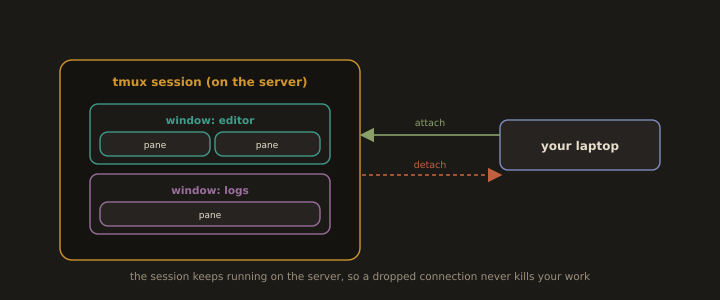

## 17. Terminal Multiplexers: tmux

**Fig. 22 · tmux keeps the session alive**



*Windows and panes live inside a session that runs on the server, so you can detach, lose the connection, and reattach to find everything still running.*

When working on remote servers over SSH, the session ends if your connection drops, and you lose everything that was running. `tmux` solves this by running sessions on the server that persist even when you disconnect. It also lets you split your terminal into multiple panes and windows.

---
### Why tmux Matters for DevOps

Without tmux, a dropped SSH connection kills a running deployment, database migration, or long build. With tmux, the process keeps running on the server and you can reconnect to it later.

---
### Installation

```bash
sudo dnf install tmux -y        # RHEL/CentOS
```
---
### `tmux` Commands

**Windows (like browser tabs):**

| Command | Action |
|---|---|
| `Ctrl+b c` | Create a new window |
| `Ctrl+b n` | Next window |
| `Ctrl+b p` | Previous window |
| `Ctrl+b 0-9` | Switch to window by number |
| `Ctrl+b ,` | Rename current window |

---
**Panes (split the terminal):**

| Command | Action |
|---|---|
| `Ctrl+b %` | Split pane vertically (left/right) |
| `Ctrl+b "` | Split pane horizontally (top/bottom) |
| `Ctrl+b arrow key` | Move between panes |
| `Ctrl+b x` | Close current pane |
| `Ctrl+b z` | Zoom pane to full screen (toggle) |

> All tmux commands start with the prefix key: `Ctrl+b`
---
**Scrolling:**

| Command | Action |
|---|---|
| `Ctrl+b [` | Enter scroll mode |
| Arrow keys or Page Up/Down | Scroll |
| `q` | Exit scroll mode |

* Start a new named session
```bash
tmux new -s deploy
```
* Detach from a session (session keeps running)
```
Ctrl+b d
```
* List all running sessions
```bash
tmux ls
```
* Reattach to a session
```bash
tmux attach -t deploy
```
* Kill a session
```bash
tmux kill-session -t deploy
```
---
### Example: Surviving a Dropped Connection

```bash
ssh user@server-ip                            # On your host computer
```
```bash
tmux new -s work                              # After logging into the server
```
- Run your commands
```bash
dnf update
./deploy.sh
tail -f /var/log/messages
```
---
If your connection drops, the tmux session keeps running on the server. Reconnect and reattach:

```bash
ssh user@server-ip
tmux attach -t work
```

You'll return to the same `tmux` session, with all commands still running.

---
> `screen` is an older alternative to tmux and is still found on many systems. The basic concepts are the same: `Ctrl+a d` to detach and `screen -r` to reattach.
---
---
