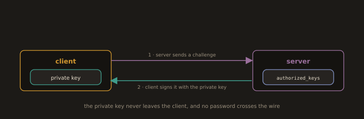

## 18. Remote Login with SSH

`Remote Login with SSH` in Linux allows secure, encrypted communication between a client and a remote server over an untrusted network. It is the standard method for remote administration and file transfer in Linux environments.

`ssh user@hostname` connects to a remote host, and `-p` specifies a non-default port. `ssh-keygen` generates a public/private key pair for passwordless authentication, and `ssh-copy-id` copies the public key to a remote server's `~/.ssh/authorized_keys` file. `~/.ssh/config` stores per-host connection settings such as hostname aliases, port, user, and identity file, simplifying repeated connections. `scp` securely copies files between local and remote hosts, and `sftp` provides an interactive file transfer session. `ssh -L` sets up local port forwarding, and `ssh -R` sets up remote port forwarding for tunneling traffic through an SSH connection. `/etc/ssh/sshd_config` controls server side settings such as `PermitRootLogin`, `PasswordAuthentication`, and `AllowUsers`. `systemctl restart sshd` applies configuration changes to the SSH daemon.

---
### 18.1 SSH Overview

SSH (Secure Shell) encrypts all communication between client and server. It replaced insecure protocols like Telnet and rsh. SSH operates on TCP port 22 by default.

The typical connection sequence:
1. Client connects to the server on port 22.
2. Server presents its host key (verified against `~/.ssh/known_hosts`).
3. Client authenticates (password or public key).
4. Encrypted session begins.

---
### 18.2 Basic SSH Connection
```bash
ssh username@<Server_IP>                     # Connect on default port 22
```
```bash
ssh -p 2222 username@<Server_IP>             # Connect on custom port
```
```bash
ssh -i ~/.ssh/id_ed25519 username@host        # Specify a private key
```
---
**Example:**

- Server 1:


---
- Server 2:


---
---
### 18.3 SSH Server Configuration:

`/etc/ssh/sshd_config` controls how the SSH daemon accepts connections.

- Changes require a service reload/restart to take effect
- Always run `sudo sshd -t` before restarting, which catches syntax errors
- Directives are matched top to bottom; `Match` blocks can override global settings
- File should be `600`, owned by `root`
- On RHEL/Fedora, /etc/ssh/sshd_config.d/*.conf drop-ins are included near the top of the file and take precedence (first match wins)
- Keep a second session open while testing, to avoid lockout

- Edit `/etc/ssh/sshd_config` to harden the server.

> Example:
```
Port 2222                          # Change default port
PermitRootLogin no                 # Disallow direct root login
PasswordAuthentication no          # Require Key based authentication
PubkeyAuthentication yes           # Enable public key authentication
AllowUsers alice bob charlie       # Whitelist specific users
MaxAuthTries 3                     # Limit authentication attempts
ClientAliveInterval 300            # Send keepalive every 300 seconds
ClientAliveCountMax 2              # Disconnect after 2 missed keepalives
X11Forwarding no                   # Disable X11 forwarding
AllowTcpForwarding no              # Disable TCP forwarding (unless needed)
```

Validate the syntax before applying anything, and keep your current SSH session open until you've confirmed the new one connects:
```bash
sudo sshd -t
```

If you only changed authentication or logging directives (no `Port` change), a reload is enough and won't drop active sessions:
```bash
sudo systemctl reload sshd
```

If you changed the `Port` directive, update SELinux and the firewall first, then restart, not reload, since reload won't rebind the listening socket to the new port:
```bash
sudo semanage port -a -t ssh_port_t -p tcp 2222
```
```bash
sudo firewall-cmd --permanent --add-port=2222/tcp
```
```bash
sudo firewall-cmd --permanent --remove-service=ssh
```
```bash
sudo firewall-cmd --reload
```
```bash
sudo systemctl restart sshd
```
---
### 18.4 SSH Client Configuration

`~/.ssh/config` lets you define connection shortcuts, so instead of typing full connection details every time, you just use an alias.

- Per user file, checked before the system wide `/etc/ssh/ssh_config`
- Settings are matched top-to-bottom; put specific `Host` blocks above wildcard (`Host *`) ones
- File should be `600`, owned by the user
- Common directives: `HostName`, `User`, `Port`, `IdentityFile`, `ProxyJump`, `LocalForward`
- `IdentitiesOnly yes` restricts SSH to the specified key, skipping others in the agent

```
Host webserver
    HostName 192.168.1.100
    User admin
    Port 2222
    IdentityFile ~/.ssh/id_ed25519

Host bastion
    HostName bastion.example.com
    User jumpuser
    Port 22

Host internal-web
    HostName 10.0.1.10
    User webadmin
    ProxyJump bastion                   # Connect via bastion host

Host db-tunnel
    HostName db.example.com
    User dbadmin
    LocalForward 3306 127.0.0.1:3306    # Forward local port to remote DB
```

**Usage:**
```bash
ssh webserver     # Connect using the alias
ssh db-tunnel      # Opens a shell on db.example.com AND sets up the tunnel
```

The config file should have `600` permissions, or SSH may ignore it. Rules match top to bottom, so specific `Host` entries should sit above any wildcard (`Host *`) defaults.

---
### 18.5 Key Based Authentication

**Fig. 23 · Key based login without a password**



*The server keeps your public key and issues a challenge; the client signs it with the matching private key, which never leaves the machine.*

Key based authentication is more secure than passwords. A key pair consists of:

- **Private key**: stays on your machine, never shared
  
- **Public key**: placed on the server in `~/.ssh/authorized_keys`

Authentication works by the server sending a random challenge; your client signs it with your private key, and the server verifies the signature using your public key. Only the holder of the matching private key can produce a valid signature.

---
**Generating keys:**

Ed25519 has been the OpenSSH recommended default since version 7.0 (2015). Every modern SSH server supports it. Use Ed25519 for all new key generation.

- Syntax:
```bash
ssh-keygen -t ed25519 -a 100 -C "<username>@<hostname>" -f ~/.ssh/id_ed25519
```
> Example:
```bash
ssh-keygen -t ed25519 -a 100 -C "vagrant@cnodedevops" -f ~/.ssh/id_ed25519
```


---
RSA remains an option for legacy systems that do not support Ed25519:

```bash
ssh-keygen -t rsa -b 4096 -C "vagrant@localhost.localdomain" -f ~/.ssh/id_rsa
```


---


---
**Generated files:**

  - Private Key: `~/.ssh/id_ed25519` (keep this secret)
    
  - Public Key: `~/.ssh/id_ed25519.pub` (copy this to servers)
    


---
**Set permissions:**

```bash
chmod 700 ~/.ssh
```


---
```bash
chmod 600 ~/.ssh/id_ed25519           # Private key: owner read/write only
```
```bash
chmod 644 ~/.ssh/id_ed25519.pub       # Public key: readable by others
```
```bash
chmod 600 ~/.ssh/authorized_keys      # Authorized keys: owner read/write only
```

>SSH will refuse to use a private key with loose permissions.


---
**Copying the public key to a server:**

```bash
cat ~/.ssh/id_ed25519.pub | ssh username@server "mkdir -p ~/.ssh && cat >> ~/.ssh/authorized_keys"
```

OR

```bash
ssh-copy-id -i ~/.ssh/id_ed25519.pub username@server
```

> Example: Copying the public Key
```bash
ssh-copy-id -i ~/.ssh/id_ed25519.pub vagrant@localhost.localdomain
```


---
> Example: Login using Public Key


---
### SSH Agent

The SSH agent holds your private key in memory so you enter the passphrase once per session.

- Runs as a background process tied to your session; exits when the session ends
  
- Start manually with `eval "$(ssh-agent -s)"`, then load a key with `ssh-add ~/.ssh/id_ed25519`
  
- `ssh-add -l` lists loaded keys; `ssh-add -D` removes them all; `ssh-add -t <seconds>` loads a key with an auto expiry
  
- Avoid `ForwardAgent yes` on untrusted hosts; root there could hijack your forwarded agent
  
- On macOS, `UseKeychain yes` (in `~/.ssh/config`) auto loads keys and remembers passphrases across reboots
---
> **Note:** On most Linux desktop environments, the agent auto starts and integrates with the login keyring, so manual `eval` is mainly needed in headless/server sessions
---
> Example:
```bash
eval "$(ssh-agent -s)"          # Start the agent
```
```bash
ssh-add ~/.ssh/id_ed25519       # Add key (prompts for passphrase once)
```
```bash
ssh-add -l                      # List loaded keys
```
```bash
ssh-add -D                      # Remove all keys from agent
```


---
---
**Disabling password authentication (after confirming key login works):**

Only disable passwords once you've verified key-based login works in a separate session; don't close your current session first.

- Edit `/etc/ssh/sshd_config`, then validate: `sudo sshd -t`
- Restart the service: `sudo systemctl restart sshd`
- Keep your current session open while testing a new login attempt in a second terminal
- If the new session fails, you still have your original session to fix the config
- `PubkeyAuthentication yes` must already be set (usually default) for key login to work at all
- Consider also setting `PermitEmptyPasswords no` and `KbdInteractiveAuthentication no` (formerly `ChallengeResponseAuthentication`) for full password-based lockout

>Example:
In `/etc/ssh/sshd_config`:

```
PasswordAuthentication no
ChallengeResponseAuthentication no
```

```bash
sudo systemctl reload sshd
```
---
---
### 18.6 File Transfers Over SSH

SSH provides secure, encrypted channels for moving files between hosts, using the same authentication (keys or passwords) as a normal SSH login.

- `scp`: Simple copy, works like `cp` but over the network: `scp file.txt user@host:/path/`
  
- `sftp`: Interactive file transfer session with commands like `get`, `put`, `ls`, `cd`
  
- `rsync -e ssh`: Efficient sync, transfers only changed data: `rsync -avz -e ssh ./dir/ user@host:/path/`
  
- All three respect `~/.ssh/config` aliases and `IdentityFile` settings
  
- `rsync` is preferred for large or repeated transfers due to delta-copying and resume support
  
- `scp` is considered legacy by OpenSSH upstream; `sftp` or `rsync` are the recommended alternatives
  
- `rsync` must be installed on **both** the local and remote machines
  
- Trailing slash matters: `./dir/` copies the **contents** of `dir`; `./dir` (no slash) copies `dir` itself into the destination
  
- Permissions aren't preserved by default; use `scp -p` or `rsync -a` (archive mode) to keep ownership, permissions, and timestamps
  
- `sftp -b batchfile` supports non interactive, scripted transfers

---
**SCP: Secure Copy:**

```bash
scp <file_name> user_name@hostname:/path/                         # Local to remote
```
> Example:

- Local Machine:

  
- Remote Server:

---
```bash
scp user_name@hostname:/path/file.txt ./                         # Remote to local
```
> Pulling it down from the server.
> Example:
- Remote Server:
  

- Local Machine:


---
```bash
scp -r /local/dir/ user_name@hostname:/path/                     # Recursive directory copy
```
>Example:


---
```bash
scp -P 2222 file.txt user_name@hostname:/path/                   # Custom port
```

---
### rsync: Efficient Synchronization

**Fig. 24 · rsync sends only the differences**


*Instead of copying everything, rsync compares source and destination and transfers just the blocks that changed.*

`rsync` only transfers changed portions of files, making it far faster than `scp` for large datasets or repeated syncs.

**Flags:** 
- `-a` archive (preserve timestamps, permissions, symlinks), `-v` verbose, `-z` compress

- `--delete` is destructive, it removes files in the destination that don't exist in the source
- `--partial` alone just keeps interrupted files instead of deleting them; pair with `--append` (or re-run the command) to actually resume efficiently
- Ownership (`user:group`) preservation with `-a` requires root privileges on both source and destination — otherwise files are owned by the connecting user

```bash
rsync -av /local/dir/ user@remote:/remote/dir/             # Sync directory
```
> Example:
- Remote Server


- Local Server


---
```bash
rsync -avz --delete /local/dir/ user@remote:/remote/dir/    # Mirror (delete remote extras)
```
```bash
rsync -avz -e "ssh -p 2222" /local/ user@remote:/remote/    # Custom SSH port
```
```bash
rsync -avz --partial --append /large/file user@remote:/path/ # Resume interrupted transfer
```

---
---
### SSHFS: Mount Remote Directory as Local

SSHFS uses FUSE (Filesystem in Userspace) to mount a remote directory over an SSH connection, letting it appear as a normal local folder. All reads/writes are transparently transferred over the encrypted SSH session.

```bash
sudo dnf install -y epel-release    # RHEL only, enables EPEL repo
sudo dnf install -y fuse-sshfs      # Install (RHEL/Fedora)
```
```bash
sshfs user@remote:/remote/path /local/mountpoint               # Mount
```
```bash
sshfs user@remote:/remote/path /local/mountpoint -p 2222       # Custom port
```
```bash
fusermount -u /local/mountpoint                                # Unmount
```
> Example:
```
sshfs vagrant@10.10.5.67:logs datastore/      #Mount
df -h /local/mountpoint                       #Check
mount | grep sshfs                            #Verify
```
- Remote Server:

  
- Local Machine:


---
---
### 18.7 SSH Hardening

| Setting | Recommendation |
|---|---|
| SSH port | Change from 22 to a Non standard port |
| Root login | Disable (`PermitRootLogin no`) |
| Password auth | Disable (`PasswordAuthentication no`) |
| Key type | Ed25519 |
| Allowed users | Whitelist with `AllowUsers` |
| Auth tries | Limit with `MaxAuthTries 3` |
| Idle timeout | Set `ClientAliveInterval 300` and `ClientAliveCountMax 2` |
| Brute force | Install and configure Fail2Ban |
| Forwarding | Disable X11 and TCP forwarding if not needed |

---
---
**Fail2Ban: Automatic IP banning after repeated failures:**

Fail2Ban monitors log files for repeated authentication failures and automatically bans offending IPs using firewall rules, mitigating brute force SSH attacks.

```bash
sudo dnf install -y epel-release             # RHEL only, enables EPEL repo
sudo dnf install -y fail2ban                 # Install (RHEL/Fedora)
sudo systemctl enable --now fail2ban         # Enable and start
sudo fail2ban-client status sshd             # Check status and ban list
sudo fail2ban-client set sshd unbanip <IP>   # Manually unban an IP
```

> Example:

Configure `/etc/fail2ban/jail.local`:

```ini
[sshd]
enabled  = true
port     = 2222
filter   = sshd
logpath  = /var/log/secure
maxretry = 3
findtime = 600
bantime  = 3600
```

```bash
sudo systemctl enable --now fail2ban
sudo fail2ban-client status sshd        # Check status and ban list
```
---
### 18.8 Troubleshooting SSH

```bash
ssh -vvv -p 2222 user@host                  # Verbose debug output
```
```bash
ls -la ~/.ssh/                              # Check key permissions
```
```bash
systemctl status sshd                       # Is the server running?
```
```bash
journalctl -u sshd --since "1 hour ago"     # Server side logs
```
```bash
tail -f /var/log/secure                     # Authentication log (RHEL/CentOS)
```
```bash
nmap -p 2222 hostname                       # Verify port is open from outside
```

---
**Common issues:**

- Permission denied (publickey): wrong key, wrong permissions on `~/.ssh/`, key not in `authorized_keys`
  
- Connection refused: sshd not running, wrong port, firewall blocking
  
- Connection timeout: firewall rule missing, host unreachable, wrong IP

---
