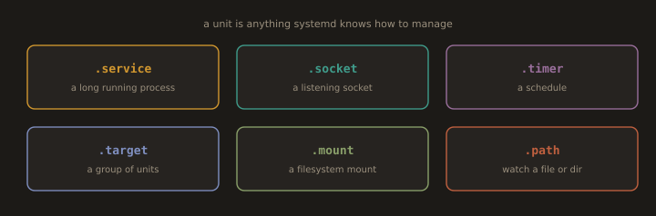
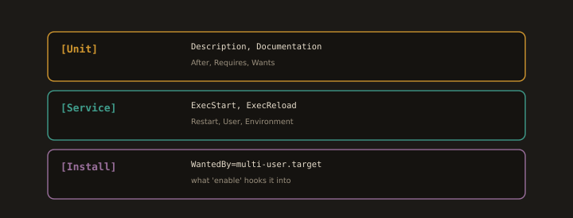
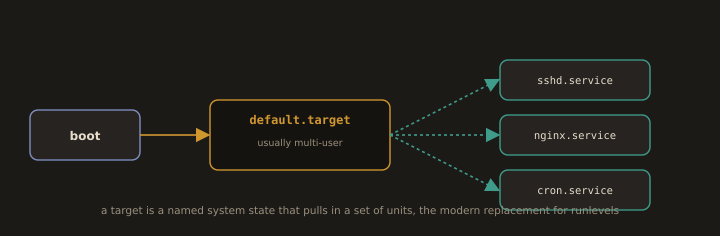
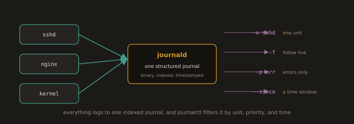
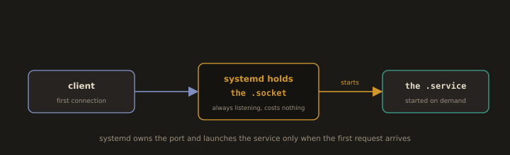

# Part 3: systemd in Depth


## systemd: The Foundation of a Linux Server

### Why systemd Replaced the Old Way

Before systemd, Linux distributions used SysV init or Upstart to manage services. These systems started services by running shell scripts in a defined order, waiting for each one to complete before starting the next. If service A needed to start before service B, you had to number the scripts correctly and hope the dependency chain was right. If a service crashed, nothing automatically restarted it unless you wrote your own monitoring wrapper.

systemd replaced this with a declarative, dependency aware, parallel service manager. Instead of writing shell scripts, you write unit files that describe what a service is, what it needs before it can start, and what happens when it fails. systemd handles the ordering, the parallelism, the restarts, and the logging. The result is faster boot times, more reliable service management, and far better visibility into what is happening on your system.

Every modern RHEL, Fedora, CentOS Stream, Ubuntu, and Debian system uses systemd. Every server you manage in this course runs it. Understanding it is not optional background knowledge. It is the operational foundation everything else builds on.

### Units: The Core Abstraction

**Fig. 25 · Everything systemd manages is a unit**



*Services, sockets, timers, targets, mounts, and paths are all units, described by small declarative files.*

Everything systemd manages is represented as a unit. A unit is a configuration file that describes one manageable entity and how systemd should handle it. The unit type is encoded in the file extension.

| Unit Type | Extension | What It Manages |
|---|---|---|
| Service | `.service` | A daemon or long running process |
| Timer | `.timer` | A scheduled job, systemd's replacement for cron |
| Socket | `.socket` | A network socket or IPC socket, for socket activation |
| Mount | `.mount` | A filesystem mount point |
| Target | `.target` | A group of units, used to define system states |
| Path | `.path` | A filesystem path, triggers other units on file changes |

Unit files live in a few standard locations. Files in `/etc/systemd/system/` are local administrator overrides and take precedence. Files in `/lib/systemd/system/` or `/usr/lib/systemd/system/` are shipped by packages and should not be edited directly. If you want to modify a package provided unit without risking your changes being overwritten on the next package update, use `systemctl edit <unit>`, which creates an override file in `/etc/systemd/system/<unit>.d/override.conf`.

### Anatomy of a Service Unit File

**Fig. 26 · The three sections of a service unit**



*The Unit section describes ordering, the Service section says how to run it, and the Install section says what enabling it should connect it to.*

A real service unit file looks like this:

```ini
[Unit]
Description=My Flask Application
Documentation=https://example.com/docs
After=network.target postgresql.service
Requires=postgresql.service

[Service]
Type=simple
User=appuser
WorkingDirectory=/opt/myapp
ExecStart=/opt/myapp/venv/bin/python app.py
Restart=on-failure
RestartSec=5
Environment=FLASK_ENV=production
EnvironmentFile=/etc/myapp/env

[Install]
WantedBy=multi-user.target
```

Each section and directive has a specific meaning:

**`[Unit]` section:**

`After` defines ordering without hard dependency. The service will start after `network.target` and `postgresql.service`, but if `postgresql.service` does not exist, this unit will still start. `Requires` adds a hard dependency. If `postgresql.service` fails to start, this service will also fail to start and systemd will report the dependency failure.

**`[Service]` section:**

`Type=simple` means systemd considers the service started as soon as the `ExecStart` process is running. Other types include `forking` (the process daemonizes itself by forking) and `oneshot` (the process runs once and exits, like a setup script).

`Restart=on-failure` tells systemd to restart the process automatically if it exits with a nonzero exit code, crashes, or is killed by a signal other than a clean shutdown signal. `RestartSec=5` adds a five second delay between restarts, preventing a rapidly crashing service from hammering the system with restart attempts.

`EnvironmentFile` loads environment variables from a file at a path you specify. This is the correct way to inject secrets and configuration into a service without hardcoding them in the unit file itself.

**`[Install]` section:**

`WantedBy=multi-user.target` controls which system state this service is associated with when you run `systemctl enable`. `multi-user.target` is the standard "server is fully booted and ready" state. When you enable a service, systemd creates a symlink in the appropriate target's `.wants` directory.

### Targets: Grouping Units Into System States

**Fig. 27 · Targets group units into system states**



*Boot reaches the default target, which pulls in all the services that make up that state; targets are the successor to runlevels.*

A target is a named group of units representing a system state. Targets replaced the old SysV runlevels with something more flexible and descriptive.

| Target | Old Runlevel | What It Means |
|---|---|---|
| `poweroff.target` | 0 | System is shutting down |
| `rescue.target` | 1 | Single user mode, minimal services |
| `multi-user.target` | 3 | Full multiuser, no GUI |
| `graphical.target` | 5 | Full multiuser with desktop environment |
| `reboot.target` | 6 | System is rebooting |

When you run `systemctl isolate multi-user.target`, systemd starts all units associated with that target and stops everything else. This is what happens during a normal boot sequence: systemd works toward `graphical.target` or `multi-user.target` (depending on the system configuration) by starting all units that belong to those targets and their dependencies.

For a headless server doing DevOps work, `multi-user.target` is the standard final state. You set this with `systemctl set-default multi-user.target`, which tells systemd what to boot into by default.

---
### journald: Structured, Centralized Logging

**Fig. 28 · One journal, queried many ways**



*Every service and the kernel write to a single structured journal, and journalctl slices it by unit, priority, and time window.*

journald is systemd's logging subsystem. It collects log output from every service managed by systemd, from the kernel, and from the bootloader, and stores it in a structured binary format with rich metadata attached to every entry: timestamp (with microsecond precision), the unit that generated the log, the process ID, the user ID, the message priority, and more.

The primary tool for reading journald logs is `journalctl`. The most useful invocations for daily operations:

```bash
# View all logs from a specific service, most recent first
journalctl -u nginx.service -r

# Follow logs in real time, equivalent to tail -f for a service
journalctl -u nginx.service -f

# View logs since the last boot only
journalctl -b

# View logs from a specific time window
journalctl --since "2024-01-15 10:00:00" --until "2024-01-15 11:00:00"

# View only error level and above
journalctl -p err

# View logs for a specific unit since boot with error priority
journalctl -u nginx.service -b -p err

# Verify how much disk space the journal currently uses
journalctl --disk-usage
```

A critical difference from traditional log files: journald logs are binary, not plain text. You cannot `grep` them directly. You use `journalctl`'s own filtering flags instead. The tradeoff is that this binary storage is tamper evident, each entry is cryptographically chained to the previous one in modern configurations, and it supports structured queries that plain text log files simply cannot match.

For long term storage, many organizations run a log shipper like Filebeat alongside systemd and ship journals to an Elastic Stack or similar centralized logging system, converting the structured binary format to searchable JSON in the process.

---
### Socket Activation: Starting Services Only When Needed

**Fig. 29 · Start the service only when needed**



*systemd keeps the socket open at all times and launches the actual service the moment a first connection comes in.*

Socket activation is a systemd feature that lets a service remain stopped until the first connection arrives on its socket, then starts automatically in response. The socket stays open and listening at all times, managed by systemd itself. If the service crashes, systemd holds the socket and queues incoming connections until the service restarts, which means clients experience a brief delay rather than a connection refused error.

A paired socket and service unit looks like this:

```ini
# myapp.socket
[Unit]
Description=My Application Socket

[Socket]
ListenStream=8080
Accept=no

[Install]
WantedBy=sockets.target
```

```ini
# myapp.service
[Unit]
Description=My Application
Requires=myapp.socket

[Service]
ExecStart=/opt/myapp/bin/server
StandardInput=socket
```

When you enable `myapp.socket`, systemd creates the socket and listens on port 8080. `myapp.service` does not start until the first connection arrives. At that point, systemd starts the service and passes the accepted connection to it.

In DevOps environments, socket activation is most commonly used with SSH (sshd.socket can reduce memory usage on hosts that are not frequently SSHed into), with D-Bus activated services, and with some container runtimes. The deeper value of understanding socket activation is what it reveals about how systemd models dependencies: instead of "start service B after service A is running," you can model "start service B when someone actually tries to use it," which is a fundamentally more demand driven, resource efficient approach.

---
