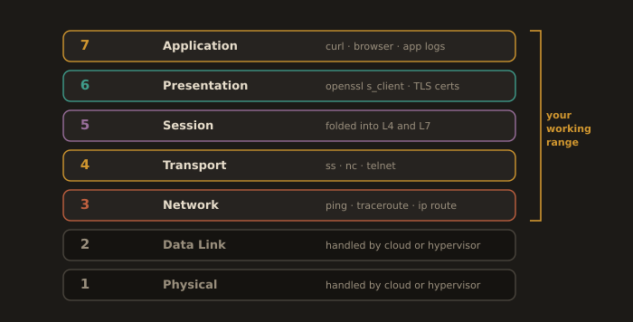
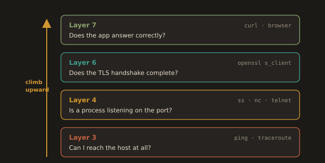
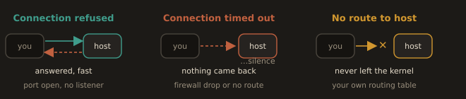

# Part 1: Theory

---

## 3.1 The OSI Model

You do not need to memorize all seven OSI layers as an academic exercise. What you need is a diagnostic habit: when something is broken, knowing which layer to check first saves you hours of guessing. In real DevOps work, almost everything you touch lives in layers 3 through 7.

**Fig. 1 · The OSI layers you actually touch**



*Layers 3 through 7 are your working range; the cloud or hypervisor owns 1 and 2.*

### The Layers That Matter: Purpose, Common Issues, and Troubleshooting

| Layer | Name             | What It Does                                                                                   | Common Protocols / Examples                          | Common Symptoms / What Breaks Here                                                                                      | How You Check It                                                                        |
| :---: | ---------------- | ---------------------------------------------------------------------------------------------- | ---------------------------------------------------- | ----------------------------------------------------------------------------------------------------------------------- | --------------------------------------------------------------------------------------- |
| **7** | **Application**  | Provides network services and protocols that applications use to communicate over the network. | HTTP, HTTPS, SSH, DNS, FTP, SMTP                     | The application returns an error, times out, or behaves incorrectly.                                                    | `curl -v`, browser developer tools, application logs                                    |
| **6** | **Presentation** | Translates data formats, handles encryption and decryption, and performs compression.          | TLS/SSL, UTF-8, JSON/XML serialization, gzip         | TLS handshake fails, or the certificate is invalid or expired.                                                          | `openssl s_client`, `curl -vI`                                                          |
| **5** | **Session**      | Establishes, manages, and terminates communication sessions between applications.              | NetBIOS, RPC                                         | Session establishment or persistence issues. Rare to diagnose directly in modern TCP/IP networks.                       | Usually folded into application or transport troubleshooting.                           |
| **4** | **Transport**    | Provides end to end communication, reliability, error checking, and flow control.              | TCP, UDP                                             | Port is closed, connection is refused, or the connection hangs.                                                         | `ss -tlnp`, `telnet <host> <port>`, `nc -zv <host> <port>`                              |
| **3** | **Network**      | Provides logical addressing and routes packets between networks.                               | IP, ICMP, OSPF, BGP                                  | Host is unreachable, routing is incorrect, or packets cannot reach the destination.                                     | `ping`, `traceroute`, `ip route`                                                        |
| **2** | **Data Link**    | Provides physical addressing and reliable communication over a single network segment.         | Ethernet, MAC addresses, ARP, VLANs                  | Frames are dropped, ARP resolution fails, VLANs are misconfigured, MAC learning issues occur, or the interface is down. | `ip link`, `ip neigh`, `bridge`, `tcpdump`, switch MAC/VLAN tables                      |
| **1** | **Physical**     | Transmits raw bits over the physical transmission medium.                                       | Cat6 cables, fiber optic cables, Wi-Fi radio signals | Cable or transceiver failure, no physical link, weak wireless signal, speed or duplex mismatch, or hardware failure.    | `ethtool`, `ip link`, NIC LEDs, cable tester, Wi-Fi signal strength, switch port status |

---
> Layers 1 and 2 (physical cables, Ethernet, MAC addresses) exist, but as a DevOps engineer working in cloud and virtualized environments, you seldom diagnose a problem at that level. The cloud provider or the hypervisor handles it.
> 
> You will see Layer 2 concepts again when working with Docker bridge networks and Kubernetes CNI plugins, but for now, your working range is L3 to L7.

---
### The Diagnostic Habit This Builds

When a deployment "is not working," that sentence carries no useful information. The skill is converting it into a layer by layer test, from the bottom of your working range upward.

```
Can I reach the host at all?                              > Layer 3 (ping, traceroute)
```
```
Is the port open and something listening to it?           > Layer 4 (ss, nc, telnet)
```
```
Does the TLS handshake complete?                          > Layer 6 (openssl s_client)
```
```
Does the application respond correctly?                   > Layer 7 (curl, browser)
```

Each step rules out an entire category of failure. If Layer 3 fails, there is no point in debugging your application code. If Layers 3 and 4 both succeed but Layer 7 returns a 500 error, you know the network is fine, and the problem is in the application itself. This single habit, working the stack from bottom to top, is the single most useful network debugging skill you will carry through this entire course.

**Fig. 2 · Diagnosing bottom to top**



*Each rung rules out a whole category of failure before you climb to the next.*

---
### How This Looks in a Real Incident

A team deploys a new version of their API. Five minutes later, alerts fire: the health check is failing. An engineer who does not have the OSI habit starts reading application logs immediately, burning fifteen minutes scrolling through irrelevant stack traces. An engineer with the habit runs `curl -v https://api.internal/health` first. The connection fails at the TCP level: connection refused. That immediately tells them the application process is not even listening on the expected port, which is a deployment or configuration problem, not a code bug. They check the pod logs and find the container crashed on startup due to a missing environment variable. Total diagnosis time: two minutes, because the OSI layer check ruled out everything except "the process is not running."

---
### Naming the Failure by Its Symptom

Three Layer 3 and Layer 4 symptoms are easy to confuse, and telling them apart cuts your search space immediately.

| Symptom | What You See | What It Almost Always Means |
|---|---|---|
| Connection refused | The connection fails instantly | You reached the host, the port is open to you, but no process is listening on it. A Layer 4 answer, delivered fast. Application or service problem, not a network one. |
| Connection timed out | The connection hangs, then fails after several seconds | A firewall, security group, or NACL is dropping the packet silently, or the route does not exist. Nothing answered at all. |
| No route to host | Fails immediately with an explicit routing error | Your own kernel has no route toward that destination. Check `ip route` before anything else. |

A fast rejection means something answered you. A hang means something swallowed the packet. That single distinction is worth more in an incident than any amount of log reading.

**Fig. 3 · Refused vs timed out vs no route**



*The shape of the failure tells you where the packet went before you read a single log.*

---
