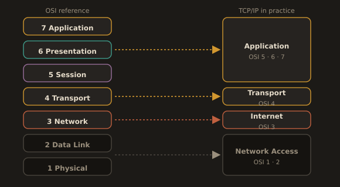
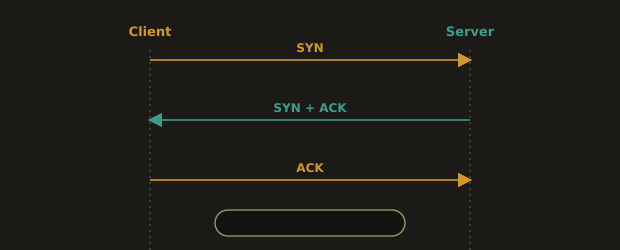
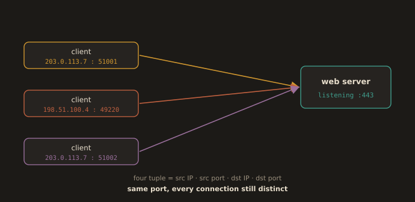
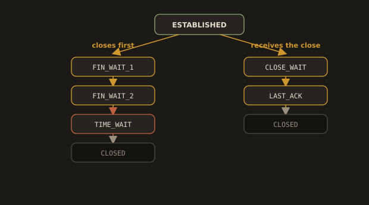
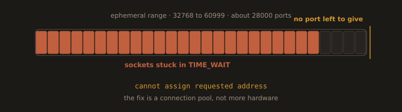

## 3.2 TCP/IP

---

### The TCP/IP Stack

TCP/IP is the protocol suite that runs the Internet and most modern networks. Unlike OSI, it is an implementation. It has four layers that map roughly onto the seven OSI layers:

| TCP/IP Layer   | Equivalent OSI Layers | Key Protocols                      |
|----------------|-----------------------|------------------------------------|
| Application    | 5, 6, 7               | HTTP, HTTPS, SSH, DNS, SMTP, FTP   |
| Transport      | 4                     | TCP, UDP                           |
| Internet       | 3                     | IP (IPv4, IPv6), ICMP              |
| Network Access | 1, 2                  | Ethernet, ARP, Wi-Fi               |

The mapping is deliberately loose. OSI was designed as a reference model before the protocols existed; TCP/IP was built from working code and later described. When someone says "that is a Layer 7 problem," they are speaking OSI. When they configure a system, they are running TCP/IP. Both statements are normal and neither is wrong.

**Fig. 4 · TCP/IP mapped onto OSI**



*Four working layers described from running code, laid loosely over the seven layer reference model.*

---
### TCP vs. UDP

These are the two protocols at the Transport layer. Understanding the difference is essential for reading firewall rules, diagnosing connection failures, and configuring services.

| Feature     | TCP (Transmission Control Protocol)               | UDP (User Datagram Protocol)                         |
|-------------|---------------------------------------------------|------------------------------------------------------|
| Connection  | Connection oriented (three way handshake)         | Connectionless                                       |
| Reliability | Guaranteed delivery, retransmission on loss       | No guarantee; packets may be lost or arrive out of order |
| Order       | Packets arrive in sequence                        | No ordering guarantee                                |
| Speed       | Slower due to overhead                            | Faster; minimal overhead                             |
| Use cases   | HTTP/HTTPS, SSH, database connections             | DNS queries, video streaming, VoIP, metrics over UDP |


> The TCP three way handshake: `SYN > SYN-ACK > ACK`. This is what happens every time your browser connects to a web server or your Jenkins agent connects to the controller. When a connection hangs, checking whether the handshake completes is the first diagnostic step.

**Fig. 5 · The TCP three way handshake**



*SYN, then SYN and ACK, then ACK: if it never completes, the fault sits below the application.*

**Reading the handshake for yourself.** Run a capture on one terminal and a connection on another. The three packets are visible in order, and once you have seen them you never forget them.

```bash
# Terminal 1: capture only handshake packets to a host
sudo tcpdump -n -i any 'tcp port 443 and host example.com'

# Terminal 2: open a connection
curl -sI https://example.com > /dev/null
```

You will see `Flags [S]`, then `Flags [S.]` (SYN plus ACK), then `Flags [.]` (the final ACK). If you only ever see repeated `[S]` packets with no reply, the SYN is being dropped by a firewall or is going somewhere with no route back. That is a Layer 3 or Layer 4 finding, and it saves you from reading application logs.

**Why UDP is not simply worse.** UDP has no handshake, no retransmission, and no ordering, which sounds like a list of missing features until you consider what those features cost. A DNS query and its answer fit in a single packet each; a handshake would triple the number of round trips for no benefit, and if the answer is lost the client simply asks again. QUIC, which carries HTTP/3, is built on UDP for exactly this reason: it moves reliability into user space where it can be improved without waiting for every operating system kernel on earth to be upgraded.

---
### Ports and Sockets

A port is a number that identifies a specific service running on a host. An IP address gets you to the right machine. A port gets you to the right service on that machine. A socket is the combination of an IP address, a port, and a protocol (TCP or UDP), uniquely identifying one end of a network connection.

This matters because a single server can run many services simultaneously, each bound to a different port. Your web server might be on port 443, your database on 5432, and your monitoring agent on 9100, all on the same machine, all reachable independently.

A TCP connection is not identified by one socket but by four values taken together: source IP, source port, destination IP, destination port. This four tuple is why a web server can hold ten thousand simultaneous connections on a single listening port. Every connected client has a different source IP or source port, so every connection is distinct even though they all terminate on port 443.

**Fig. 6 · One listening port, many connections**



*The four tuple keeps every client distinct even though all of them land on port 443.*

**Ephemeral ports.** When your machine initiates an outbound connection, the kernel picks an unused source port for it automatically, from a range called the ephemeral port range. On Linux this range is configurable and defaults to ports 32768 through 60999, roughly 28,000 ports.

```bash
# Show the ephemeral port range on this host
cat /proc/sys/net/ipv4/ip_local_port_range
```

That number, roughly 28,000, is the ceiling on how many simultaneous outbound connections a host can make to a single destination IP and port pair. It is the number that turns into an outage when a busy service opens a fresh connection for every request instead of reusing a pool. That is the mechanism behind port exhaustion, covered below.

**Privileged ports.** Ports below 1024 are privileged: binding to them traditionally requires root. This is why containers running Nginx as a non root user usually listen on 8080 internally and are published to 80 externally, and why a service that works when you run it with `sudo` and fails without it is often a port binding problem rather than a network one.

---
### Common Protocols and Their Ports

| Protocol       | Port | Transport   | Purpose                                                      |
|----------------|------|-------------|--------------------------------------------------------------|
| HTTP           | 80   | TCP         | Unencrypted web traffic                                      |
| HTTPS          | 443  | TCP         | TLS encrypted web traffic (also UDP 443 for HTTP/3 over QUIC) |
| SSH            | 22   | TCP         | Encrypted remote shell access                                |
| FTP (data)     | 20   | TCP         | File transfer (data channel)                                 |
| FTP (control)  | 21   | TCP         | File transfer (control channel)                              |
| SMTP           | 25   | TCP         | Email relay between servers                                  |
| DNS            | 53   | TCP and UDP | Domain name resolution (UDP for queries; TCP for zone transfers and large responses) |
| DHCP           | 67, 68 | UDP       | Address assignment (67 server, 68 client)                    |
| NTP            | 123  | UDP         | Time synchronization                                         |
| HTTP alt       | 8080 | TCP         | Common alternative port for web apps and Jenkins             |
| HTTPS alt      | 8443 | TCP         | Common alternative port for HTTPS services                   |
| MySQL          | 3306 | TCP         | MySQL/MariaDB database                                       |
| PostgreSQL     | 5432 | TCP         | PostgreSQL database                                          |
| Redis          | 6379 | TCP         | Redis in-memory data store                                   |
| Kubernetes API | 6443 | TCP         | kube-apiserver, the port every kubectl command talks to      |
| etcd           | 2379, 2380 | TCP   | etcd client and peer traffic in a Kubernetes control plane   |
| Node Exporter  | 9100 | TCP         | Prometheus metrics endpoint on a Linux host                  |

Knowing these ports by memory is a practical skill. When you write a firewall rule to allow Jenkins traffic, you need to know it runs on port 8080 by default. When you debug a failed database connection, you check whether port 3306 is reachable. When a `kubectl` command hangs, 6443 is the first port you test.

---
### Connection States: What ESTABLISHED and TIME_WAIT Actually Mean

When you run `ss -tnp` or `netstat -tnp`, you will see a column listing the state of each TCP connection. Two states come up constantly in real operational work, and understanding them prevents a lot of confused troubleshooting.

**ESTABLISHED** means the TCP three way handshake has been completed and the connection is actively open. Data can flow in both directions. This is the normal, healthy state for an active connection.

**TIME_WAIT** is the state a connection enters after it has been closed, but the operating system holds onto it for a short period (typically 60 to 120 seconds, depending on the OS) before fully releasing it. This exists for a specific reason: it prevents a delayed, duplicate packet from an old, already closed connection from being misinterpreted as belonging to a brand new connection that happens to reuse the same port.

The state lifecycle for a typical connection looks like this. The side that closes the connection first goes through one path; the side that receives the close goes through a different one:

```
SYN_SENT      client initiates the handshake
SYN_RECEIVED  server received the SYN, sent its own SYN-ACK
ESTABLISHED   handshake complete, data flowing

-- the side that closes first --

FIN_WAIT_1    sent a FIN, waiting for it to be acknowledged
FIN_WAIT_2    FIN was acknowledged, waiting for the other side's FIN
TIME_WAIT     both FINs exchanged, waiting out the safety period
CLOSED        fully released

-- the side that receives the close --

CLOSE_WAIT    received a FIN, waiting for the local application to close its end
LAST_ACK      sent its own FIN, waiting for the final acknowledgment
CLOSED        fully released
```
---
> `CLOSE_WAIT` is worth remembering on its own: if you see connections piling up in `CLOSE_WAIT` and staying there, it almost always means the application received the signal to close but never actually called close() on the socket, a real and common application bug, not a network problem.
---

On Linux, the TIME_WAIT duration is fixed at 60 seconds and is compiled into the kernel, not exposed as a tunable. Engineers who go looking for a sysctl to shorten it do not find one, which is a deliberate decision, not an oversight.

**Fig. 7 · The connection state lifecycle**



*The side that closes first walks through TIME_WAIT; the side that receives the close walks through CLOSE_WAIT.*

### Why TIME_WAIT Causes Real Problems

A high volume server, particularly one that opens many short lived outbound connections (a load balancer, a service making thousands of API calls per second), can accumulate a large number of connections sitting in TIME_WAIT. Each one technically still holds the local port it was using. If enough connections pile up in TIME_WAIT, the server can run out of available local ports to open new outbound connections with, a condition often called port exhaustion.

**Fig. 8 · How port exhaustion arrives**



*Sockets held in TIME_WAIT eat the ephemeral range until the kernel has no source port left to give.*

```bash
# Count connections by state, a useful first check when diagnosing
# connection exhaustion or unusual connection counts
ss -tan | awk '{print $1}' | sort | uniq -c | sort -rn
```

If you see thousands of connections sitting in TIME_WAIT on a high traffic server, this is a real signal, not noise. The common fixes are tuning the kernel's TCP settings (`net.ipv4.tcp_tw_reuse`), reducing how often new connections are opened by using connection pooling and keep alive instead of opening a fresh connection per request, or adding more outbound IP addresses to spread the load across a larger pool of available ports.

**What port exhaustion looks like from the outside.** It rarely announces itself. The symptoms are a service that works perfectly at low traffic and starts failing under load, with CPU and memory both looking healthy, and application logs full of connection timeouts or "cannot assign requested address" errors pointing at a downstream service. That last message is the giveaway: the kernel is telling you it has no source port left to give. Confirm it by counting TIME_WAIT sockets and comparing the total against the size of the ephemeral range.

```bash
# Sockets in TIME_WAIT right now
ss -tan state time-wait | wc -l

# Compare against the size of the ephemeral range
cat /proc/sys/net/ipv4/ip_local_port_range
```

**On the two tunables you will read about.** `net.ipv4.tcp_tw_reuse` allows the kernel to reuse a TIME_WAIT socket for a new outbound connection when it is safe to do so, and it remains the correct knob to reach for. `net.ipv4.tcp_tw_recycle` appears in a great many older blog posts and Stack Overflow answers, and it should never be used: it broke badly for clients behind NAT and was removed from the Linux kernel in version 4.12. If you find it in a runbook or a Terraform sysctl block, that configuration predates 2017 and needs review.

Tuning is a stopgap in any case. The durable fix is architectural: use HTTP keep alive and a connection pool so the same connections are reused instead of being torn down and reopened thousands of times per second.

---
### How This Appears in Real Companies

A team running a Node.js API behind Nginx notices that under heavy load, new requests start timing out, even though CPU and memory on the server look completely fine. The actual cause: their application was opening a new outbound HTTP connection to a downstream payment API for every single incoming request instead of reusing connections through a connection pool. Under load, thousands of these short lived connections piled up in TIME_WAIT, and the server ran out of local ports to assign to new outbound connections. The fix was not more hardware. It was switching the HTTP client library to use a persistent connection pool, which eliminated the constant churn of opening and closing connections.

---
