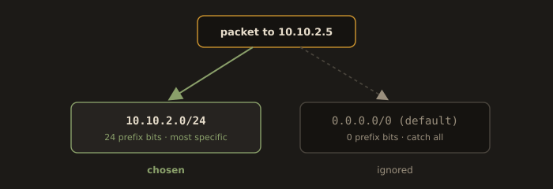
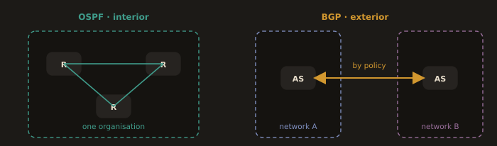

## 3.3 Routing

Routing is how a packet finds its way from source to destination across one or more networks.

A router makes forwarding decisions based on a routing table: a list of destination networks and the next hop to reach them. Each entry says: "to reach network X, send the packet to Y."

**Default gateway:**

The router a host sends packets to when it has no more specific route. Every server needs a default gateway configured, or it cannot reach anything outside its local subnet. On Linux: `ip route add default via <gateway-ip>`.

**Static route:**

A manually configured route for a specific destination. Used in lab environments and simple networks where dynamic routing protocols are not needed.

**Dynamic routing protocols:**

In large networks, routers exchange route information automatically. OSPF is common inside enterprise networks. BGP runs the internet. In DevOps work, you will mostly see static routing in lab environments and rely on cloud-managed routing in production.

---
### Reading a Routing Table

Every Linux host has a routing table, and reading it correctly is a skill you will use in nearly every network incident.

```bash
ip route show
```

```
default via 192.168.1.1 dev enp0s1 proto dhcp metric 100
10.10.2.0/24 via 192.168.1.254 dev enp0s1 proto static metric 100
192.168.1.0/24 dev enp0s1 proto kernel scope link src 192.168.1.50 metric 100
```

Three entries, three meanings.

The `192.168.1.0/24` line is a directly connected route. The kernel added it automatically the moment an address in that range was assigned to `enp0s1`. Anything in this range is reachable on the local link with no router involved: the host resolves the destination MAC with ARP and sends the frame directly.

The `10.10.2.0/24` line is a static route. To reach that network, hand the packet to 192.168.1.254, which is a router on the local link that knows how to get there. This is exactly what you will configure by hand in Lab 3C.

The `default` line is the catch all. Anything that matches no other entry goes to 192.168.1.1. `default` is simply another way of writing `0.0.0.0/0`, the route that matches every possible address.

**Fig. 9 · Longest prefix wins**



*A packet to 10.10.2.5 matches both the /24 and the default route, and the more specific one takes it.*

**The longest prefix match rule.** When several routes could match a destination, the kernel always picks the one with the longest prefix, meaning the most specific one. A packet bound for 10.10.2.5 matches both `10.10.2.0/24` (24 bits of prefix) and `default` (0 bits), so the /24 wins. This rule alone explains most "why is my traffic going the wrong way" questions. The `metric` value only breaks ties between routes with the same prefix length; it does not override specificity.

Ask the kernel directly rather than reasoning about it in your head:

```bash
ip route get 10.10.2.5
ip route get 8.8.8.8
```

This prints the exact route the kernel would use, including the source address it would send from. In a routing dispute it is the authoritative answer, and it takes one second.

---
### A Conceptual Look at Dynamic Routing

You will not configure BGP in this course, but you will hear it named in incident channels, and you should know what people are referring to.

A dynamic routing protocol is simply routers telling each other which networks they can reach, so that routing tables are built and repaired automatically rather than typed by hand. Two families matter.

**OSPF (Open Shortest Path First)** is an interior gateway protocol: it runs inside one organization's network. Every router floods a description of its own links to every other router, so each one builds a complete map of the network and computes shortest paths itself. It converges quickly and it is what enterprise data center networks typically run internally.

**BGP (Border Gateway Protocol)** is an exterior gateway protocol: it runs between organizations, and it is what stitches the independent networks of the internet into a single reachable whole. It does not choose routes by shortest path but by policy, because the question it answers is commercial as much as technical. BGP is also why "the internet broke" headlines happen: a misconfigured BGP announcement from one network can withdraw or hijack routes for a large part of the world, and it has, several times, taken major platforms offline for hours.

**Fig. 10 · Interior OSPF, exterior BGP**



*OSPF maps the inside of one network; BGP stitches independent networks into the internet by policy.*

**Where this touches you.** In a cloud VPC you do not run a routing protocol at all: you edit a route table object, and the provider's software defined network enforces it. Where dynamic routing does reappear in DevOps work is in Kubernetes: several CNI plugins, Calico most prominently, use BGP to distribute pod network routes across nodes. That is the moment the word stops being trivia and starts being something you configure.

---
