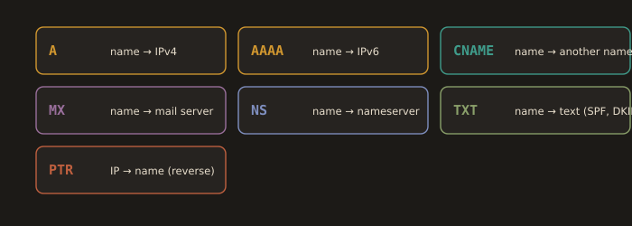
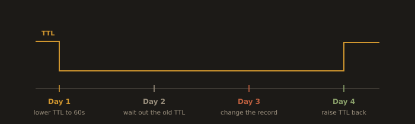
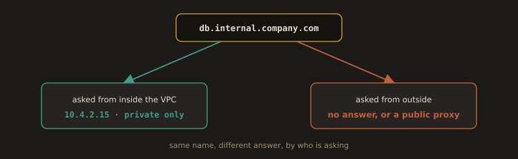

## 3.4 DNS in Practice

You already know DNS resolves names to IP addresses through a chain of lookups. The practical engineering knowledge sits in the record types you will actually configure and a few behaviors that catch people off guard in production.

---
### Record Types You Will Actually Use

**Fig. 11 · The records you will actually set**



*Seven record types, each answering a different question about a name.*

|   Record  | What It Does                                                                                         | Common Uses                                                                                   | Example                                            |
| :-------: | ---------------------------------------------------------------------------------------------------- | --------------------------------------------------------------------------------------------- | -------------------------------------------------- |
|   **A**   | Maps a hostname to an IPv4 address.                                                                  | The most common DNS record, used by websites, APIs, and other services.                       | `example.com → 93.184.216.34`                      |
|  **AAAA** | Maps a hostname to an IPv6 address.                                                                  | Used when a service is reachable over IPv6.                                                   | `example.com → 2606:2800:220:1:248:1893:25c8:1946` |
| **CNAME** | Creates an alias from one hostname to another hostname. It does not point directly to an IP address. | Point `www.example.com` to `example.com`, or map a custom domain to a cloud service hostname. | `www.example.com → example.com`                    |
|   **MX**  | Identifies the mail servers responsible for receiving email for a domain.                            | Routes incoming email to the correct mail server.                                             | `example.com → mail.example.com`                   |
|   **NS**  | Identifies the authoritative name servers for a domain or subdomain.                                 | Delegates DNS management to specific name servers or DNS providers.                           | `example.com → ns1.example.net`                    |
|  **TXT**  | Stores arbitrary text associated with a domain.                                                      | SPF, DKIM, DMARC, domain ownership verification, and other verification records.              | `"v=spf1 include:_spf.google.com ~all"`            |
|  **PTR**  | Maps an IP address back to a hostname (reverse DNS).                                                 | Reverse DNS lookups, mail server validation, logging, and troubleshooting.                    | `93.184.216.34 → example.com`                      |

### Notes

* **A** and **AAAA** records are used for **forward DNS lookups** (hostname > IP address).
* **PTR** records are used for **reverse DNS lookups** (IP address > hostname).
* A **CNAME** record must point to another **hostname**, never directly to an IP address.
* A domain **cannot** have a **CNAME** record at the zone apex (for example, `example.com`) if other records such as **NS** or **SOA** exist there. Many DNS providers offer proprietary alternatives such as **ALIAS** or **ANAME** to work around this limitation.
* Modern email deployments commonly use multiple **TXT** records for **SPF**, **DKIM**, and **DMARC** authentication. This helps prevent email spoofing and improves email deliverability.
* **PTR** records live in a reverse zone (`in-addr.arpa`) controlled by whoever owns the IP block, which in practice means your cloud provider or hosting company, not you. You request a PTR record; you do not simply add one to your own zone file. This is why outbound mail from a fresh cloud instance is so often rejected.


> The record types you will configure most often as a DevOps engineer are the A record and the CNAME. A common real pattern: your application's actual address is something ugly generated by a cloud load balancer, like `my-app-1234567890.us-east-1.elb.amazonaws.com`. You create a CNAME record pointing `app.yourcompany.com` to that load balancer hostname, so users see a clean, branded domain while the underlying infrastructure can change without anyone needing to update a bookmark.

---
`/etc/resolv.conf` on Linux specifies which DNS server the system uses:

* View current DNS configuration
```bash
cat /etc/resolv.conf
```

* On systems using systemd-resolved
```bash
resolvectl status
```

On RHEL/Fedora with NetworkManager, DNS is managed via `nmcli` or connection profiles, not by editing `/etc/resolv.conf` directly. The file is often a symlink managed by `systemd-resolved`.

---
### Reading a `dig` Answer

`dig` is the tool you will reach for whenever a name resolves to something unexpected, and its output rewards a careful read.

```bash
dig example.com A
```

The answer is divided into sections. The QUESTION section repeats what you asked, which is useful when a search domain has silently been appended to your query. The ANSWER section contains the records returned, each with its remaining TTL in seconds as the second field. The `status: NOERROR` in the header means the query succeeded; `NXDOMAIN` means the name does not exist at all, which is a very different problem from a name existing and pointing at the wrong address.

Three flags do most of the work in practice:

```bash
# Just the answer, nothing else
dig +short example.com

# Ask a specific resolver, bypassing whatever your system is configured to use
dig @1.1.1.1 example.com
dig @8.8.8.8 example.com

# Walk the delegation chain from the root servers down, ignoring caches
dig +trace example.com
```

`+trace` is the one that settles arguments. It starts at the root, follows the NS delegations to the TLD servers, then to the authoritative servers for the domain, and shows you each hop. If the authoritative server returns the correct new address but your application still sees the old one, the problem is a cache somewhere between the two, which is a TTL problem, not a DNS configuration problem.

`dig` lives in the `bind-utils` package on RHEL and Fedora and `dnsutils` on Debian and Ubuntu. Minimal cloud images frequently ship without it, which is worth knowing before you need it at three in the morning.

---
### TTL: The Setting That Bites People During Migrations

TTL, time to live, controls how long a DNS answer is allowed to be cached before a resolver has to ask again. This number is invisible until the moment you need to change a DNS record quickly, and then it becomes the single most important number in the room.

If your A record has a TTL of 3600 seconds (one hour), and you change which server it points to, some fraction of the internet will keep using the old, cached answer for up to an hour. During a planned migration, this is manageable: you lower the TTL to something small, like 60 seconds, a day or two before the migration, wait for the old, longer TTL to fully expire out of caches everywhere, make the change, and then raise the TTL back up once everything is confirmed stable.

During an unplanned incident, a high TTL is a genuine problem. If a server's IP address needs to change immediately because of a security issue, and the TTL was left at 86400 seconds (24 hours), you are stuck waiting for caches around the world to expire naturally, with no way to force it.

- Planned migration timeline:
```
Day 1: Lower TTL on the existing record to 60 seconds
Day 2: Wait at least as long as the original (prechange) TTL value, so any caches that fetched the record before you lowered it have time to expire
Day 3: Make the actual change (update the A or CNAME record)
Day 4: Confirm traffic has shifted, then raise TTL back to a normal value
```

One caveat worth carrying: lowering the TTL is a request, not a command. Some resolvers, particularly on consumer ISP networks, clamp or ignore very low TTLs and hold answers longer than you asked them to. Plan the cutover so that the old address keeps serving traffic for a while after the change rather than being switched off at the moment the record flips. Keeping the old server alive and serving for an extra day costs almost nothing. Turning it off on schedule and discovering that a long tail of clients is still resolving to it costs a great deal.

**Fig. 12 · A TTL aware cutover**



*Lower the TTL, wait out the old one, make the change, then raise it again once traffic has shifted.*

---
### Split Horizon DNS

Split horizon DNS, sometimes called split brain DNS, is a setup where the same domain name resolves to different answers depending on who is asking. An internal employee on the company VPN querying `database.internal.company.com` might get a private IP address reachable only inside the company network. Someone outside the company querying the same name either gets no answer at all or gets routed somewhere entirely different.

**Fig. 13 · Split horizon DNS**



*The same name answers a private address inside the VPC and something else, or nothing, outside it.*

This is common in real infrastructure for two reasons. First, security: internal services like databases and admin panels should never resolve to anything from the public internet at all, removing an entire category of attack surface. Second, practicality: an internal service might be reachable via a private IP on the company's internal network, while the same hostname, when queried from outside, might point to a public facing proxy or simply fail to resolve, which is the desired, intentional behavior.

In AWS this is not a bespoke setup but a first class feature: a Route 53 private hosted zone attached to a VPC answers queries from inside that VPC, while a public hosted zone with the same domain name answers everyone else. Kubernetes does the same thing inside a cluster, where CoreDNS resolves `service.namespace.svc.cluster.local` to a ClusterIP that means nothing outside the cluster. Both are split horizon DNS by another name.

The failure mode to watch for is the resulting confusion. When one engineer says a name resolves correctly and another says it does not, and both are telling the truth, split horizon is usually the reason. The correct next question is not "is it broken" but "which resolver were you asking."

---
### Common DNS Mistakes

**Leaving TTL high before a planned change.**

Always lower it ahead of time, not at the moment of the change.

**Forgetting that CNAME records cannot coexist with other records at the same name.**

If `example.com` has a CNAME record, you cannot also add an MX or TXT record at that same name. This is a real DNS rule, not a tooling limitation, and it trips up a lot of people setting up email on a domain that uses a CNAME for the root.

**Assuming a DNS change has propagated because it works for you.** 

Your own machine and resolver might already have a stale answer cached, or might be hitting a resolver that already refreshed. Use `dig @8.8.8.8` and `dig @1.1.1.1` to explicitly check what different public resolvers are currently returning before declaring a DNS change complete.

**Debugging with `ping` instead of `dig`.**

`ping` resolves a name and then immediately tries to reach it, so a failure tells you nothing about which of the two steps broke. `dig` answers the resolution question alone. Separate the two questions before you try to answer either.

---
