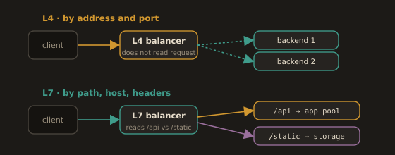

## 3.5 Load Balancing

### What Is a Load Balancer?

A load balancer sits in front of a group of servers and distributes incoming requests across them. Without one, all traffic hits a single server. When that server becomes overloaded or fails, the application goes down.

---
**With a load balancer:**

- Traffic is spread across multiple servers, preventing any single one from being overwhelmed.
- If a server fails, the load balancer stops sending it traffic, and the application stays up.
- You can add or remove servers without changing anything the client sees.

---
### Layer 4 vs. Layer 7 Load Balancing

| Type              | Operates At    | Routing Basis                          | Awareness of Content |
|-------------------|----------------|----------------------------------------|----------------------|
| L4 (Transport)    | TCP/UDP level  | IP address and port                    | None; routes without reading the request |
| L7 (Application)  | HTTP level     | URL path, hostname, headers, cookies   | Full; can route based on request content |

An L7 load balancer can route `/api/*` requests to an API server cluster and `/static/*` to an object storage endpoint. An L4 load balancer cannot make that distinction.

**Fig. 14 · Load balancing at L4 and L7**

*L4 forwards packets by address and port; L7 reads the request and routes on path, host, and headers.*

Nginx functions as both. AWS Elastic Load Balancing offers an Application Load Balancer (ALB, Layer 7) and a Network Load Balancer (NLB, Layer 4).

The tradeoff is not simply "L7 is better." An L4 load balancer forwards packets without reading them, so it is faster, cheaper, and protocol agnostic: it will happily balance PostgreSQL, gRPC, or any TCP protocol it has never heard of, and it can preserve the client's source IP. An L7 load balancer must terminate the connection, parse the request, and open a new connection to the backend. That gives it path routing, header inspection, TLS termination, and retries, at the cost of latency and the fact that the backend now sees the load balancer's IP rather than the client's, which is why `X-Forwarded-For` exists. Choose L4 when you need raw throughput or a non HTTP protocol; choose L7 when routing decisions depend on what is inside the request.

---
