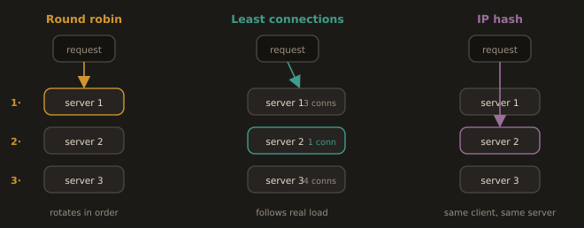
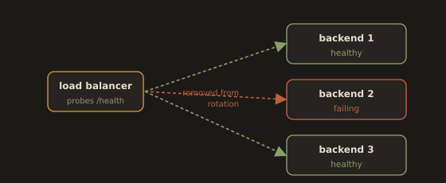

## 3.6 Load Balancing Algorithms

You already know conceptually why load balancers exist. The engineering decision is choosing which algorithm fits a given workload, because the wrong choice creates real performance problems.

**Fig. 15 · Three ways to spread the load**



*Round robin rotates blindly, least connections follows real load, IP hash pins a client to one backend.*

---
### Round Robin

Requests are distributed to backend servers in strict rotating order: server one, then server two, then server three, then back to server one. This is the simplest algorithm and the most common default.

Round robin works well when every backend server has roughly equal capacity, and every request takes roughly the same amount of time to process. It breaks down when those two assumptions are not true. If one request takes ten milliseconds and another takes ten seconds, round robin has no awareness of that difference and will happily send the next request to whichever server is next in line, even if that server is still struggling with a slow request from a moment ago.

- Example:

```nginx
upstream backend {
    server 192.168.1.10;
    server 192.168.1.11;
    server 192.168.1.12;
    # Round robin is the default; no directive needed
}
```

Limitation: It assumes all requests take the same time. If some requests are CPU heavy and others are trivial, round robin can overload one server while others sit idle.

---
**Weighted Round Robin**

Servers get a weight proportional to their capacity. A server with weight 3 receives three times as many requests as one with weight 1.

```nginx
upstream backend {
    server 192.168.1.10 weight=3;  # More powerful server
    server 192.168.1.11 weight=1;
}
```

Weights are also the mechanism behind a canary release: give the new version a weight of 1 against the old version's weight of 19, and roughly five percent of traffic reaches the new build while you watch its error rate.

---
### Least Connections

The load balancer tracks how many active connections each backend currently has open and routes each new request to whichever server currently has the fewest.

This is the better choice whenever the request duration varies significantly, which describes most real applications. A backend currently handling three long running requests will naturally receive fewer new requests than one sitting idle, because least connections actively accounts for current load rather than blindly rotating.

- Example:

```nginx
upstream backend {
    least_conn;
    server 192.168.1.10;
    server 192.168.1.11;
    server 192.168.1.12;
}
```

---
### IP Hash

The client's source IP address is run through a hash function, and the result determines which backend server handles that client. Critically, the same client IP always maps to the same backend server, as long as the pool of backend servers does not change.

This is used specifically when an application keeps session data in memory on a particular server rather than in a shared store like Redis. If a user logs in and their session data lives only in server two's memory, every subsequent request from that user needs to land on server two specifically, or the application will not recognize them as logged in.

This is commonly called sticky sessions, or session affinity, in practice. The tradeoff is real: if a server holding sticky sessions goes down, every user who was pinned to it gets disconnected and has to start a fresh session somewhere else. The long term fix used by most modern, well architected applications is to move session state out of the server entirely and into a shared store like Redis, which removes the need for sticky sessions altogether and lets you use least connections instead, which handles uneven load far better.

- Example:

```nginx
upstream backend {
    ip_hash;
    server 192.168.1.10;
    server 192.168.1.11;
    server 192.168.1.12;
}
```

Limitation: if a server goes down, all clients mapped to it get reassigned. Also, if many users share a NAT IP (for example, an entire office behind a single public IP), one server takes all their traffic. For long-term production use, move session state to a shared store like Redis and use least connections instead.

---
### Sticky Sessions Without IP Hash

IP hash is not the only way to achieve stickiness, and it is usually the crudest. An L7 load balancer can pin a client with a cookie instead, which survives a client changing IP address and does not collapse when an entire office shares one NAT address. AWS ALB does this with target group stickiness, setting its own `AWSALB` cookie. Nginx open source does not offer cookie based stickiness; the `sticky` directive is an Nginx Plus feature, and the community workaround is a hash on a request header or cookie value:

```nginx
upstream backend {
    hash $cookie_sessionid consistent;
    server 192.168.1.10;
    server 192.168.1.11;
}
```

The `consistent` keyword is worth understanding. With plain hashing, adding or removing one backend rehashes nearly every client and scatters every existing session. Consistent hashing remaps only the fraction of clients that belonged to the changed server. If you must be sticky, be sticky consistently.

---
### Choosing Between Them in Practice

| Situation | Best Choice | Why |
|---|---|---|
| Stateless API, uniform request cost | Round robin | Simple, even distribution, no downside |
| Requests vary widely in duration | Least connections | Adapts to actual current load |
| Server holds session state in memory | IP hash (sticky sessions) | Same user must reach the same server |
| Server holds session state in Redis or similar shared store | Least connections | No need for stickiness, better load distribution |
| Backends have unequal capacity, or you are running a canary | Weighted round robin | Traffic share is set explicitly, per server |

The pattern worth internalizing: sticky sessions are usually a sign of an architectural shortcut, not a long term design goal. Most experienced teams treat moving session state out of the application server as a priority specifically so they can stop using sticky sessions and switch to least connections.

---
### Health Checks

Any production load balancer should periodically probe each backend to confirm it is healthy and remove it from rotation if it fails.

**Fig. 16 · Health checks pull the sick backend**



*The load balancer probes each server and stops sending traffic to any that fail.*

Nginx open source uses passive health checks: it detects failures when a request to a backend actually fails. Nginx Plus adds active health checks. AWS ALB performs active health checks: it sends an HTTP request to a configured path (typically `/health`) on each backend every 30 seconds and removes backends that return non-2xx responses or time out.

**Passive checks in Nginx open source** are configured on the upstream server itself:

```nginx
upstream backend {
    server 192.168.1.10 max_fails=3 fail_timeout=30s;
    server 192.168.1.11 max_fails=3 fail_timeout=30s;
    server 192.168.1.12 backup;
}
```

Three failed requests within 30 seconds mark that backend unavailable for the next 30 seconds. The `backup` server receives traffic only when all primary servers are down. The important limitation: a passive check only learns a backend is broken by failing a real user's request against it. Some users pay for the discovery.

**AWS ALB defaults**, which you should know because they are what you get when you do not set them: a check every 30 seconds, a 5 second timeout, 2 consecutive failures to mark a target unhealthy, and 5 consecutive successes to mark it healthy again. Those defaults mean an unhealthy target recovering takes up to 150 seconds to return to service, which surprises people during deployments.

**What makes a good health endpoint.** A health check should verify that the process can serve traffic, and stop there. If `/health` also checks the database, a brief database blip marks every instance unhealthy at once and the load balancer removes the entire fleet, converting a degraded dependency into a full outage. Keep a shallow liveness check for the load balancer and put dependency checks somewhere else, such as a separate readiness endpoint or your monitoring system. This is exactly the distinction Kubernetes draws between liveness and readiness probes, which you will meet again in the Kubernetes module.

---
