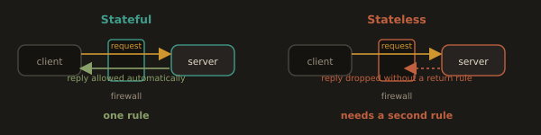
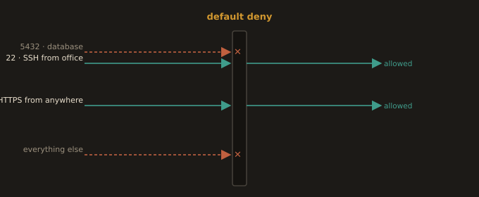
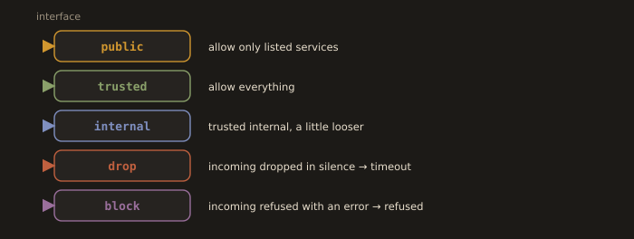
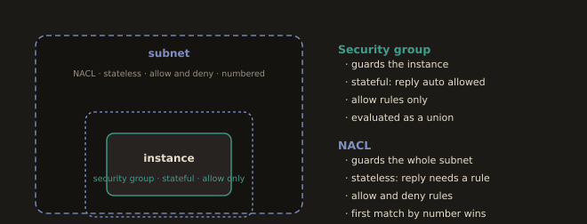

## 3.7 Firewalls and Security Groups
---
### What Is a Firewall?

A firewall is a network security system that monitors and controls traffic based on a defined set of rules. Rules specify: direction (inbound or outbound), source IP, destination IP, protocol (TCP/UDP/ICMP), and port. Traffic that matches an allow rule is permitted; everything else is denied (default deny posture) or vice versa.

---
### The Practical Difference: Stateful vs Stateless

A stateless firewall evaluates every single packet on its own, with no memory of what came before it. If you want to allow a client to make a request and receive a response, you have to write two separate rules: one allowing the request in, and a second allowing the response back out. The firewall has no concept of "this response belongs to that earlier request."

A stateful firewall tracks active connections. You write one rule allowing the initial request through, and the firewall automatically recognizes the response traffic as part of that same, already permitted connection, allowing it back through without a separate matching rule.

**Fig. 17 · Stateful remembers, stateless forgets**



*A stateful firewall recognises the reply to a request it already allowed; a stateless one needs a second rule for it.*

---
### Why This Distinction Actually Matters

This is not a minor technical detail. It changes how many rules you write and how easy your firewall configuration is to reason about and audit later.

With a stateless setup, every single service needs explicit rules in both directions. Forgetting the return path rule is one of the most common firewall misconfigurations, and it produces a specific, confusing symptom: the connection appears to initiate successfully, but then it simply hangs, because the response is silently being dropped on its way back.

With a stateful setup, you only think about the direction the connection was initiated in. Nearly everything you will configure throughout this course, AWS Security Groups, `firewalld` on RHEL based systems, is stateful, specifically because it removes this entire category of mistake.

---
### Default Deny

A default deny posture means that unless traffic explicitly matches an allow rule, it is blocked automatically. This stands in contrast to the default allow, where traffic passes through freely unless something explicitly blocks it.

Every serious production environment uses default deny. AWS Security Groups are default deny by design: when you create a brand new security group, it permits no inbound traffic at all until you add explicit allow rules. This is a deliberate, important safety decision. It means a forgotten or misconfigured rule results in something being unreachable, which is an obvious, loud, immediately noticeable problem. The alternative, default allow, means a forgotten rule results in something being exposed to the internet that should never have been reachable in the first place, which can sit completely silent and unnoticed for months until it becomes a real security incident.

**Fig. 18 · Default deny**



*Nothing passes unless a rule allows it, so a forgotten rule fails loud instead of quietly exposing a service.*

---
### How This Looks in Practice

A team provisions a new database server. They correctly attach a security group allowing inbound traffic on port 5432 only from their application servers' security group, not from the broader internet. Three months later, a different engineer, debugging an unrelated issue, temporarily adds a rule allowing `0.0.0.0/0` (meaning literally any IP address on the internet) on port 5432 to make their own local testing easier, fully intending to remove it once their testing wraps up. They forget. Because the environment defaults to deny everything except what is explicitly allowed, this single overly permissive rule is now the one and only path that exposes the database directly to the public internet. A routine security audit a few weeks later catches it immediately, specifically because it stands out as the one rule that obviously does not belong, sitting in clear contrast to the otherwise tightly scoped default deny configuration.

---
### `firewalld` on Linux

`firewalld` is the default firewall management tool on RHEL, Fedora, and CentOS Stream. It uses zones to classify network interfaces. The most common zones:

- `public`: the default for external-facing interfaces. Only explicitly allowed services and ports are permitted.
- `trusted`: all traffic is allowed.
- `drop`: all incoming traffic is silently dropped.

Two more zones are worth knowing by name: `internal`, intended for a trusted internal network and slightly more permissive than `public`, and `block`, which rejects incoming traffic with an ICMP error rather than dropping it silently. The distinction between `drop` and `block` is exactly the distinction between a connection that times out and one that is refused, which is the diagnostic difference described in section 3.1.

**Fig. 19 · firewalld zones at a glance**



*Each interface sits in a zone, and the zone decides whether traffic is allowed, dropped in silence, or refused.*

Common `firewall-cmd` operations:

* List all rules in the active zone
```bash
firewall-cmd --list-all
```

* Allow SSH (`--permanent` survives reboot)
```bash
firewall-cmd --permanent --add-service=ssh
```

* Allow a specific port
```bash
firewall-cmd --permanent --add-port=8080/tcp
```

* Remove a port
```bash
firewall-cmd --permanent --remove-port=8080/tcp
```

* Reload to apply permanent changes to the running config
```bash
firewall-cmd --reload
```

>Without `--permanent`, changes apply only to the running configuration and are lost on reboot.

Two more commands you will want in the labs:

```bash
# Which zone is this interface in? The answer explains a lot of "blocked" traffic.
firewall-cmd --get-active-zones

# Move an interface into a zone permanently
firewall-cmd --permanent --zone=internal --change-interface=enp0s2
firewall-cmd --reload
```

Since RHEL 8, `firewalld` uses `nftables` as its backend rather than `iptables`. You configure zones and services; `firewalld` renders them into nftables rules underneath. This matters when you go looking for your rules with `iptables -L` and find almost nothing there.

---
### AWS Security Groups

In AWS, Security Groups function as virtual firewalls attached to EC2 instances and other resources. Key characteristics:

- Stateful: you define inbound rules; return traffic is automatically allowed.
- Default behavior: all inbound traffic is denied; all outbound traffic is allowed.
- You add explicit inbound allow rules by protocol, port range, and source (CIDR or another security group).
- Multiple security groups can be attached to one instance.

Example inbound rules for a web server:

| Type   | Protocol | Port Range | Source        | Purpose             |
|--------|----------|------------|---------------|---------------------|
| SSH    | TCP      | 22         | Your office IP /32 | Admin access   |
| HTTP   | TCP      | 80         | 0.0.0.0/0    | Public web traffic  |
| HTTPS  | TCP      | 443        | 0.0.0.0/0    | Public HTTPS traffic |

There is no deny rule in a security group. You can only add allow rules, and everything not allowed is denied. This is a feature, not a limitation: it makes a security group readable top to bottom with no rule ordering to reason about, and it means the answer to "can this reach that" is always the union of the allow rules, never a subtraction.

The most valuable habit in this section: use a security group as the source, not a CIDR block. A rule on the database security group allowing port 5432 from `sg-app` rather than from `10.0.2.0/24` keeps working when the app tier moves subnets, scales, or is rebuilt, and it cannot accidentally grant access to something else that happens to land in that CIDR range later.

---

**Security Groups vs. NACLs:** Security Groups operate at the instance level and are stateful. NACLs (Network Access Control Lists) operate at the subnet level and are stateless: you must explicitly allow both inbound and outbound directions. For most DevOps work, Security Groups are the primary tool. NACLs add an extra layer of subnet-level control when needed.

The stateless nature of NACLs has a consequence people meet exactly once and never forget. Because return traffic is not tracked, a NACL that allows inbound HTTPS on 443 but has no outbound rule covering the ephemeral port range will let requests in and silently drop every response. Any outbound NACL rule intended to permit replies must allow the ephemeral range, ports 1024 through 65535, not just the service port. NACLs also process rules in numbered order and stop at the first match, unlike security groups, and they do support explicit deny rules, which is the one thing they can do that security groups cannot. That makes them the correct tool for blocking a specific abusive IP range at the subnet edge, and the wrong tool for routine service to service access control.

| | Security Group | NACL |
|---|---|---|
| Attaches to | Instance / ENI | Subnet |
| State tracking | Stateful | Stateless |
| Rule types | Allow only | Allow and deny |
| Evaluation | All rules, union of allows | In number order, first match wins |
| Typical use | Everyday service access control | Coarse subnet level blocks |

**Fig. 20 · Security group vs NACL**



*The security group guards the instance and tracks state; the NACL guards the subnet and does not.*

---

### `iptables`

`iptables` is the lower level Linux firewall framework that `firewalld` builds on top of. On newer systems, `iptables` commands are translated to `nftables` rules. You will encounter `iptables` directly on older systems and in Docker networking, where Docker adds its own rules to manage container networking.

Key concepts:

- **Tables:** `filter` (controls packet acceptance), `nat` (address translation), `mangle` (modifies packet headers).

- **Chains in the filter table:** `INPUT` (traffic destined for this host), `OUTPUT` (traffic originating from this host), `FORWARD` (traffic passing through this host).

- **Policy:** the default action if no rule matches (`ACCEPT` or `DROP`).

* List all rules with line numbers
```bash
iptables -L -n -v --line-numbers
```

* Allow incoming SSH
```bash
iptables -A INPUT -p tcp --dport 22 -j ACCEPT
```

* Drop all other incoming traffic
```bash
iptables -P INPUT DROP
```

`iptables` rules are not persistent by default. Save and restore them with `iptables-save` and `iptables-restore`, or use `firewalld` or `ufw` which handle persistence automatically.

> The `FORWARD` chain is not an academic footnote. It is the chain that decides whether a Linux host will route packets between two of its own interfaces, which is exactly what you are asking it to do in Lab 3C, and it is the reason a router VM with `ip_forward` enabled can still silently drop everything if the firewall says no.

On RHEL 9 and later, and on Fedora, the `iptables` command you type is a compatibility shim (`iptables-nft`) that writes nftables rules underneath. Two consequences follow. Rules created by `firewalld` may not appear in `iptables -L` output at all, which leads people to conclude no firewall is running when one very much is. And the native tool for inspecting what is actually loaded is `nft`:

```bash
# The rules actually in the kernel, as nftables sees them
sudo nft list ruleset
```

`iptables` knowledge remains worth having because Docker still writes iptables rules to publish container ports, and because Kubernetes `kube-proxy` in iptables mode implements Service routing with them. You will read those rules long before you write any of your own.

---
