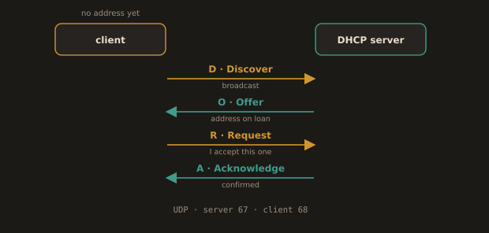

## 3.8 DHCP

DHCP (Dynamic Host Configuration Protocol) is what automatically assigns IP addresses to devices when they join a network. Without DHCP, every device would need a manually configured static IP, which is unmanageable at scale.

When a Linux server or container boots, it sends a broadcast request (DHCP Discover) looking for a DHCP server. The server responds with an offer (IP address, subnet mask, default gateway, DNS server, and lease duration). The client accepts the offer and uses those settings until the lease expires.

The four step exchange has a name worth remembering, because the acronym tells you which step failed when you read a packet capture: DORA, for Discover, Offer, Request, Acknowledge. The client broadcasts a Discover because it has no address yet and cannot send a unicast packet. Servers reply with an Offer. The client broadcasts a Request naming the offer it accepts, which is also how the servers it declined learn to release their reservations. The chosen server confirms with an Acknowledge. DHCP runs over UDP, port 67 on the server and port 68 on the client.

**Fig. 21 · DHCP in four steps: DORA**

*Discover, Offer, Request, Acknowledge, and the acronym tells you which step failed in a capture.*

In AWS, every EC2 instance automatically receives an IP address, subnet mask, default gateway, and DNS resolver via DHCP. You do not configure this manually. The VPC's DHCP options set controls which DNS servers and domain names are handed out.

In Linux, you can see DHCP-assigned addresses with `ip addr show`. The lease information is stored in files like `/var/lib/dhclient/dhclient.leases` or managed by NetworkManager/systemd-networkd, depending on the distribution.

---
**Why does this matter in DevOps?**

- Containers and VMs in most environments get their networking via DHCP.

- If DHCP fails, devices fall back to link local addresses in the `169.254.0.0/16` range. If you see a `169.254.x.x` address on an interface that should have a real IP, DHCP has failed.

- When designing server infrastructure, critical services (databases, load balancers, DNS servers) should always have static IPs or use DHCP reservations, not floating leases.

- A cloud instance's private IP is handed to it by DHCP but is fixed for the life of the instance, so the address itself is stable. What is not stable is the assumption that it will be the same after a rebuild. This is precisely why service discovery and DNS exist, and why hardcoding an instance's IP into a configuration file is a mistake you make only once.

- Docker runs its own address assignment for the default bridge network, out of `172.17.0.0/16`. Kubernetes assigns pod addresses from a cluster wide pod CIDR through the CNI plugin, not through DHCP at all. Both are the same idea wearing different clothes: something has to hand out addresses, and the day it collides with an address range you already use on your corporate network is the day you learn which range it was using.

---
