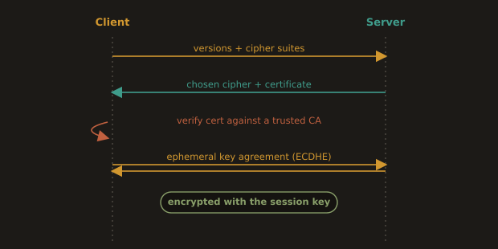
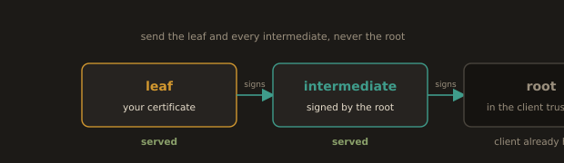
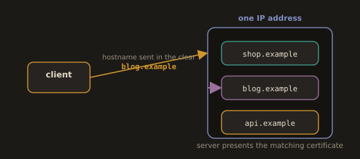

## 3.9 TLS and HTTPS

TLS (Transport Layer Security) is the protocol that encrypts traffic between a client and a server. It operates at the boundary between Layer 6 (Presentation) and Layer 7 (Application) in the OSI model. HTTPS is HTTP running over TLS.

As a DevOps engineer, you deal with TLS constantly: generating and renewing certificates, configuring Nginx to terminate TLS, debugging handshake failures, and setting up tools like Let's Encrypt or AWS Certificate Manager.

---
**How a TLS handshake works:**

1. The client connects to the server and sends the TLS versions and cipher suites it supports.
2. The server responds with its chosen cipher suite and its TLS certificate.
3. The client verifies the certificate against trusted Certificate Authorities (CAs).
4. They agree on a session key using asymmetric cryptography (an ephemeral Diffie-Hellman exchange, ECDHE in any modern configuration).
5. All subsequent traffic is encrypted with that session key using symmetric encryption (typically AES-GCM or ChaCha20-Poly1305).

**Fig. 22 · The TLS handshake**



*Client and server agree on a cipher, prove identity with a certificate, and derive a session key that stays private.*

**A correction worth making explicitly.** Older material, including earlier drafts of these notes, describes step 4 as using "RSA or ECDHE." That is now wrong in an important way. TLS 1.3 removed RSA key exchange entirely, along with static Diffie-Hellman, because neither provides forward secrecy: an attacker who records encrypted traffic today and later obtains the server's private key can decrypt all of it retroactively. Every TLS 1.3 handshake uses an ephemeral key exchange, so past sessions stay unreadable even if the server key is later compromised. RSA still appears in TLS 1.3, but only as a signature algorithm proving the server owns its certificate, never as the means of exchanging the session key. When you configure a cipher list for TLS 1.2 and see every suite begin with `ECDHE`, this is the reason.

TLS 1.3 also completes the handshake in one round trip rather than two, which is a visible latency improvement, and it encrypts more of the handshake itself.

---
**Major terms:**

- **Certificate:**
  
      A file containing the server's public key and identity, signed by a CA.

- **CA (Certificate Authority):**

      A trusted third party that signs certificates (Let's Encrypt, DigiCert, AWS ACM).

- **Self signed certificate:**

      A certificate signed by its own private key, not by a CA. Browsers and tools will warn or refuse to connect unless you explicitly trust it. Used in lab environments.

- **Certificate chain:**

      Many certificates are not signed directly by a root CA but by an intermediate CA. The full chain (leaf > intermediate > root) must be presented to clients.

- **SNI (Server Name Indication):**

      A TLS extension that lets a single server serve multiple certificates on one IP address. The client sends the hostname in the TLS handshake before encryption begins.

**On the chain, since this is the failure you will actually hit.** The server must send the leaf certificate and every intermediate above it, but not the root, which the client already has. Browsers often paper over a missing intermediate by fetching it themselves, so a site can look perfectly fine in Chrome and fail in `curl`, in a Java client, and in your CI pipeline. When someone reports that a certificate "works in the browser but breaks in the app," a missing intermediate is the first thing to check. With Let's Encrypt, always deploy `fullchain.pem`, never `cert.pem`, and the problem does not arise.

**Fig. 23 · The certificate chain**



*Serve the leaf and every intermediate above it; the client already holds the root.*

**On SNI.** Because the client sends the hostname in the clear before encryption begins, the server knows which certificate to present even when many sites share one IP address. This is what makes shared hosting and multi tenant ingress possible. It is also why a request that reaches the right IP can still be answered with the wrong certificate: if the client omits SNI, or sends a name the server has no server block for, it gets the default certificate. That is exactly the situation `openssl s_client -servername` exists to reproduce.

**Fig. 24 · One address, many certificates**



*The hostname arrives in the clear first, so the server knows which certificate to present.*

---
**Nginx TLS configuration:**

```nginx
server {
    listen 443 ssl;
    listen [::]:443 ssl;
    http2 on;

    server_name example.com;

    ssl_certificate     /etc/nginx/ssl/fullchain.pem;   # leaf plus intermediates
    ssl_certificate_key /etc/nginx/ssl/privkey.pem;

    ssl_protocols TLSv1.2 TLSv1.3;
    ssl_ciphers ECDHE-ECDSA-AES128-GCM-SHA256:ECDHE-RSA-AES128-GCM-SHA256:ECDHE-ECDSA-AES256-GCM-SHA384:ECDHE-RSA-AES256-GCM-SHA384:ECDHE-ECDSA-CHACHA20-POLY1305:ECDHE-RSA-CHACHA20-POLY1305;
    ssl_prefer_server_ciphers off;

    ssl_session_cache shared:SSL:10m;
    ssl_session_timeout 1d;
    ssl_session_tickets off;

    add_header Strict-Transport-Security "max-age=63072000" always;
}
```

Three things in that block have changed from what older tutorials teach, and each is worth knowing.

`listen 443 ssl http2;` is deprecated as of Nginx 1.25.1. HTTP/2 is now enabled with a separate `http2 on;` directive inside the server block. The old form still parses but emits a warning on every `nginx -t`.

`ssl_ciphers HIGH:!aNULL:!MD5;` was standard advice for years and is now too loose: `HIGH` still admits CBC mode suites and other constructions that current guidance excludes. The list above is Mozilla's intermediate profile, which permits only ECDHE key exchange with AEAD ciphers. Note that `ssl_ciphers` has no effect on TLS 1.3 at all, which chooses from its own fixed set of three AEAD suites; the directive governs TLS 1.2 only.

`ssl_prefer_server_ciphers off;` looks wrong to anyone taught to force the server's ordering, but when the cipher list contains only strong suites, there is no weak option to protect the client from, and letting the client choose lets it pick whichever suite its hardware runs fastest. Mozilla sets this off deliberately in both the intermediate and modern profiles.

TLSv1.0 and TLSv1.1 are deprecated and disabled in modern configurations. Only TLSv1.2 and TLSv1.3 should be used in production. Rather than copying a cipher list from a blog post, generate one for your exact Nginx and OpenSSL versions from the Mozilla SSL Configuration Generator at `https://ssl-config.mozilla.org/`, which is the reference the rest of the industry treats as authoritative.

You can check the TLS configuration of any server with:

* View the certificate and negotiated protocol
```bash
curl -vI https://example.com 2>&1 | grep -E "(TLS|SSL|issuer|expire)"
```

* More detailed TLS inspection
```bash
openssl s_client -connect example.com:443 -servername example.com
```

* Check the expiry date without reading the whole certificate
```bash
echo | openssl s_client -connect example.com:443 -servername example.com 2>/dev/null \
  | openssl x509 -noout -dates -subject -issuer
```

* Verify the chain the server actually sends, which is where the missing intermediate shows up
```bash
openssl s_client -connect example.com:443 -servername example.com -showcerts
```

> Certificate expiry is one of the most common causes of a sudden, total, self inflicted outage, and it is entirely preventable. Automate renewal (`certbot` with a systemd timer, or AWS ACM, which renews by itself) and alert on days remaining, not on failure. A certificate that expires at 02:00 on a Saturday does not care how good your incident response is.

---
