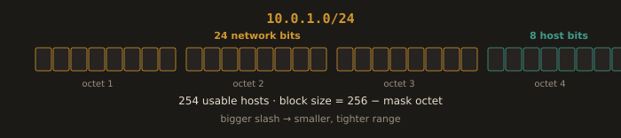
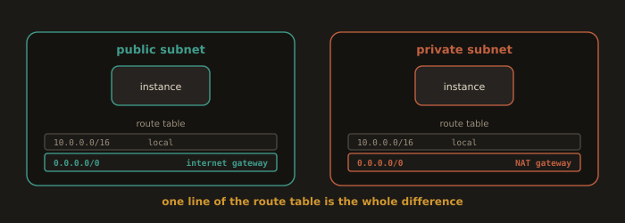
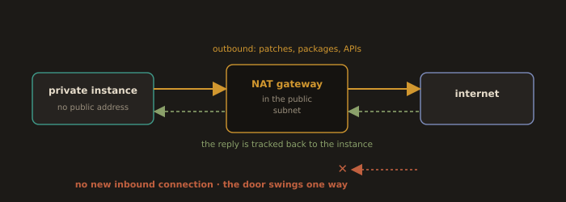
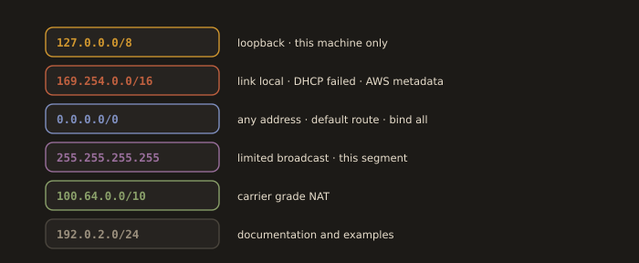

## 3.10 NAT, Addressing, and CIDR in Practice
---
### IPv4 Addressing

An IPv4 address is a 32-bit number written in four octets of decimal, separated by dots: `192.168.1.10`.

Each octet represents 8 bits, giving a range of 0 to 255 per octet. Total IPv4 address space: 2^32 = approximately 4.3 billion addresses.

An IP address has two parts: the network portion (which network) and the host portion (which device on that network). The subnet mask separates them.

---
### Subnetting and CIDR Notation

CIDR (Classless Inter Domain Routing) notation is simply the precise way engineers write down both an address range and its size in one compact expression, like `10.0.1.0/24`.

The number after the slash tells you how many bits are fixed as the network portion. The remaining bits are available for individual host addresses within that range. A smaller number after the slash means a larger range of addresses. A larger number after the slash means a smaller, more tightly scoped range.

**Fig. 25 · What the slash buys you**



*Bits left of the slash fix the network; the rest are hosts, and the block size falls straight out of the mask.*

| Prefix | Subnet Mask       | Network Bits | Host Bits | Usable Hosts |
|--------|-------------------|--------------|-----------|--------------|
| /8     | 255.0.0.0         | 8            | 24        | 16,777,214   |
| /16    | 255.255.0.0       | 16           | 16        | 65,534       |
| /24    | 255.255.255.0     | 24           | 8         | 254          |
| /25    | 255.255.255.128   | 25           | 7         | 126          |
| /26    | 255.255.255.192   | 26           | 6         | 62           |
| /27    | 255.255.255.224   | 27           | 5         | 30           |
| /28    | 255.255.255.240   | 28           | 4         | 14           |
| /30    | 255.255.255.252   | 30           | 2         | 2            |
| /32    | 255.255.255.255   | 32           | 0         | 1 (single host) |

Usable hosts = 2^(host bits) - 2. You subtract 2 because the first address is the network address and the last is the broadcast address. Neither can be assigned to a device.

---
**Example: 192.168.1.0/26**

- Prefix length: 26 bits network, 6 bits host
- Subnet mask: 255.255.255.192 (binary: 11111111.11111111.11111111.11000000)
- Network address: 192.168.1.0
- Broadcast address: 192.168.1.63 (all host bits set to 1)
- Usable host range: 192.168.1.1 to 192.168.1.62
- Number of usable hosts: 2^6 - 2 = 62
  
---
### Doing the Math Without Binary

You will do this often enough that the shortcut is worth learning properly, and slowly enough at first that the binary is worth writing out once.

The block size of a subnet is `256 - (last non zero octet of the mask)`. For a /26, the mask is 255.255.255.192, so the block size is `256 - 192 = 64`. Subnets therefore begin at multiples of 64 in the final octet: .0, .64, .128, .192. Any address you are given falls into whichever of those blocks contains it.

Take `192.168.1.100/26`. The block size is 64. The multiples of 64 are 0, 64, 128, 192, and 100 falls between 64 and 128. So:

- Network address: 192.168.1.64
- Broadcast address: 192.168.1.127 (one below the next block, 128)
- Usable range: 192.168.1.65 to 192.168.1.126
- Usable hosts: 62

Three questions, three seconds, no binary. Verify with a tool rather than trusting the arithmetic:

```bash
ipcalc 192.168.1.100/26        # RHEL/Fedora: dnf install ipcalc
sipcalc 192.168.1.100/26       # alternative, more detail
```

**AWS subtracts five, not two.** In every AWS subnet, five addresses are unavailable: the network address, the broadcast address, and three that AWS reserves for the VPC router, DNS, and future use. A /24 subnet gives 251 usable addresses in AWS, not 254. A /28, the smallest AWS permits, gives 11. This is not a rounding error when an autoscaling group and a load balancer are drawing from the same range.

---
### Why Real Infrastructure Uses Multiple Small Subnets Instead of One Large One

A common beginner instinct is to provision one enormous subnet and put every single resource into it. Real infrastructure rarely does this, for a few concrete, practical reasons.

Different tiers of an application need different exposure levels. Your web servers might need to be reachable from the public internet. Your database absolutely should not be. Placing them in separate subnets, a public subnet and a private subnet, lets you apply fundamentally different routing rules and security postures to each group, rather than relying entirely on security group rules to manually compensate within one giant, undifferentiated address space.

Cloud providers also organize infrastructure around availability zones, physically separate data centers within a region. A standard, resilient pattern places a public subnet and a private subnet in each availability zone, so that if one entire availability zone has a problem, the application can keep running using the resources in the others. This naturally produces several smaller subnets rather than one large flat one.

The distinction that actually defines a public subnet is worth stating plainly, because it is not a checkbox and not a naming convention. A subnet is public if and only if its route table has a route to an internet gateway. A subnet is private if its route table sends outbound traffic to a NAT gateway instead, or nowhere at all. Two subnets can be identical in every other respect and differ only in that one line of their route tables. Everything else, the names, the tags, the diagrams, is convention.

**Fig. 27 · One line of the route table**



*A subnet is public only because it routes to an internet gateway; send that route to a NAT gateway instead and it is private.*

---
### NAT in Practice: Why Private Subnets Still Need Internet Access?

A private subnet, by design, has no direct route to the public internet and is not reachable from it. But servers living inside that private subnet still frequently need outbound internet access. They need to download security patches, install software packages, or call external APIs.

This is exactly what a NAT Gateway solves. It lives in a public subnet and allows instances in a private subnet to initiate outbound connections to the internet, while still remaining completely unreachable from the internet itself. The NAT Gateway translates the private instance's address as outbound traffic passes through it and routes any response back to the correct originating instance. Critically, the internet cannot use this same path to initiate a brand new inbound connection toward that private instance. The door only swings one way.

**Fig. 26 · The door swings one way**



*A private instance reaches out through the NAT gateway, but nothing on the internet can reach back in.*


- Private subnet instance wants to run: `dnf update -y`
```
Private instance  >  NAT Gateway (sits in the public subnet)  >  Internet
                                    |
                       Response comes back through
                       the same NAT Gateway
```
The instance still has no public IP address of its own and remains completely unreachable from the internet.

**Another Example:**
1. Your VM (`192.168.1.10`) sends a packet to `8.8.8.8:53` (Google DNS).
2. The packet reaches the router/NAT gateway.
3. The router replaces the source address with its own public IP (`203.0.113.5`) and records the mapping in a translation table.
4. Google receives the packet from `203.0.113.5` and responds to it.
5. The router receives the response, looks up the translation table, and forwards the packet to `192.168.1.10`.

> The private device is completely hidden from the outside. This is why a home router can connect dozens of devices using a single public IP.

**The three details that turn into tickets.** A NAT gateway lives in one availability zone; if that zone fails, private subnets in other zones that route through it lose outbound internet. Production designs place one NAT gateway per availability zone for this reason. A NAT gateway also bills per hour and per gigabyte processed, which makes it a surprisingly common line item on a cloud bill when a private subnet is pulling container images from the public internet on every deployment. And a NAT gateway is IPv4 only: the IPv6 equivalent is an egress only internet gateway, which provides the same one way property for IPv6 traffic.

---
### Special Purpose Addresses:

| Range             | Purpose                                                                               |
|-------------------|---------------------------------------------------------------------------------------|
| 127.0.0.0/8       | Loopback (localhost). `127.0.0.1` always refers to the local machine.                |
| 169.254.0.0/16    | Link-local. Auto-assigned when DHCP fails. In AWS, `169.254.169.254` is the instance metadata endpoint (IMDS). |
| 0.0.0.0/0         | Represents all addresses. Used in routing tables (default route) and firewall rules.  |
| 255.255.255.255   | Limited broadcast. Sent to all hosts on the local network.                            |
| 100.64.0.0/10     | Carrier grade NAT (RFC 6598). Also used by some cloud services internally.            |
| 192.0.2.0/24, 198.51.100.0/24, 203.0.113.0/24 | Reserved for documentation and examples. Safe to use in your notes and diagrams. |

**Fig. 28 · Addresses with a fixed meaning**



*A handful of ranges never behave like ordinary hosts, and you will meet them every week.*

Two of these deserve a sentence each. `0.0.0.0` means two different things depending on where it appears, and conflating them causes real confusion: in a routing table or a firewall rule it means "any address," while as a bind address it means "listen on every interface on this host." A service bound to `127.0.0.1` is reachable only from the machine itself, which is the single most common reason a correctly running service is unreachable from outside. Check it with `ss -tlnp` and read the local address column before touching the firewall.

And `169.254.169.254`, the AWS instance metadata endpoint, is a link local address that every EC2 instance can reach and no one else can. It serves the instance's own identity and, importantly, its IAM role credentials, which is why a server side request forgery bug in an application running on EC2 is so dangerous: it can be tricked into fetching those credentials. IMDSv2, which requires a session token obtained by a PUT request, exists specifically to close that hole, and it should be enforced on every instance you create.

---
### Common Addressing Mistakes

**Overlapping CIDR ranges.** 

If two networks that eventually need to be connected, two AWS VPCs, or a VPC and an on premises office network, are accidentally assigned the same or overlapping address ranges, you cannot route between them without extensive, painful renumbering. Planning your address ranges carefully before provisioning anything prevents this entirely.

**Subnets sized too small to grow.** 

A `/28` subnet holds only 16 addresses, and AWS itself reserves five of those for internal use, leaving just 11 usable. This fills up surprisingly fast once auto scaling groups and load balancers start consuming addresses from the same range. A reasonable default for most general purpose subnets is `/24`, which leaves comfortable room to grow without needing a redesign later.

**Forgetting that AWS reserves five IP addresses in every subnet.** 

The network address, the broadcast address, plus three additional addresses AWS itself reserves for internal VPC services. A `/24` subnet, which is normally 256 total addresses, only gives you 251 usable addresses in AWS specifically, not 254 like in a standard, non cloud network calculation.

**Using 10.0.0.0/16 for everything, in every environment.**

It is the default in every tutorial, which means it is also the default in the VPC your colleague built, the one the acquired company built, and the one your VPN vendor uses internally. The day you need to peer two of them, you cannot. Allocate deliberately: one distinct range per environment and per region, written down in one place before anything is provisioned.

---
