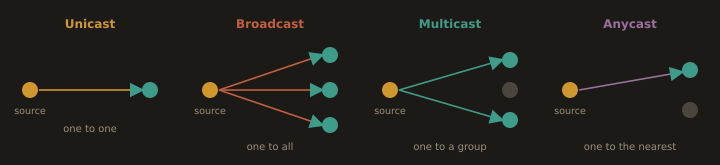

# Part 2: Linux and Cloud Networking Reference

> This part is your existing working reference, kept in full. Everything that follows is preserved from your earlier notes, with corrections added as callouts where a command or file location has changed since it was written. Nothing has been removed.

---

## 3.11 Networking Concepts

**Network Communication Types**

**1. Unicast (One to One)**
 - One source; One destination
 - Use: Web browsing, SSH, email
 - Example: `192.168.1.10 → 192.168.1.20`

**2. Broadcast (One to All)**
 - One source; All devices in networks
 - Use: ARP, DHCP
 - Example: `192.168.1.10 → 255.255.255.255`

**3. Multicast (One to Many)**
 - One source; Multiple specific devices
 - Use: Video streaming, conferencing
 - IP Range: 224.0.0.0 – 239.255.255.255
 - Example: `192.168.1.10 → 239.255.0.1`

**4. Anycast (One to Nearest)**
 - One source; Nearest of multiple identical destinations
 - Use: DNS servers, CDNs

**Fig. 29 · Four ways to address traffic**



*Unicast to one, broadcast to all, multicast to a group, anycast to the nearest of many.*

---

**IP Address**

A unique numerical label assigned to every device on an IP network for identification and routing.

**Types:**
- **IPv4 (Internet Protocol Version 4):**
    - Format: 32 bit, dotted decimal notation
    - Example: `192.168.1.1`
    - Limitation: ~4.3 billion addresses (exhausted)
    
- **IPv6 (Internet Protocol Version 6):**
    - Format: 128 bit, hexadecimal notation
    - Example: `2001:0db8:85a3::8a2e:0370:7334`
    - Virtually unlimited addresses

**IP Address Functions:**
- Host Identification:
 - Uniquely identifies each device
- Interface Addressing:
 - Identifies specific network interfaces
- Routing:
 - Enables packet delivery to the correct destinations

**IP Address Categories:**
- Public IP Address:
  - Globally routable on the Internet
  - Allocated by IANA; Regional Internet Registries (RIRs); ISPs
  - Required for direct Internet access
    
- Private IP Address(RFC 1918)
  - Used within local networks only
  - Not routable on the public Internet
  - Requires NAT (Network Address Translation) for Internet access
    
**- Examples:**
```
10.0.0.0/8        (10.0.0.0 - 10.255.255.255)     - Large organizations
172.16.0.0/12     (172.16.0.0 - 172.31.255.255)   - Medium organizations  
192.168.0.0/16    (192.168.0.0 - 192.168.255.255) - Home/small business
```


**Default Gateway**

A router that sends data between different networks, such as from a local network (LAN) to the Internet. It often uses NAT to convert private IP addresses to public ones.

**Functions:**
  - Routes traffic from the local network to external networks (LAN; Internet)
  - Typically performs NAT (Network Address Translation)
  - Serves as the "exit point" from the local network

**Example:**
  - Local device: 192.168.1.100
  - Gateway: 192.168.1.1
  - Internet destination: routed through the gateway


**DNS (Domain Name System)**

It’s what helps your computer find websites by turning names like example.com into the numerical addresses computers use to connect, kind of like looking up a contact’s phone number to make a call.

**DNS Components:**
 - Recursive resolver:
     - First point of contact for DNS queries
     - Caches responses for performance
     - Examples:
         - 8.8.8.8 (Google)
         - 1.1.1.1 (Cloudflare)
           
 - Authoritative nameserver:
     - Holds the official DNS records for domains
     - Provides definitive answers for specific domains
     - Managed by domain owners/hosting providers
 
 - DNS Resolution Process:
`1. Query recursive resolver → 2. Check cache → 3. Query root servers → 4. Query TLD servers → 5. Query authoritative servers → 6. Return IP address`


---
