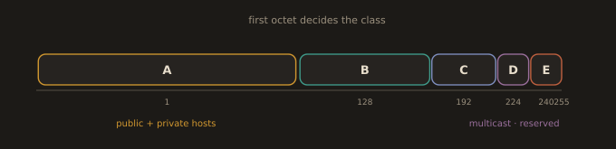

## 3.12 IPv4 Classful Addressing & Special Ranges

While modern networks use CIDR (Classless Inter Domain Routing), understanding historical classful addressing helps interpret legacy systems and documentation.

**Fig. 30 · The old classful bands**

*The first octet placed an address in class A, B, C, D, or E long before CIDR replaced the scheme.*

**Unicast Address Classes (A, B, C):**

These were used for assigning addresses to hosts on the public internet and have corresponding private address blocks defined in RFC 1918.

| **Class** | **First Octet** | **   Public Range        ** | **      Private Range     **  | **Default Mask** | **CIDR** |
| :-------: | :-------------: | :-------------------------: | :--------------------------:  | :--------------: | :------: |
|   **A**   |      1–126      |  1.0.0.0 – 126.255.255.255  |  10.0.0.0 – 10.255.255.255    |    255.0.0.0     |   /8     |
|   **B**   |     128–191     | 128.0.0.0 – 191.255.255.255 | 172.16.0.0 – 172.31.255.255   |   255.255.0.0    |   /16    |
|   **C**   |     192–223     | 192.0.0.0 – 223.255.255.255 | 192.168.0.0 – 192.168.255.255 |  255.255.255.0   |   /24    |

**Special Use Address Classes (D, E) & Notable Reservations**:

These address ranges are reserved for specific protocols and are not used for general host addressing.

| **Class** | **First Octet** | **Address Range** | **Purpose** | **Examples** |
| :-------: | :-------------: | :---------------: | :---------: | :--------------- |
|   **D**   |     224–239     | 224.0.0.0 – 239.255.255.255 | **Multicast** | 224.0.0.1 (All hosts), 224.0.0.2 (All routers) |
|   **E**   |     240–255     | 240.0.0.0 – 255.255.255.255 | **Reserved / Experimental** | 255.255.255.255 (Limited broadcast) |
|  **N/A**  |      **127**    |   127.0.0.0/8     | **Loopback** | 127.0.0.1 (Localhost) |
|  **N/A**  |     **169.254** |   169.254.0.0/16  | **APIPA** | 169.254.x.x (Automatic Private IP Addressing) |
|  **N/A**  |    **192.0.2**  |   192.0.2.0/24    | **TEST NET** | 192.0.2.1 (Documentation & examples) |

Other reserved ranges:
- 198.51.100.0/24, 203.0.113.0/24 (documentation)
- 100.64.0.0/10 (Carrier Grade NAT)
- 255.255.255.255 (Local broadcast)

---
