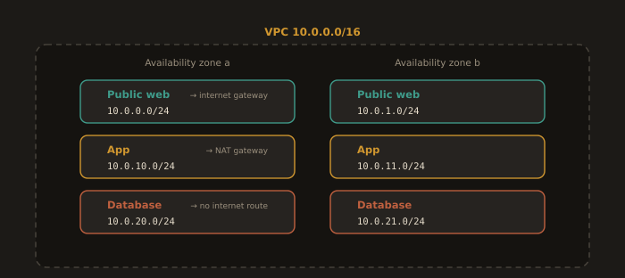

## Lab 3B: Subnetting and a Three Tier VPC Design (On Paper)

**Goal:** do the arithmetic by hand, then design an address plan you will build for real in Module 8. No VMs, no cloud account. A pen is sufficient.

---

### Part 1: Given 192.168.1.0/26

Calculate, showing your working:

1. The subnet mask in dotted decimal
2. The network address
3. The broadcast address
4. The usable host range
5. The number of usable hosts

**Work it through.** The prefix is /26, meaning 26 network bits and 6 host bits. The mask has 26 leading ones:

```
11111111.11111111.11111111.11000000
   255   .   255   .   255  .  192
```

Block size is `256 - 192 = 64`, so /26 subnets of this network begin at .0, .64, .128, and .192. The block starting at .0 runs to .63.

| Item | Value |
|---|---|
| Subnet mask | 255.255.255.192 |
| Network address | 192.168.1.0 |
| Broadcast address | 192.168.1.63 |
| Usable host range | 192.168.1.1 to 192.168.1.62 |
| Usable hosts | 2^6 - 2 = 62 |

Now do the same for `192.168.1.130/26` without looking back. Block size 64; 130 falls in the block that starts at 128. Network 192.168.1.128, broadcast 192.168.1.191, usable .129 to .190, 62 hosts. Check yourself with `ipcalc 192.168.1.130/26`.

---

### Part 2: Design a three tier VPC layout in 10.0.0.0/16

You are given `10.0.0.0/16`: 65,536 addresses, far more than you need, which is the point. The goal is not to use it all. It is to divide it so the tiers are separable, the boundaries are obvious to a human reading a route table, and there is room left over.

**Requirements:**

- A public web tier, reachable from the internet
- A private application tier, reachable only from the web tier
- A private database tier, reachable only from the application tier
- Room to add a fourth tier later without renumbering anything

**A minimal answer, three subnets:**

| Tier | CIDR | Mask | Usable (standard) | Usable (AWS) | Route table sends 0.0.0.0/0 to |
|---|---|---|---|---|---|
| Public web | 10.0.1.0/24 | 255.255.255.0 | 254 | 251 | Internet gateway |
| App | 10.0.2.0/24 | 255.255.255.0 | 254 | 251 | NAT gateway |
| Database | 10.0.3.0/24 | 255.255.255.0 | 254 | 251 | Nothing, or NAT gateway if patching is needed |

That single line in the last column is the entire difference between a public and a private subnet. Everything else about them is identical.

**The answer you would actually deploy, spanning two availability zones:**

A single subnet lives in a single availability zone, so a design with one subnet per tier cannot survive the loss of one zone. Real designs place each tier in at least two.

| Tier | AZ a | AZ b |
|---|---|---|
| Public web | 10.0.0.0/24 | 10.0.1.0/24 |
| App | 10.0.10.0/24 | 10.0.11.0/24 |
| Database | 10.0.20.0/24 | 10.0.21.0/24 |

Note what the numbering does. Tiers are separated by a gap of ten in the third octet, so a fourth tier can be added at 10.0.30.0/24 and 10.0.31.0/24, and a third availability zone can be added at 10.0.2.0/24, 10.0.12.0/24 and 10.0.22.0/24, without a single existing subnet moving. Anyone reading `10.0.21.0/24` in a route table can tell at a glance that it is database tier, second zone. Address plans are read far more often than they are written.

**Fig. 31 · Three tiers across two zones**



*Public, application, and database tiers mirrored in two availability zones, numbered so a fourth tier drops in without renumbering.*

Total consumed: six /24 subnets out of the 256 available in a /16. Roughly 98 percent of the range is still free. That is not waste. That is the design working.

**Deliverables:**

1. The completed table for Part 1, with working shown
2. Your VPC table, with a route table column for each subnet
3. Three sentences on why the database tier gets no route to an internet gateway, and how it installs security patches anyway
4. One sentence naming the address range you would allocate to a second VPC in a different region, and why it must not overlap this one

Keep this page. In Module 8 you will build it in Terraform and compare what you designed against what you had to change.

---
