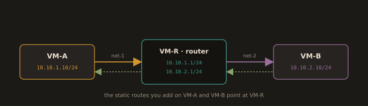

## Lab 3C: Two VMs on Different Subnets, Connected with Static Routes

**Goal:** make two hosts on different subnets talk to each other through a Linux router you configure yourself, and see `ip route` change before and after. This is the lab that turns routing from a diagram into something you have actually done.

---

### Topology

Three VMs. The router has an interface on each subnet; the hosts have one each.

```
   VM-A                     VM-R (router)                     VM-B
10.10.1.10/24  ------  10.10.1.1/24   10.10.2.1/24  ------  10.10.2.10/24
   net-1                  net-1  net-2                        net-2
```

In VirtualBox, create two internal networks named `net-1` and `net-2`. Give VM-A one adapter on `net-1`, VM-B one adapter on `net-2`, and VM-R two adapters, one on each. Keep each VM's existing NAT adapter for internet access; it does not participate in this lab.

**Fig. 32 · Lab 3C topology**



*Two hosts on separate subnets, joined only by the router VM you configure by hand.*

---

### Step 1: Address the interfaces

On **VM-A** (substitute your real interface name from `ip -br link`):

```bash
sudo ip addr add 10.10.1.10/24 dev enp0s8
sudo ip link set enp0s8 up
```

On **VM-B**:

```bash
sudo ip addr add 10.10.2.10/24 dev enp0s8
sudo ip link set enp0s8 up
```

On **VM-R**, both:

```bash
sudo ip addr add 10.10.1.1/24 dev enp0s8
sudo ip addr add 10.10.2.1/24 dev enp0s9
sudo ip link set enp0s8 up
sudo ip link set enp0s9 up
```

---

### Step 2: `ip route` before

On VM-A:

```bash
ip route show
```

```
10.10.1.0/24 dev enp0s8 proto kernel scope link src 10.10.1.10
```

One directly connected route and nothing else for this network. Now prove the consequence:

```bash
ping -c 2 10.10.1.1        # the router's near side: works, same subnet
ping -c 2 10.10.2.10       # VM-B: fails
```

```
ping: connect: Network is unreachable
```

Read that message carefully. It is not a timeout and it is not a refusal. The kernel is saying it has no route toward 10.10.2.0/24 and therefore did not even put a packet on the wire. Capture this output; it is half your deliverable.

Run the same three commands on VM-B and record them too.

---

### Step 3: Turn VM-R into a router

A Linux host with two interfaces does not forward between them by default. Two things must be true.

**Enable IP forwarding:**

```bash
# Check the current value: 0 means forwarding is off
cat /proc/sys/net/ipv4/ip_forward

# Turn it on for now
sudo sysctl -w net.ipv4.ip_forward=1

# Make it survive a reboot
echo 'net.ipv4.ip_forward = 1' | sudo tee /etc/sysctl.d/99-router.conf
sudo sysctl --system
```

**Let the firewall forward the traffic.** This is the step that catches everyone. `firewalld` filters forwarded packets, not just packets addressed to the host itself, so forwarding can be enabled in the kernel and still drop everything. For a lab, place both internal interfaces in the trusted zone:

```bash
sudo firewall-cmd --permanent --zone=trusted --change-interface=enp0s8
sudo firewall-cmd --permanent --zone=trusted --change-interface=enp0s9
sudo firewall-cmd --reload
sudo firewall-cmd --get-active-zones
```

> The `trusted` zone is correct for an isolated lab and wrong for anything else. In production you would write an explicit forwarding policy allowing only the flows you intend. The point here is to see that IP forwarding and firewall policy are two separate gates, and traffic must pass both.

---

### Step 4: Add the static routes

VM-R knows both networks, because it has an interface on each. VM-A and VM-B do not. Tell them.

On **VM-A**:

```bash
sudo ip route add 10.10.2.0/24 via 10.10.1.1 dev enp0s8
```

On **VM-B**:

```bash
sudo ip route add 10.10.1.0/24 via 10.10.2.1 dev enp0s8
```

Both routes are required. A route is a one way instruction: without the second one, VM-A's packet reaches VM-B and VM-B's reply has nowhere to go. The symptom of a missing return route is a ping that hangs rather than failing fast, and diagnosing that from VM-A alone is impossible, which is a lesson in itself.

---

### Step 5: `ip route` after

On VM-A:

```bash
ip route show
```

```
10.10.1.0/24 dev enp0s8 proto kernel scope link src 10.10.1.10
10.10.2.0/24 via 10.10.1.1 dev enp0s8
```

The second line is new, and it is entirely the work you did. Now:

```bash
ping -c 3 10.10.2.10
traceroute -n 10.10.2.10
```

The ping succeeds. The traceroute shows two hops: 10.10.1.1, then 10.10.2.10. You can see the router in the path, which is the visible proof that the packet is being routed rather than delivered on the local link.

Ask the kernel to explain its own decision:

```bash
ip route get 10.10.2.10
```

```
10.10.2.10 via 10.10.1.1 dev enp0s8 src 10.10.1.10 uid 1000
```

---

### Step 6: Make it persistent

Everything above is lost at reboot, which is correct behaviour for `ip` commands and a nasty surprise if you assumed otherwise. Persist the route with NetworkManager on VM-A:

```bash
sudo nmcli connection modify "System enp0s8" +ipv4.routes "10.10.2.0/24 10.10.1.1"
sudo nmcli connection up "System enp0s8"
ip route show
```

Reboot the VM and run `ip route show` again. If the route is still there, you have done this properly.

---

### Deliverables

1. `ip route show` from VM-A and VM-B, before and after, four outputs total
2. The failed `ping` before, with its exact error message, and the successful `ping` after
3. The `traceroute -n` output showing the router in the path
4. The `ip route get 10.10.2.10` output
5. In prose: you enabled `net.ipv4.ip_forward` and it still did not work until you touched `firewalld`. Explain in a few sentences what each of those two gates does, and why a kernel that is willing to forward a packet may still not forward it.

**Cleanup**, if you are not keeping the topology:

```bash
sudo ip route del 10.10.2.0/24          # on VM-A
sudo ip route del 10.10.1.0/24          # on VM-B
sudo sysctl -w net.ipv4.ip_forward=0    # on VM-R
```

---
