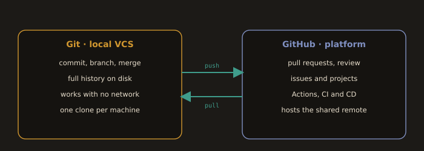

## Introduction to Git & GitHub

- What is Git?
  - Distributed version control system to track changes, enable collaboration, and work offline.
  - Tracks code changes (history, authorship, timelines).
  - Enables conflict-free collaboration (no overwriting others' work).
  - Runs locally (commit, branch, merge offline).

- What is GitHub?
  - Cloud platform hosting Git repositories and providing:
    - Pull Requests (code review + merge)
    - Issues (bug/feature tracking)
    - CI/CD integrations (e.g., Actions)
    - Project boards, wikis, automation

### Git vs. GitHub

**Fig. 1 · Git is the tool, GitHub is the place**

*Git versions your code on your machine; GitHub hosts the shared copy and wraps it in review and automation.*

| Aspect            | Git (VCS)                                   | GitHub (Platform)                              |
|-------------------|----------------------------------------------|------------------------------------------------|
| Type              | Distributed Version Control System           | Cloud-based Git hosting platform               |
| Function          | Tracks code changes locally                  | Hosts remote repositories                      |
| Installation      | Required (local CLI)                         | Not required (web UI), optional CLI            |
| Internet Needed?  | No (for local work)                          | Yes (for collaboration)                        |
| Core Features     | Commits, branches, merging, history          | PRs, Issues, CI/CD, Wikis, Actions             |
| Ownership         | Open-source (Linus Torvalds)                 | Microsoft-owned                                |
| Analogy           | Personal notebook (drafts)                   | Shared library (publishing/collaboration)      |

---
