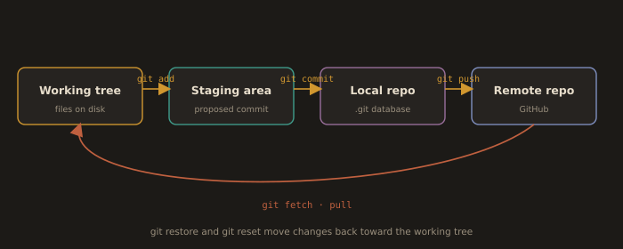

## How Git Works (with GitHub)

**Fig. 2 · The four areas a change moves through**



*add stages, commit records, push shares; fetch and pull bring the remote back down.*

```
+---------------+    +---------------+    +--------------------+    +---------------------+
| Working Tree  |    | Staging Area  |    | Local Repository   |    | Remote Repository   |
+---------------+    +---------------+    +--------------------+    +---------------------+
       |                    |                    |                          |
       | git add/mv/rm      |                    |                          |
       +------------------->|                    |                          |
       |                    | git commit         |                          |
       |                    +------------------->|                          |
       |                    |                    | git push                 |
       |                    |                    +------------------------->|
       |                    |                    |                          |
       |                    |                    |<-------------------------+
       | git reset <file>   |                    |          git fetch       |
       |<-------------------+                    |                          |
       | git reset <commit> |                    |                          |
       |<----------------------------------------+                          |
       | git diff           |                    |                          |
       |<------------------>|                    |                          |
       | git diff HEAD      |                    |                          |
       |<--------------------------------------->|                          |
       |                    |                    |                          |
       |<------------------------------------------------------------------+|
       |  git clone/pull                                                    |

```

- Working Directory (Your Project Workspace)
  - Your local project folder where files are edited.
  - Changes are untracked or modified until staged.
  - Example:
      Editing index.html
        → Git sees this as an "unsaved draft"

- Staging Area (Preparation Zone)
  - Loading dock between working directory and repository.
  - Selectively choose which changes to include in the next commit.
  - Use git add <file> to move changes here
  - Analogy:
      Like packing selected items into a box before shipping (committing)

- .git Directory (Git’s Database)
  - Hidden folder storing committed snapshots, history, branches, tags, and configs.
  - Analogy:
      A vault storing all versions of your project

- Remote Repositories (Team Collaboration Hub)
  - Centralized versions hosted online (GitHub, GitLab).
  - Used for syncing via push/pull; enables collaboration and backups.
  - Acts as a backup in case of local failure.
  - Analogy:
      A shared cloud drive for the team’s project versions.

---
