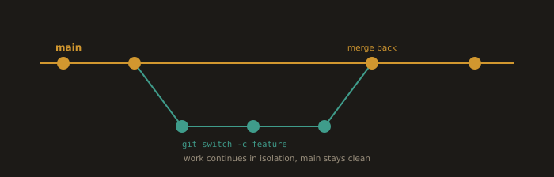
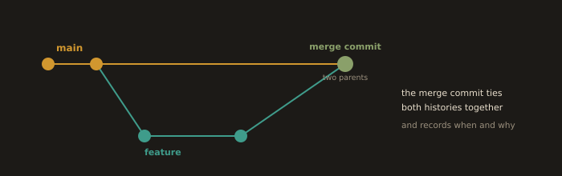

## Core Workflows: Committing changes, Branching, Merging, and Remotes

### Committing Changes (Saving Revisions)
- Creates a revision snapshot with metadata (author, timestamp, message).
- Analogy: Like saving game progress → each commit is a restore point
- Two-step process:
  - git add: Stages changes from the working directory to the staging area
  - git commit: Permanently saves staged changes to the local repository
    
  - Stage changes
```
  git add <file>         #stage a file
```
```
  git add .              #stage everything
```

- Commit staged changes
```
  git commit -m "feat: add price range filter"
```

### Branching (Parallel Development)

**Fig. 3 · A branch is a parallel line of work**



*Branch off main, commit freely in isolation, then merge the finished work back.*
- Creates independent lines of development without affecting the main code
- Commands:
  - git branch <name>           #Creates new branch
  - git switch <branch>         #Moves between branches
- Example:
    Create a new-feature branch
        Develop freely
          Switch back to the main anytime
          
- Why use?:
    Test ideas/fixes safely in isolation

```
  git branch <name>      # Create branch
```
```
  git switch <name>      # Switch to branch (modern)
```
  or
```
  git checkout <name>    # Older equivalent
```

Example:
```
git switch -c new-feature
```

...edit files...

```
git commit -m "feat: implement new feature"
```
```
git switch main
```

### Merging (Combining Work)

**Fig. 4 · Merging joins two histories**



*A merge commit has two parents, keeping the full history of both branches and marking where they came together.*
  - Integrates changes from one branch into another
  - Workflow:
    - git switch main (move to target branch)
    - git merge new-feature (pull changes into target)
  - Preserves the full history of both branches
  - Analogy:
        Merging highway lanes
          Combining separate development paths

- Move to the target branch and merge the source branch:
```
  git switch main
```
```
  git merge new-feature
```

### Remotes (Team Collaboration)
- Shared repositories hosted online (GitHub/GitLab/Bitbucket)
- Operations:
  - git push
      Uploads local commits to remote
  - git pull
      Downloads remote changes to the local
- Enables distributed version control
- Backup against local data loss
- Real-time team synchronization
- Analogy: Central cloud storage for team projects

- Push and pull:
```
  git push origin main
```
```
  git pull origin main
```

- Set default pull behavior (optional):
```
  git config --global pull.rebase true             #or false, or 'only'
```

---
