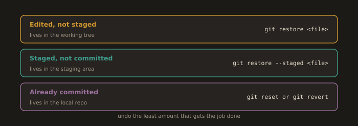
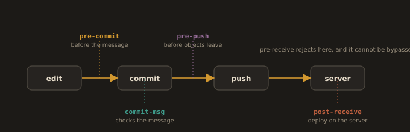

## Undoing / Reverting Changes

**Fig. 5 · Three places a change can be, three ways to undo**



*Where the change currently sits decides which command takes it back.*

**Case 1: Edited but NOT staged**:
Changes made in a code but not added into the staging area.

Syntax:
```
  git restore <file>                        #Modern, safer
```
```
git checkout -- <file>                      #Older syntax
```

Example:
```
cd ~/javaapp/sample-app
```
```
mkdir paymentgateway && cd paymentgateway
```
```
vim paymentgatewaycode
```
```
<h1> Select Payment System </h1>        #Integrating multiple payment system
```
```
cd ..
```
```
git status
```
```
git add paymentgatewaycode
```
```
cd paymentgateway
```
```
vim paymentgatewaycode
```
```
<h1> You are selecting Esewa </h1>          #Integrating Esewa
```

Undo changes (modern, unambiguous even if a branch shares the name):
```
git restore paymentgatewaycode
```
```
git checkout -- paymentgatewaycode        #Older equivalent; the -- avoids branch ambiguity
```

Verify:
```
cd paymentgateway
```
```
cat paymentgatewaycode
```

**Case 2: Staged but NOT committed**:
Changes made in a code & added into the staging area.

Syntax: 

**Older:**
Unstage changes for <file_name> from the index (staging area), but keep the changes in your working directory.
```
  git reset HEAD <file_name>
```

Restore <file_name> in your working directory to its last committed state (from HEAD).
Note: In newer versions of Git, git restore <file> is preferred.
```
  git checkout <file_name>
```

**Newer**
Unstage <file>: Removes <file> from the staging area, but keeps your local changes.
```
  git restore --staged <file>     #Unstage (keep working copy)
```

Discard changes in <file> in your working directory and restore it to the latest committed version (HEAD).
```
  git restore <file>              #Discard working changes if desired
```

Example:
```
cd ~/javaapp/sample-app
```
```
mkdir cart && cd cart
```
```
vim cart
```
```
<h1> Select item</h1>            #Cart management
```
```
→ cd ..
→ git add cart
→ git commit -m “cart management system deployed”
```

Edit and add again:
```
vim cart
#Cart management
<h1> select item </h1>
<h2> select paymentgateway </h2>
```

```
cd ..
git status
git add cart
```

```
git reset HEAD cart
git checkout cart
```

Verify:
```
cat cart/cart
```

**Case 3: Already committed**
Changes made in a file and added to the staging area are also committed
to the local repository. (File already in the local repository)

- Method A: Soft reset (keep changes staged)
```
git reset --soft HEAD~1
```

- Method B: Mixed reset (default; keep changes in working copy, unstaged)
```
git reset --mixed HEAD~1
```

- Method C: Hard reset (discard commit and changes; destructive)
```
git reset --hard HEAD~1                            #Warning: Permanently removes work
```

- Method D: Revert (safe on shared branches; creates an “anti-commit”)
```
git log                                            #find commit hash
```
```
git revert --no-commit <commit_hash>
```
```
git commit -m "revert: undo <short-hash> <original subject>"
```

Example:
1. Commit a file
```
mkdir shipping && cd shipping && touch shipping
```
```
echo "Express Delivery" > shipping
cd ..
git add shipping
git commit -m "Added Shipping Module"
```

2. Make unwanted changes and commit
```
echo "Priority Shipping" >> shipping/shipping
git add shipping
git commit -m "Update Shipping Options"
```

3. Undo the commit (two methods)
Method A: Soft reset (keep changes in staging)
```
git reset --soft HEAD~1 #Undo last commit, keep changes staged
```

Method B: Undo the last commit (and also unstage the changes)
```
git reset --mixed HEAD~1
```

Method C: Hard reset (completely discard commit)
```
git reset --hard HEAD~1                     #Permanently remove last commit
```
Warning: This deletes your latest commit and file changes

Method D: Revert the commit by creating a new opposite commit (Recommended)
To view the last few commit hashes:
→ git log
→ Identify the commit


- Copy the <commit_hash>

Syntax
```
git revert --no-commit <commit_hash>    #Stages the inverse of the commit but does NOT commit yet
```
```
git commit -m "revert: undo <short-hash> <original subject>"   #Mandatory follow-up to finish the revert
```
Note: plain `git revert <commit_hash>` (without `--no-commit`) stages and commits the inverse in one step, and is what most people want.

Example:
```
git revert --no-commit 4e772d533db53efec66f03a37e3cdfeda31787cd
```
```
git commit -m "revert: undo 4e772d5 express delivery"
```

Verify:
  ```
  git log                    #Last commit removed
  ```
  ```
  cat shipping/shipping      #Shows only "Express Delivery"
  ```
---

**Customizing Git**

Configuration levels:
```
git config --local          #repo-specific (.git/config)
```
```
git config --global         #user-wide (~/.gitconfig)
```
```
git config --system         #machine-wide
```

Common settings:
```
git config --global user.name "techgeek68"
```
```
git config --global user.email "pyakurelelx@gmail.com"
```
```
git config --global core.editor "vim"
```
```
git config --list
```

Aliases (append to ~/.gitconfig):

Visual history
```
  lol = log --oneline --graph --decorate --all
```
Delete merged local branches (except main)
```
  cleanup = "!git branch --merged | egrep -v '\\*|main|master' | xargs -r git branch -d"
```

**Hooks**:

**Fig. 6 · Where each hook fires**



*Local hooks guard the laptop; the server hook is the one that cannot be skipped.*

Hooks are scripts that run at specific points in the Git workflow, allowing automation. Common hooks are:

- pre-commit: Runs when you execute `git commit`, before the commit message editor opens. It lets you automate checks (formatting, linting, secret scanning, tests) so problems are caught before the commit is created. Aborting it aborts the commit. location: .git/hooks/pre-commit

- pre-push: Runs when you execute `git push`, before objects are sent to the remote. Useful for a fast test subset or build check before your work leaves the machine. location: .git/hooks/pre-push

- post-receive: Runs on the remote repository after a push is received. Often used to trigger deployment, notifications, or CI jobs.

Summary:
- automation triggers in .git/hooks/
- pre-commit: run linters/test
- pre-push: run smoke tests
- post-receive: deploy on server

---
