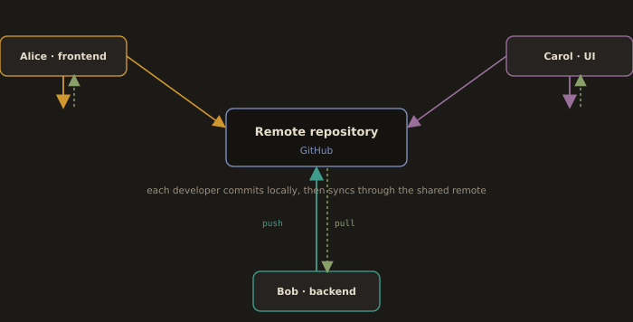

## Collaboration Example (3 Developers)

**Fig. 7 · Three developers, one remote**



*Everyone works in their own clone and meets at the shared remote through push and pull.*
The diagram illustrates the core workflow of version control systems (VCS) like Git, emphasizing how changes move between three key areas: the Working Copy, Local Repository, and Remote Repository.

Scenario: Alice (frontend), Bob (backend), Carol (UI) collaborate on an e-commerce site.

```
                  +------------------+
User 1:           |  Working Copy    |  
Alice             +------------------+
                        | ^ 
               Commit   | | Update
                        v |
                +------------------+
                | Local Repository |
                +------------------+
                        | ^
                 Push   | | Pull
                        v |
          +---------------------------------------+
          |   Remote Repository                   |
          |      (git)                            |
          +---------------------------------------+
                ^ |                       ^ |
          Push  | | Pull                  | | Push/Pull
                | v                       | v 
            +------------------+      +------------------+
            | Local Repository |      | Local Repository |  
            +------------------+      +------------------+
                   ^ |                          ^ |
            Commit | | Update            Commit | | Update
                   | v                          | v
            +------------------+      +------------------+
User 2:     |  Working Copy    |      |  Working Copy    |  User 3:
Bob         +------------------+      +------------------+  Carol

```

**Workflow & Key Components:**

Working Copy
- Your local project files (editable directly).
- Example: Editing code in Visual Studio Code on your laptop.

Commit Update → Local Repository
- Save changes from the Working Copy to your Local Repository as a versioned "snapshot."
- Example: After fixing a bug, you run git commit -m "Fix login error" to save it
locally.

Push Pull → Remote Repository
- Push: Upload commits from Local Repository to a shared Remote Repository (e.g., GitHub).
- Example: Use git push to share your bug fix with teammates.
- Pull: Download changes from Remote Repository to Local Repository + Working Copy.
- Example: Use git pull to get a teammate's latest feature from GitHub.

Remote Repository
 - Central cloud-hosted storage (e.g., GitHub/GitLab).
 - Example: A GitHub repo like https://github.com/yourteam/project.

Synchronization Cycle
- Changes loop between developers' local environments and the shared remote
repo.


**Developer 1: Alice (Frontend Developer)**
• Task: Add product filtering feature
Workflow:
```
git pull origin main                              #Syncs with remote
```
*Edits product-list.js (Working Copy)*
```
git add product-list.js                           #Stages changes
```
```
git commit -m "feat: add price range filter"      #Saves to local repository
```
```
git push origin main                              #Uploads to remote repository
```

**Developer 2: Carol (UI Designer)**
• Task: Improve cart styling
Workflow:
```
git fetch origin                                  #Checks remote changes
```
*Edits styles.css* (Working Copy)
```
git add styles.css
```
```
git commit -m "feat: redesign cart UI"            #Local Repository
```
```
git push origin main                              #Remote Repository (Pushes before Bob)
```

**Developer 3: Bob (Backend Developer)**
• Task: Implement coupon code validation
Workflow:
```
git pull origin main                              #Gets Alice's updates
```
*Edits checkout.php*  (Working Copy)
```
git add checkout.php
```
```
git commit -m "feat: add coupon validation"       #Local Repository
```
```
git push origin main                              #Remote Repository
```
**Push fails (remote has newer commits)**         #⚠️ Push fails! (Carol pushed first)
```
git pull --rebase origin main                      #Integrates Carol's changes
```
**resolve conflicts (e.g., styles.css), then:**
```
git add styles.css
```
```
git rebase --continue                               #Complete rebase
```
```
git push origin main                                #Success!
```

Why this works:
- Parallel development on separate files

- Conflict managed explicitly via rebase
  - Carol pushes first → Creates new base version
  - Bob uses rebase to replay his changes on top
  - Explicit conflict resolution ensures code integrity
  
- Clear audit trail: v1 (Alice) → v2 (Carol) → v3 (Bob)
  - GitHub shows the exact conflict resolution point

---
