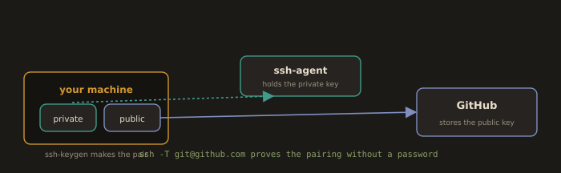

## Linking Local Git Repository with Remote GitHub Repository 

**SSH Key-based Authentication to GitHub**

**Fig. 8 · How SSH auth to GitHub fits together**



*The private key never leaves your machine; only the public half goes to GitHub, and the test handshake proves the match.*

Generate SSH key:
```
ssh-keygen
```
or
```
  ssh-keygen -t ed25519 -C "pyakurelelx@gmail.com"
```
```
cd ~/.ssh
```
```
vim config
```
```
Host github.com
  HostName github.com
  User git
  ServerAliveInterval 60
  ServerAliveCountMax 5
  TCPKeepAlive yes
  IPQoS throughput
```

Set permissions and start the agent:
```
chmod 600 ~/.ssh/config
```
```
eval "$(ssh-agent -s)"                #Start background process of ssh
```
```
ssh-add ~/.ssh/id_ed25519             #Handover private key to the background process of ssh 
```

Add public key to GitHub:
```
cat ~/.ssh/id_ed25519.pub              #Copy output
```
Log in to your GitHub account:
GitHub 
  → Settings 
    → SSH and GPG keys 
      → New SSH key

Test:
```
ssh -T git@github.com
```

Log in to your GitHub account and navigate to the desired repository:

----
Using SSH

1. Log in to your GitHub account and open the desired repository.
2. Click the Code button.
3. Select SSH.
4. Copy the SSH repository link
5. Open your terminal and run:
  ```bash
    git clone git@github.com:OWNER/REPO.git
  ```

---

Using HTTPS

1. Log in to your GitHub account and open the desired repository.
2. Click the **Code** button.
3. Select **HTTPS**.
4. Copy the HTTPS link.
5. Open your terminal and run:
   ```bash
     git clone https://github.com/OWNER/REPO.git
   ```

---

Using GitHub CLI (`gh`)

1. Make sure you have [GitHub CLI](https://cli.github.com/) installed and authenticated.
   ```bash
   gh auth login
   ```
   
2. In your terminal, run:
   ```bash
   gh repo clone OWNER/REPO
   ```

---

Replace `OWNER/REPO` with your repository’s path (e.g., `techgeek68/cafe-website-on aws-s3`).  

---
**Link local to remote:**

```
cd ~/javaapp/sample-app
```
```
git remote add origin git@github.com:techgeek68/JavaApp.git
```
```
git remote -v
```

*Remove origin (if needed):*
```
git remote remove origin
```

Pull (configure and fetch):
Pulling files from the remote repository into the local repository.
```
git config pull.rebase true     #Optional preference
```
```
git pull origin main            #Use 'master' if your repo uses that
```

Push:
Pushing files in the local repository to the remote GitHub repository.
```
git push origin main
```

**Unlink remote (if needed):**
```
git remote rm origin
```
```
git config --list
```

---
