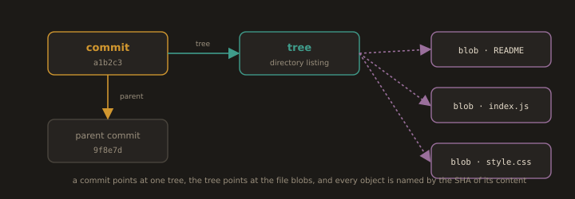
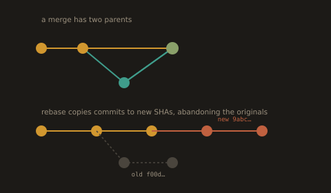
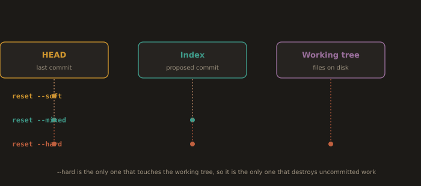

# Part B: Team Engineering Workflows (Module 4)

Part A above is the mechanics of Git. Part B is the part that gets you hired and keeps you employed: how a team of people who disagree with each other ships software through a shared repository without breaking production.

---

## B1. Distributed Version Control Is a Mental Model, Not a History Log

Most people learn Git as a list of commands that produce a list of commits. That model works until the first rebase, then it collapses. The model that survives is the object model.

### The four object types

**Fig. 9 · The four Git objects in one picture**



*A commit names a tree, the tree names the file blobs, and each commit points back to its parent.*

Git is a content addressable key value store. Everything is stored under the SHA of its own content.

| Object | What it holds |
|--------|---------------|
| blob   | The bytes of a file. No name, no path, no permissions. |
| tree   | A directory listing: names, modes, and the SHAs of blobs and other trees. |
| commit | One tree SHA, zero or more parent commit SHAs, author, committer, message. |
| tag    | An annotated pointer to an object, with its own message and optional signature. |

A branch is not a container of commits. A branch is a 41 byte file containing one SHA. Look at it:

```bash
cat .git/refs/heads/main
```
```bash
git cat-file -p HEAD              # show the commit object: tree, parent, author, message
```
```bash
git cat-file -p HEAD^{tree}       # show the directory listing that commit points at
```
```bash
git rev-parse HEAD                # the SHA that "HEAD" currently resolves to
```

Three consequences follow immediately, and they explain most Git behaviour that beginners find arbitrary.

1. **A commit is a full snapshot, not a diff.** Diffs are computed on demand between two snapshots. This is why `git checkout` of an old commit is instant and why history rewriting is cheap.
2. **History is a directed acyclic graph, not a line.** `git log` prints a linearised view of a graph. Merges have two parents. Rebase does not move commits, it creates new commit objects with new SHAs and new parents, and abandons the old ones.

**Fig. 10 · History is a graph, and rebase rewrites it**



*Merges have two parents; rebase does not move commits, it creates new ones with new SHAs and leaves the originals behind.*
3. **Nothing is deleted when you "delete" it.** `git reset --hard` moves a pointer. The old commits stay in the object database, unreferenced, until garbage collection removes them. That is why `git reflog` can save you, and why it is your first response to any Git accident.

```bash
git reflog                        # every position HEAD has held, including the ones you "lost"
git log --oneline --graph --decorate --all
```

### What "distributed" actually means

Every clone contains the complete object database and the full history. There is no privileged copy at the protocol level. `origin` is privileged only because your team agreed it is. The remote is a social convention enforced by server side permissions, not a property of Git.

This gives you:

* Offline work, including branching, committing, merging, blaming, and bisecting.
* No single point of failure. Any clone can reconstitute the project.
* Cheap branches, because a branch costs one file with one SHA in it.
* Merges that use a merge base. Git finds the common ancestor of two branches and performs a three way merge. Conflicts occur only where both sides changed the same region relative to that base.

### The three trees

**Fig. 11 · The three trees, and what each reset touches**



*soft moves HEAD, mixed moves HEAD and the index, hard moves all three and is the only one that loses your edits.*

Every Git command you run is moving data between three places. Memorise this and `reset` stops being frightening.

| Tree | Meaning | Inspect with |
|------|---------|--------------|
| HEAD | The last commit on the current branch | `git show HEAD` |
| Index (staging area) | The proposed next commit | `git diff --staged` |
| Working tree | The files on disk | `git diff` |

`git reset` takes a commit and optionally rewrites these three trees:

* `--soft` moves HEAD only.
* `--mixed` (default) moves HEAD and the index.
* `--hard` moves HEAD, the index, and the working tree. Only this one destroys uncommitted work.

Once this table is internalised, the rest of the chapter is bookkeeping.

---
