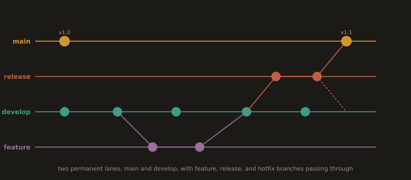
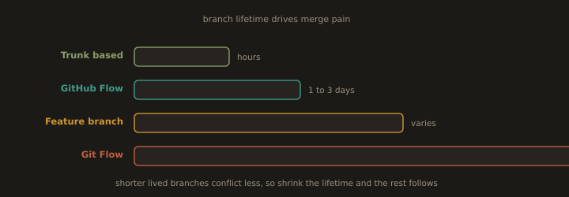

## B2. Branching Strategies and Their Trade Offs

There are only four models in wide use, and the correct answer depends on team size, release cadence, and whether you support multiple versions in the field at once.

### Feature branching

Branch from `main`, work, open a pull request, merge back, delete the branch. This is the substrate that every other model builds on. It says nothing about how long the branch lives, which is the only variable that actually matters.

### GitHub Flow

One long lived branch, `main`, which is always deployable. Every change is a short lived branch plus a pull request. Merge to `main` triggers deployment. No release branches, no develop branch.

Good for: web services with continuous deployment, one production version, small to mid size teams.
Weak for: shipping software that customers install and pin to a version.

### Git Flow

Published by Vincent Driessen in 2010. Two permanent branches (`main` for released code, `develop` for integration) plus three transient types (`feature/*`, `release/*`, `hotfix/*`).

**Fig. 12 · Git Flow at a glance**



*Feature work integrates on develop, a release branch stabilises it, and main only ever holds tagged releases.*

```
main     o-----------------o---------o        (tagged releases only)
          \               /         /
release    \        o----o         /          (stabilise, bugfix only)
            \      /              /
develop  o---o----o------o-------o            (integration)
          \       /       \     /
feature    o--o--o         o---o
```

Note the honest caveat the author himself added years later: Git Flow was designed for versioned software with several supported releases in the wild, and it is a poor fit for a continuously delivered web application. Teams that adopt it by default usually inherit the ceremony without the requirement.

Good for: installed software, firmware, mobile apps with store review cycles, anything supporting multiple live versions.
Weak for: continuous delivery. `develop` becomes a second integration bottleneck, merges get large, and conflicts pile up in release branches.

### Trunk based development

Everyone commits to one trunk. Branches, if they exist at all, live for hours and never more than a day. Incomplete work ships behind feature flags rather than sitting on a branch. Releases are cut as tags on trunk, or as short lived release branches that only take cherry picked fixes.

This is the model correlated with high delivery performance in the DORA research programme, and it is what large engineering organisations converge on. The reason is arithmetic: merge pain grows with the square of branch lifetime and the number of parallel branches. Shrink the lifetime to a day and merge pain approaches zero.

Prerequisites, and they are not optional:

* Fast, trustworthy CI on every commit. If the pipeline takes forty minutes, trunk based development becomes trunk based breakage.
* Feature flags, so that unfinished code can be merged and disabled.
* Expand and contract migrations, so that schema changes are backward compatible across a deploy.
* A culture where breaking trunk is fixed within minutes and is nobody's shame.

### Choosing

**Fig. 13 · Shorter branches, smaller merges**



*The one variable that matters is how long a branch lives; every model is really a choice about that.*

| Team size | Reasonable default | Why |
|-----------|--------------------|-----|
| 1 to 3 | Trunk with short branches, or trunk directly | Ceremony costs more than it returns. Still protect `main` and still use PRs, because the reviewer may be future you. |
| 4 to 15 | GitHub Flow or trunk based with short lived feature branches | One deployable branch, PR review, CI gate. This is the sweet spot for most product teams. |
| 15 to 50 | Trunk based, feature flags, merge queue | Parallel PRs start racing each other. A merge queue serialises them and tests each candidate against the head it will actually land on. |
| Multiple supported versions in the field | Git Flow, or trunk plus long lived release branches | You need somewhere to backport a security fix to version 3.2 while trunk is on 5.0. |

Rules of thumb that hold at every size:

* Branch lifetime is the metric. Optimise it downward. Everything else is derived.
* Long lived branches are a debt instrument. You borrow speed today and repay it, with interest, in conflict resolution.
* Never create a branch you cannot describe in one sentence, and never create one whose merge you cannot imagine.

---
