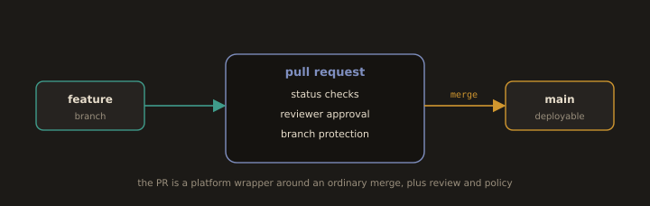

## B3. Pull Requests and Code Review

A pull request is not a Git feature. Git has no concept of a PR. It is a platform object: a request to merge branch A into branch B, plus a comment thread, plus a set of status checks, plus policy. The Git operation underneath is an ordinary merge.

**Fig. 14 · A pull request wraps a merge in policy**



*Underneath it is a plain merge; the value is the review, the checks, and the protection layered on top.*

### Why review exists

Review has four jobs, in descending order of value:

1. **Correctness against intent.** Does this do what the issue asked, and is what the issue asked actually the right thing?
2. **Risk detection.** What happens on the error path, under concurrency, under load, on rollback, with a partially applied migration?
3. **Knowledge distribution.** After merge, at least two people understand this code. This is the quiet reason review survives audits and staff turnover.
4. **Shared standards.** Consistency of design, not of whitespace.

### What makes a review useful rather than a rubber stamp

A rubber stamp is an approval issued without a model of what the code does. It is worse than no review, because it launders risk into a signed audit trail.

Useful reviews have observable properties:

* **The diff is small.** Effectiveness collapses beyond a few hundred changed lines. If the PR is large, the correct review comment is "split this."
* **The reviewer runs it, or at least reads the tests as a specification.** Ask: if this code were subtly wrong, which of these tests would fail? If the answer is none, the tests are decoration.
* **Comments are specific and actionable, and separate blocking from taste.** Use conventional comment prefixes so intent is unambiguous:

  ```
  blocking: this drops the transaction if the retry fires. Wrap in the same tx.
  question: why 3 retries and not the module default of 5?
  nit: name this `userID` for consistency with the rest of the package.
  praise: nice, this removes the whole special case in the caller.
  ```
* **Formatting is never discussed.** Formatters and linters run in pre-commit and in CI. A human arguing about a trailing comma is a process failure, not a diligent reviewer.
* **The security and operability questions are asked every time.** Authorisation checks, input validation, injection surfaces, secrets, logging of sensitive fields, new dependencies and their provenance, backward compatibility, metrics and rollback path.
* **Review latency is measured.** A perfect review delivered in three days is worse for the organisation than a good review delivered in three hours, because the author has context switched and the branch has drifted. Treat review as an interrupt, not as backlog.

`CODEOWNERS` routes reviews automatically to the people who own the touched paths:

```
# .github/CODEOWNERS
/infra/            @platform-team
/services/billing/ @billing-team @security-guild
*.tf               @platform-team
```

### Reviewing generated code

This deserves its own treatment, because it is becoming the majority of the reviewing you will do, and it fails differently from human code.

Human code fails where the human was confused, and the confusion is usually visible in the code. Generated code fails where the model was confident, and confidence is invisible. The specific failure modes:

* **Plausible but wrong.** The code compiles, reads beautifully, follows house style, and quietly does the wrong thing at the boundary. Review the boundaries first: empty input, zero, nil, off by one, timezone, currency rounding, partial failure.
* **Invented APIs.** A function that does not exist, a flag that was removed two versions ago, a config key that was never real. Verify every unfamiliar call against the actual documentation, not against how reasonable it sounds.
* **Silent scope creep.** The model refactored three files it was not asked to touch. Every hunk in the diff must be justified by the issue, and hunks that are not are removed or split into their own PR.
* **Tests generated from the same wrong assumption.** If the same tool wrote the code and the tests, the tests confirm the bug. Read the tests before the implementation and ask whether they would catch a real regression.
* **Provenance and licence.** Large verbatim blocks that look like they came from somewhere probably did. Your organisation's policy, not your comfort level, decides what is acceptable.
* **Volume.** Generation makes it trivially cheap to produce a 900 line PR. The reviewer, not the generator, absorbs that cost. Push back on size, hard.

The professional standard: **the author owns the diff, regardless of who or what typed it.** "The model wrote it" is not an explanation, it is an abdication. In review, ask the author to explain a non obvious hunk in their own words. If they cannot, that is your finding, and it is a blocking one.

---
