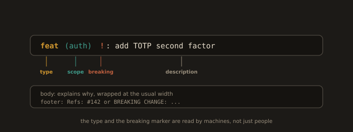
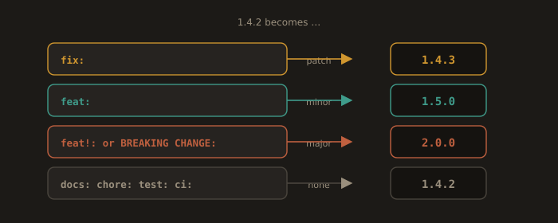

## B4. Conventional Commits and the Payoff

We do not enforce a commit format because we enjoy bureaucracy. We enforce it because a machine readable commit history is an input to automation. We enforce the format here in section B4, and cash it in during Lab 4C.

### The format

```
<type>[optional scope][optional !]: <description>

[optional body]

[optional footer(s)]
```

Types in common use: `feat`, `fix`, `docs`, `style`, `refactor`, `perf`, `test`, `build`, `ci`, `chore`, `revert`.

**Fig. 15 · Anatomy of a conventional commit**



*Type, optional scope, an optional breaking marker, then the description; the body and footer carry the rest.*

```
feat(auth): add TOTP second factor

Adds a TOTP enrolment endpoint and verification on login. Codes are
30 second windows with one step of clock skew allowed.

Refs: #142
```

Breaking changes are marked with `!` after the type or scope, or with a `BREAKING CHANGE:` footer:

```
feat(api)!: return 404 instead of 200 with empty body for missing users

BREAKING CHANGE: clients that relied on the empty 200 must handle 404.
```

### The mapping to Semantic Versioning

**Fig. 16 · The commit type is a version instruction**



*Each commit type declares its release impact, so the version bump is computed, never chosen by hand.*

This is the whole point. The commit type is a machine readable declaration of release impact.

| Commit | SemVer effect | 1.4.2 becomes |
|--------|---------------|---------------|
| `fix:` | patch | 1.4.3 |
| `feat:` | minor | 1.5.0 |
| `feat!:` or `BREAKING CHANGE:` footer | major | 2.0.0 |
| `docs:`, `chore:`, `test:`, `ci:`, `style:` | none | 1.4.2 |

### What you get once the format is enforced

* **Automated version bumps.** Nobody edits a version string by hand, so nobody forgets.
* **Automated changelogs.** `CHANGELOG.md` is generated from the commits, grouped by type, with links to the commits and issues.
* **Automated releases.** Tag, GitHub Release, release notes, and optionally a package publish, all triggered by a merge.
* **Automated blame at the release level.** "Which release introduced this?" becomes a lookup rather than an investigation.

### The two tools you will meet

* **semantic-release**: releases immediately on merge to the release branch. It computes the version, tags, publishes, writes the changelog, all in the pipeline. Aggressive and excellent for libraries.
* **release-please** (`googleapis/release-please-action@v4`): does not release on merge. It maintains a standing **Release PR** that accumulates changes and shows you the next version and the proposed changelog. You release by merging that PR. Safer for services, because a human still chooses the moment. We use this in Lab 4C.

**The squash merge trap.** If your repository squashes PRs, the commit that lands on `main` carries the **PR title**, not the individual commit messages. Lint the PR title as well, otherwise every landed commit is `Update stuff (#42)` and the automation produces nothing. Enforce it with a PR title linter in CI, or require merge commits.

---
